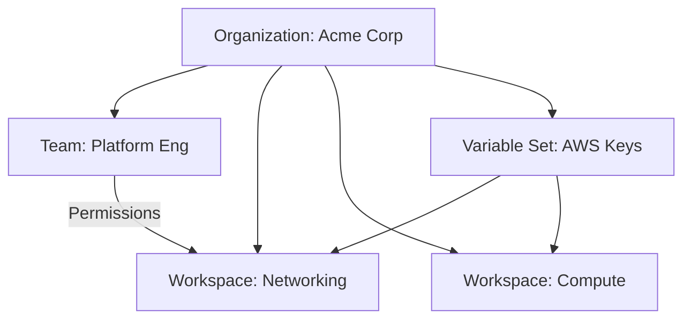

# Introduction and Architecture

Terraform Cloud (now part of **HashiCorp Cloud Platform - HCP Terraform**) is a managed service that provides a consistent, reliable environment for teams to collaborate on infrastructure.

## What is HCP Terraform?
It is a "SaaS" (Software as a Service) platform that replaces the need for a local backend, a manual CI/CD pipeline, and complex secret management. It provides:
- **Centralized State**: No more manual S3 bucket setup.
- **Remote Execution**: Plans and applies run on HashiCorp's servers, not your laptop.
- **Consistency**: The same version of Terraform and providers is used every time.

## Core Hierarchy
1.  **Organization**: The top-level container (e.g., your company). It owns teams, workspaces, and variable sets.
2.  **Workspace**: A dedicated environment for a specific project or component (e.g., `prod-network`).
3.  **Teams**: Groups of users with specific permissions (e.g., `SRE-Team`).

## Mermaid Diagram: HCP Terraform Hierarchy

---

## 🏗️ Real-Life Scenario: The "Works on My Machine" Curse
**Problem**: An engineer runs `terraform apply` on their Mac using Terraform 1.5. Another engineer tries to run it on Linux using Terraform 1.2. The state file becomes incompatible, and the deployment fails.
**Solution**: Move to HCP Terraform. All runs happen in a standard Docker container hosted by HashiCorp. It doesn't matter what OS the engineer uses; the execution is exactly the same every time.

---

## ❓ Interview Questions
1.  **What is the difference between a TFC Organization and a Workspace?**
    *   *Answer*: An Organization is the high-level account for a company. A Workspace is a specific instance of infrastructure (containing state, variables, and code) managed within that Organization.
2.  **Can you use Terraform Cloud for free?**
    *   *Answer*: Yes. HCP Terraform has a robust free tier for small teams (up to 500 resources) that includes state management and remote runs.

---

## 🧠 Quiz Snippet (5/50+)
1.  **What is the top-level container in HCP Terraform?** (Organization)
2.  **Does HCP Terraform replace the need for an S3 backend?** (Yes, it manages state automatically)
3.  **True/False: HCP Terraform runs are executed locally on your machine.** (False - they run on HashiCorp's infrastructure)
4.  **What is the primary benefit of a shared state in TFC?** (Consistency and collaboration across teams)
5.  **Can a single Organization have multiple Workspaces?** (Yes)
