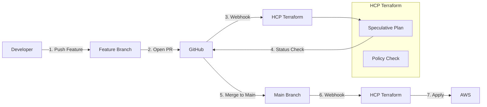

# VCS Driven Workflow (GitOps)

The "Standard" way to use Terraform Cloud. You push to Git, and TFC takes it from there.

## 1. The GitOps Flow

Stop running `terraform apply` locally. In TFC, the Source of Truth is the Git Repository.

---

## 2. Speculative Plans

When you open a Pull Request, TFC runs a **Speculative Plan**.
*   It downloads the code from the PR branch.
*   It runs `terraform plan`.
*   It reports the result back to GitHub as a **Status Check** (Green checkmark or Red X).
*   **Crucial**: It cannot be Applied. It is read-only validation.

---

## 3. Configuration

### Connecting VCS
1.  **Organization Settings** -> **Providers** -> **Add a VCS Provider**.
2.  Select **GitHub** (or GitLab/Bitbucket).
3.  Authenticate via OAuth.

### Workspace Mapping
Each Workspace listens to a specific repository and branch.

| Setting | Description | Recommended |
| :--- | :--- | :--- |
| **Repository** | The Git repo URL. | `my-org/infra-repo` |
| **VCS Branch** | The branch to deploy from. | `main` (Production) or `dev` (Development). |
| **Directory** | Sub-folder for monorepos. | `apps/payment-service` |
| **Auto-Apply** | Apply automatically on merge? | `False` for Prod, `True` for Dev. |

---

## 4. Real-Life Scenarios

### Scenario 1: "The Broken PR"
**Problem**: A developer refactored a module but made a typo in a variable name.
**Event**: They opened a PR. TFC triggered a Speculative Plan.
**Outcome**: The Plan failed (Status Check: Failed). The "Merge" button in GitHub turned gray (Blocked).
**Result**: The broken code never reached the `main` branch.

### Scenario 2: "The Forgotten Merge"
**Problem**: A developer merged a PR to `main` at 5 PM on Monday but forgot to click "Queue Apply" in TFC.
**Event**: Tuesday morning, everyone assumed the new feature was live. It wasn't.
**Solution**: Enable **"Auto-Apply"** for non-production environments to ensure that if code is in the branch, it is in the cloud.

### Scenario 3: "Monorepo Filtering"
**Problem**: You have 50 microservices in one repo. Changing Service A triggers runs for all 50 workspaces. Chaos.
**Solution**: Configure **"VCS Triggers"** (Directory Filter).
*   Workspace A Pattern: `apps/service-a/**/*`
*   Workspace B Pattern: `apps/service-b/**/*`
Now, TFC only wakes up if files in the relevant folder change.

---

## 5. ❓ Interview Questions

1.  **Does TFC need write access to my GitHub repo?**
    *   **Answer**: Yes, primarily to post Status Checks (commit statuses) and occasionally to create webhooks.

2.  **How do you handle multiple environments (Dev/Prod) with VCS workflow?**
    *   **Answer**: Two common patterns:
        *   **Branch Strategy**: Workspace `Dev` tracks `dev` branch. Workspace `Prod` tracks `main` branch.
        *   **ConfigFile Strategy**: Both track `main`, but map to different directories (`env/dev`, `env/prod`) or use different `.tfvars`.

3.  **What happens if I push a new commit while a run is already queued?**
    *   **Answer**: By default, TFC cancels the pending run and starts a new one for the latest commit (Auto-Cancellation) to save time, unless the run has already started Applying.

4.  **Can I use a VCS other than GitHub?**
    *   **Answer**: Yes, TFC supports GitLab, Bitbucket, and Azure DevOps.

5.  **Why is "Speculative Plan" named that way?**
    *   **Answer**: Because it speculates "What would happen if we merged this?" without actually changing anything.

6.  **Does TFC support git submodules?**
    *   **Answer**: Yes, but you must ensure the SSH key TFC uses has access to pull those submodules.

7.  **What is a "VCS Trigger Pattern"?**
    *   **Answer**: A glob pattern (e.g., `modules/**/*.tf`) used to include or exclude files from triggering a workspace run.

8.  **If I delete a branch in Git, does TFC delete the workspace?**
    *   **Answer**: No. TFC workspaces and Git branches are loosely coupled. You must manage workspace lifecycle separately (or use a Terraform provider to manage TFC itself!).

9.  **Can a speculative plan read remote state?**
    *   **Answer**: Yes, it has the same permissions as a normal run, so it can read outputs from other workspaces to build accurate plans.

10. **Refers to "Oauth Token" vs "SSH Key" for VCS?**
    *   **Answer**: OAuth is for TFC to talk to the Git API (Webhooks/Status). SSH Keys are used by the Runner to clone the code (especially submodules).

---

## 6. 🧠 Knowledge Check (Quiz)

### Workflow
1.  **In a VCS workflow, `terraform apply` is triggered by:**
    *   [x] Merging to the tracked branch.
    *   [ ] Opening a PR.

2.  **Speculative Plans create resources:**
    *   [ ] Always.
    *   [x] Never.

3.  **To block a merge if the plan fails:**
    *   [x] Use GitHub Branch Protection Rules requiring the TFC Status Check.
    *   [ ] Use Sentinel.

4.  **If "Auto-Apply" is OFF:**
    *   [x] The run pauses after Plan and waits for human confirmation.
    *   [ ] The run fails.

### Configuration
5.  **Monorepo support relies on:**
    *   [x] Workspace "Working Directory" and "Trigger Patterns".
    *   [ ] Creating separate repos.

6.  **To connect TFC to GitHub, you need:**
    *   [x] Owner/Admin permissions on the GitHub Org.
    *   [ ] Just a user account.

7.  **Auto-Cancellation handles:**
    *   [x] Redundant intermediate commits.
    *   [ ] Security.

8.  **Each workspace can track:**
    *   [x] One branch.
    *   [ ] All branches simultaneously.

9.  **Can TFC update the PR with the Plan details?**
    *   [x] Yes (TFC Bot).
    *   [ ] No.

10. **If you rename the GitHub Repo:**
    *   [x] TFC usually handles it (via ID), but you might need to refresh settings.
    *   [ ] TFC breaks immediately.

### Scenarios
11. **You want to test a dangerous change:**
    *   [x] Open a PR to see the Speculative Plan impact.
    *   [ ] Push to main.

12. **Why use the "Working Directory" setting?**
    *   [x] Because your Terraform code isn't in the root of the repo.
    *   [ ] To hide files.

13. **If a PR is closed without merging:**
    *   [x] TFC ignores it (Speculative plans are ephemeral).
    *   [ ] TFC runs destroy.

14. **To skip a run for a documentation-only commit:**
    *   [x] Add `[skip ci]` to the commit message.
    *   [ ] Delete the file.

15. **Status Checks appear in GitHub as:**
    *   [x] "HCP Terraform / Run (workspace-name)".
    *   [ ] "Jenkins".

### General
16. **Is "GitOps" just for Kubernetes?**
    *   [ ] Yes.
    *   [x] No, it applies to Infrastructure (Terraform) too.

17. **Which is the "Source of Truth" in VCS Workflow?**
    *   [x] The Git Branch.
    *   [ ] The local laptop.

18. **Can you force a run from the UI even if VCS is connected?**
    *   [x] Yes, "Queue Plan" uses the latest commit on the tracked branch.
    *   [ ] No.

19. **If the VCS token expires:**
    *   [x] Webhooks fail; TFC cannot see changes.
    *   [ ] TFC uses magic.

20. **Can one Repo feed multiple workspaces?**
    *   [x] Yes (e.g., Prod, Stage, Dev workspaces tracking the same or different branches).
    *   [ ] No.
