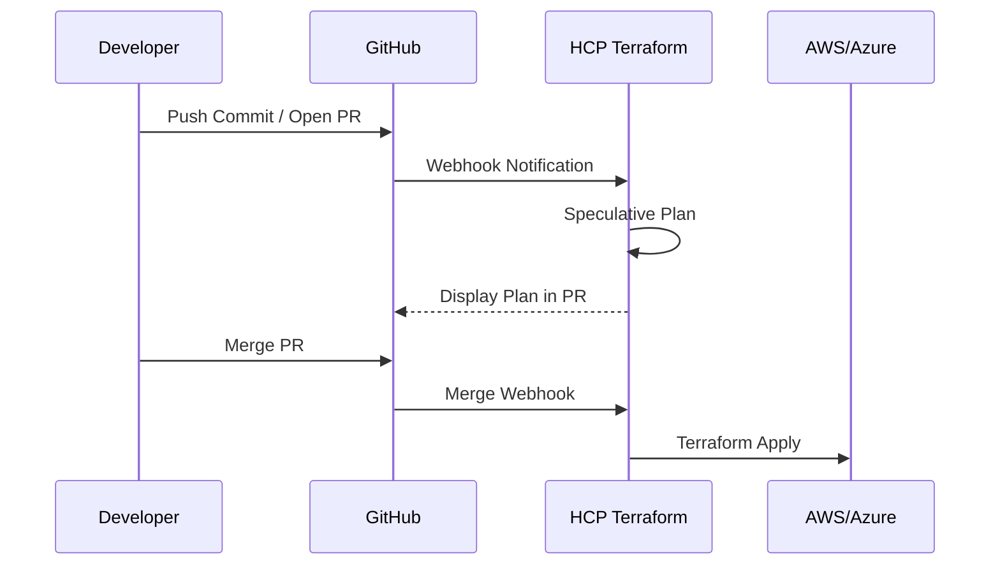

# VCS-Driven Workflow

The VCS (Version Control System) workflow is the "GitOps" heart of HCP Terraform. It connects your code repository directly to your infrastructure.

## How it Works
When you connect a GitHub/GitLab repo to a TFC workspace:
1.  **Speculative Plan**: When you open a Pull Request, TFC automatically runs a `plan`. This tells you the impact *before* you merge.
2.  **Automatic Run**: When you merge to the main branch, TFC triggers a real `plan` and (if configured) an `apply`.
3.  **Status Checks**: TFC posts the plan results directly back to the GitHub PR UI.

## Benefits
- **Visibility**: Everyone can see the proposed infrastructure changes in the PR.
- **Auditability**: Every change is linked to a Git commit and an author.
- **Safety**: Guardrails like Policy as Code can block bad merges.

## Mermaid Diagram: VCS Flow

---

## 🏗️ Real-Life Scenario: The Invisible Change
**Problem**: An admin manually runs `terraform apply` from their terminal. They change 5 firewall rules. No one else on the team knows why or when this happened.
**Solution**: Switch to the VCS-driven workflow. To change those rules, the admin *must* open a PR. The team reviews the change, sees the `plan` output in the PR comment, and approves it. 
**Result**: The change is documented in Git history forever.

---

## ❓ Interview Questions
1.  **What is a "Speculative Plan"?**
    *   *Answer*: It is a plan triggered by a non-default branch (like a PR branch). It shows the proposed changes but cannot be "Applied." It's for verification only.
2.  **How does HCP Terraform know a new commit was pushed?**
    *   *Answer*: It uses **Webhooks**. When the Git provider receives a push, it sends a message to TFC to start a run.

---

## 🧠 Quiz Snippet (5/50+)
1.  **Which workflow is considered the "GitOps" approach?** (VCS-Driven Workflow)
2.  **Can you apply a Speculative Plan?** (No)
3.  **True/False: VCS integration requires a local `terraform init`.** (False - TFC handles the initialization remotely)
4.  **Where do you see the output of a TFC plan during a PR?** (In the PR comments or Status Checks section)
5.  **Which branch usually triggers an 'Apply' in TFC?** (The default/main branch)
