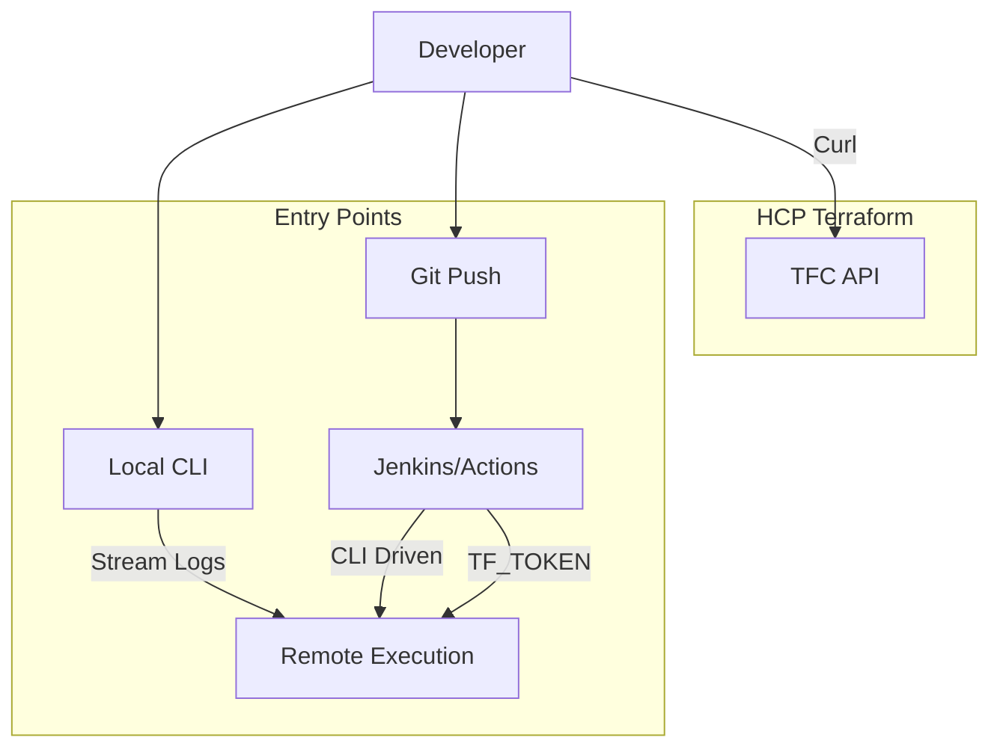

# CLI and API Workflows

Sometimes GitOps isn't enough. You need the flexibility of the CLI or the automation power of the API.

## 1. The CLI Workflow (Remote Execution)

Run Terraform on your laptop, but execute it in the Cloud. Best of both worlds: local terminal feedback + remote state consistency.

### Setup
1.  **Login**: `terraform login` generates a token and saves it to `~/.terraform.d/credentials.tfrc.json`.
2.  **Configuration**:
    ```hcl
    terraform {
      cloud {
        organization = "my-org"
        workspaces {
          name = "my-app-dev"
        }
      }
    }
    ```
3.  **Run**: `terraform apply`.
    *   **Output**: "Running plan in Terraform Cloud. Output will stream here."
    *   **Reality**: Your laptop is just a "dumb terminal". The heavy lifting happens on a TFC Runner.

---

## 2. The API Workflow

Everything in TFC is an API. You can automate workspace creation, variable updates, and runs.

### The TFE Provider
Use Terraform to manage Terraform Cloud!
```hcl
provider "tfe" {
  token = var.tfc_token
}

resource "tfe_workspace" "test" {
  name         = "my-workspace"
  organization = "my-org"
  auto_apply   = true
}
```

### Direct API Calls (curl)
Trigger a run from a bash script or external CI (Jenkins):

```bash
# 1. Create a Configuration Version
curl \
  --header "Authorization: Bearer $TOKEN" \
  --header "Content-Type: application/vnd.api+json" \
  --request POST \
  --data @config.json \
  https://app.terraform.io/api/v2/workspaces/$WS_ID/configuration-versions

# 2. Upload Code (to the upload-url)

# 3. Queue a Run
curl \
  --header "Authorization: Bearer $TOKEN" \
  --header "Content-Type: application/vnd.api+json" \
  --request POST \
  --data @run.json \
  https://app.terraform.io/api/v2/runs
```

---

## 3. CI/CD Integration (Non-VCS)

If you use Jenkins, GitLab CI, or GitHub Actions *without* the native VCS binding (e.g., for complex monorepos or dynamic pipelines), you use the **CLI-Driven Workflow** in CI.

**Pattern**:
1.  CI Agent installs `terraform`.
2.  Injects `TF_TOKEN_app_terraform_io` as a secret env var.
3.  Runs `terraform init` -> `terraform plan` -> `terraform apply`.
4.  **Crucial**: The backend is still `cloud {}`, so the state is locked and stored remotely. The CI Agent is just the trigger.



---

## 4. Real-Life Scenarios

### Scenario 1: "The Hybrid"
**Problem**: A developer wants to debug a complex variable interpolation in the `Dev` environment without committing 20 "fix typo" commits to Git.
**Solution**: They use the **CLI Workflow**. They modify the code locally, run `terraform plan`, verify the output (calculated locally or remotely), and then commit the clean code once it works.

### Scenario 2: "The Nightly Cron"
**Problem**: You need to destroy the "Sandbox" environment every night at 2 AM to save money. TFC doesn't have a native scheduler.
**Solution**: A GitHub Action runs on a cron schedule. It uses the **TFC API** (or TFE Provider) to queue a `destroy` run on the Sandbox workspace.

### Scenario 3: "Self-Service Vending"
**Problem**: Teams need new workspaces instantly. Planning via ticket takes too long.
**Solution**: A "Vending Machine" workspace.
1.  Team submits a PR to a YAML file: `workspaces: [ "team-a-app" ]`.
2.  The Vending Workspace uses the `tfe` provider to iterate over the list and create the new workspaces, set up their teams, and inject base credentials automatically.

---

## 5. ❓ Interview Questions

1.  **What handles the credentials in a CLI-driven remote run?**
    *   **Answer**: The *Remote Runner* needs the cloud credentials (AWS Keys) stored in the TFC Workspace variables. Your local laptop credentials are NOT used (unless navigating complex local-exec).

2.  **Why use `terraform login` instead of hardcoding the token?**
    *   **Answer**: Security. `terraform login` opens a browser to generate a user token and stores it securely in a dedicated credentials file, keeping it out of code.

3.  **Can you run `terraform console` with remote state?**
    *   **Answer**: Yes, it connects to the remote state so you can query outputs and expressions against the live infrastructure.

4.  **What is the `TF_TOKEN_app_terraform_io` environment variable?**
    *   **Answer**: It allows you to authenticate the Terraform CLI with TFC in non-interactive environments (CI/CD) without running `terraform login`.

5.  **How do you upload local code to TFC via API?**
    *   **Answer**: You create a `configuration-version`, get an `upload-url`, and then PUT a `.tar.gz` archive of your directory to that URL.

6.  **Does the CLI workflow support Sentinel policies?**
    *   **Answer**: Yes. When you run `terraform apply` locally, TFC runs the policy checks remotely. If they fail, your local CLI reports the failure and exits.

7.  **What is the "Execution Mode" setting?**
    *   **Answer**: You can set a workspace to "Remote" (run on TFC) or "Local" (run on laptop, store state on TFC).

8.  **Can you ignore files from upload in CLI workflow?**
    *   **Answer**: Yes, `.terraformignore` works exactly like `.gitignore`. Critical for excluding large local binaries or sensitive files.

9.  **What is "Remote State Data Source"?**
    *   **Answer**: A way for workspace A to read outputs from workspace B using `data "terraform_remote_state"`. Requires access permissions in TFC.

10. **The `tfe` provider is used for what?**
    *   **Answer**: Managing the configuration of TFC itself (Workspaces, Teams, Variables) using Terraform code (Admin-as-Code).

---

## 6. 🧠 Knowledge Check (Quiz)

### CLI Workflow
1.  **`terraform login` is mandatory for:**
    *   [x] Interactive CLI access to TFC.
    *   [ ] CI/CD pipelines (use Env Vars).

2.  **In remote execution, where do `local-exec` provisioners run?**
    *   [x] On the TFC Runner (Linux VM).
    *   [ ] On your laptop.

3.  **To exclude files from being uploaded to TFC:**
    *   [x] `.terraformignore`
    *   [ ] `.gitignore` (only for git).

4.  **If `execution_mode` is "Local":**
    *   [x] TFC only stores state; you run the binary.
    *   [ ] TFC runs the binary.

### API & Integration
5.  **The `tfe` provider allows:**
    *   [x] Managing Workspaces and Variables as Code.
    *   [ ] Deploying AWS resources.

6.  **To authenticate in CI, use:**
    *   [x] `TF_TOKEN_app_terraform_io`
    *   [ ] `terraform login` (requires browser).

7.  **The default execution mode for TFC workspaces is:**
    *   [x] Remote.
    *   [ ] Local.

8.  **Can you trigger a run via API?**
    *   [x] Yes.
    *   [ ] No.

9.  **Does `terraform plan` locally check remote policies?**
    *   [x] Yes, for Remote execution workspaces.
    *   [ ] No.

10. **A "Run Trigger" is:**
    *   [x] An automated link between workspaces.
    *   [ ] A manual button.

### Scenarios
11. **"Hybrid" workflow refers to:**
    *   [x] Testing locally (Remote Run), Merging to Git for Prod.
    *   [ ] Using AWS and Azure.

12. **If you need to destroy a workspace on schedule:**
    *   [x] Use the API/CLI from a scheduler (GitHub Actions cron).
    *   [ ] Use Lifecycle rules.

13. **Local state storage (`terraform.tfstate`) is:**
    *   [x] Not used in TFC workflows.
    *   [ ] Still created as a backup.

14. **Streaming logs mean:**
    *   [x] You see the remote runner's stdout in your terminal.
    *   [ ] You download a log file.

15. **To use the CLI workflow, you must:**
    *   [x] Define a `cloud` block in your config.
    *   [ ] Use `backend "s3"`.

### General
16. **Is the TFC API versioned?**
    *   [x] Yes (v2).
    *   [ ] No.

17. **Can you use the TFC API to read state outputs?**
    *   [x] Yes (State Version Outputs endpoint).
    *   [ ] No.

18. **Does `terraform init` download providers locally in CLI workflow?**
    *   [x] Yes, for validation/intellisense, but the remote runner downloads them again.
    *   [ ] No.

19. **Can multiple users run CLI apply on the same workspace simultaneously?**
    *   [ ] Yes.
    *   [x] No, TFC enforces locking.

20. **Is the `tfe` provider official?**
    *   [x] Yes, maintained by HashiCorp.
    *   [ ] No.
