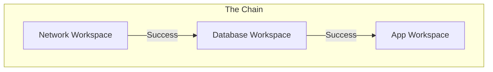

# Workspace Management

A TFC Workspace is more than just a state file. It's the central hub for your infrastructure environment.

## 1. Workspace Types

| Type | Trigger | Description |
| :--- | :--- | :--- |
| **VCS-Driven** | Git Push | The standard GitOps approach. Best for automated CI/CD. |
| **CLI-Driven** | `terraform apply` | Best for local development and debugging (State is remote, command is local). |
| **API-Driven** | `curl` / `tfe` | Best for automated provisioning of ephemeral environments (e.g., feature preview envs). |

---

## 2. State Management (The Time Machine)

TFC keeps a history of every state file version.

*   **View**: See the exact JSON of the state at any point in time.
*   **Download**: Get the raw `.tfstate` file for local analysis.
*   **Locking**: See who is currently running a plan and holding the lock.
*   **Force Unlock**: Admin override to break locks (use with caution!).

### Rolling Back
If you deployed a bad config, you **cannot** just "restore" an old state file to fix the cloud.
*   **Why**: Because the Cloud (Reality) has changed. Rolling back the state file just desynchronizes Terraform from Reality.
*   **Correct Way**: Revert the Git Commit and run `terraform apply`.
*   **Rare Exception**: If you deleted the state file by accident but the cloud resources are fine, you *can* restore an old state file to "re-adopt" them.

---

## 3. Run Triggers (Chaining)

Infrastructure is often layered.
**Network Workspace** -> **Database Workspace** -> **App Workspace**.

If you update the Network (e.g., change Subnet IDs), the App needs to know.
**Run Triggers** automate this.

*   **Configuration**: Go to **App Workspace** -> **Settings** -> **Run Triggers** -> Select **Database Workspace**.

---

## 4. Notifications

Don't sit watching the console. TFC sends alerts.
*   **Triggers**: "Run Creating", "Run Errored", "Run Needs Approval".
*   **Destinations**: Slack (Webhook), Email, Microsoft Teams.

---

## 5. Real-Life Scenarios

### Scenario 1: "The Bad Release"
**Problem**: Deployment v2.0 failed and corrupted the state file.
**Solution**: The team examined the **State History** tab. They identified the last "healthy" state (v1.9). They verified cloud resources matched v1.9 manually, then restored that state version to unblock the pipeline.

### Scenario 2: "The Cascading Update"
**Problem**: The Network team updated the VPC CIDR. They applied their workspace.
**Consequence**: The application teams didn't know. Their next deploy failed because they were using old Subnet IDs.
**Fix**: Configured **Run Triggers**. Now, when Network finishes applying, it automatically queues a "Plan" in the Application workspace to verify compatibility immediately.

### Scenario 3: "SlackOps"
**Problem**: Approvals were slow because managers had to log in to TFC to check for pending runs.
**Fix**: Integrated **Slack Notifications**. Now, "Run Needs Approval" alerts pop up in the `#devops-approvals` channel with a direct link to the run.

---

## 6. ❓ Interview Questions

1.  **Can you share state between workspaces?**
    *   **Answer**: Yes, using `terraform_remote_state` data source. Workspace A can read outputs from Workspace B.

2.  **What happens to the state if a run errors?**
    *   **Answer**: TFC saves the "partial state" (whatever was successfully created). It does *not* revert to the pre-run state.

3.  **How do you delete a workspace?**
    *   **Answer**: Settings -> Destruction and Deletion. Be careful: You usually want to "Queue Destroy Plan" first to delete the cloud resources, *then* delete the workspace object.

4.  **Are environment variables encrypted?**
    *   **Answer**: Yes, if you mark them as "Sensitive". They are write-only in the UI.

5.  **What is "Auto-Apply"?**
    *   **Answer**: A setting that skips the "Human Approval" gate after a successful plan.

6.  **Can I use the same SSH key for multiple workspaces?**
    *   **Answer**: Yes, stored in the GitHub/VCS connection settings or as an SSH Key object in TFC.

7.  **Limit on State Versions?**
    *   **Answer**: TFC stores historical state versions indefinitely by default (within reasonable limits), allowing deep auditing.

8.  **What is "Structured Run Output"?**
    *   **Answer**: A new UI view that groups logs by resource, making it easier to read than the raw CLI stream.

9.  **How do you migrate a workspace from one Org to another?**
    *   **Answer**: You can't directly "move" it. You must create a new workspace in the destination Org and migrate the state (using `terraform init -migrate-state`) and variables.

10. **Does deleting a workspace notify the owner?**
    *   **Answer**: Not by default. You should have notifications configured.

---

## 7. 🧠 Knowledge Check (Quiz)

### Workspace Basics
1.  **A Workspace contains:**
    *   [x] State, Variables, and Run History.
    *   [ ] Just code.

2.  **To delete cloud resources, you should:**
    *   [x] Queue a Destroy Plan.
    *   [ ] Delete the workspace settings.

3.  **Run Triggers cause:**
    *   [x] A run in Workspace B when Workspace A applies successfully.
    *   [ ] A git merge.

### State & Notifications
4.  **Can you download the state file?**
    *   [x] Yes, from the States tab.
    *   [ ] No, it's locked.

5.  **If you restore an old state version:**
    *   [x] You risk drift (desync) with the real cloud resources.
    *   [ ] It automatically reverts cloud changes.

6.  **Notifications can be sent to:**
    *   [x] Slack, Email, Webhooks.
    *   [ ] SMS.

7.  **"Sensitive" variables are:**
    *   [x] Hidden in the UI and encrypted.
    *   [ ] Visible to admins.

### Scenarios
8.  **If a run hangs indefinitely:**
    *   [x] An admin can "Cancel Run" or Force Unlock.
    *   [ ] You must delete the workspace.

9.  **Chaining workspaces (Run Triggers) helps with:**
    *   [x] Dependency management.
    *   [ ] Cost saving.

10. **The "Queue Destroy" button:**
    *   [x] Runs `terraform destroy`.
    *   [ ] Deletes the workspace.

### General
11. **Do workspaces cost money?**
    *   [x] No, they are free entities (features like Sentinel cost money).
    *   [ ] Yes, per workspace billing.

12. **Can you filter which workspaces a user can see?**
    *   [x] Yes, via Team permissions.
    *   [ ] No, all opens.

13. **Auto-Apply is dangerous for:**
    *   [x] Production environments.
    *   [ ] Dev environments.

14. **Structured Run Output helps:**
    *   [x] Debugging specific resources.
    *   [ ] Speed.

15. **Migrating state between workspaces requires:**
    *   [x] CLI intervention (`terraform init`).
    *   [ ] Just a UI button.
