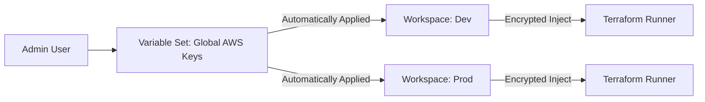

# Variables and Secret Management

HCP Terraform provides a secure, centralized way to manage your configuration values and sensitive credentials.

## Types of Variables
1.  **Terraform Variables**: Values for `variable "name" {}` in your `.tf` files.
2.  **Environment Variables**: OS-level variables (e.g., `AWS_ACCESS_KEY_ID`, `CONFIRM_APPLY`).

## The "Sensitive" Flag
Any variable can be marked as **Sensitive**.
- It is hidden in the UI (displays as `********`).
- It is masked in the run logs.
- It is encrypted at rest in the TFC database.
- **CRITICAL**: Once saved as sensitive, it cannot be read back by humans, only by the Terraform runner.

## Variable Sets (Organization Level)
Instead of adding your AWS keys to 20 different workspaces, create a **Variable Set** in the Organization settings.
- **Benefit**: Update the keys in *one* place, and all 20 workspaces get the update.
- **Scope**: You can apply a Variable Set to "All Workspaces" or "Selected Workspaces."

## Mermaid Diagram: Secret Flow

---

## 🏗️ Real-Life Scenario: The Credential Rotation Day
**Problem**: The security team rotates the AWS root keys. You have 100 Terraform workspaces.
**Without Variable Sets**: You have to log into TFC and manually update 100 workspaces (200 variables).
**With Variable Sets**: You update the one "Global AWS" Variable Set. 
**Outcome**: Rotation finished in 30 seconds instead of 4 hours.

---

## ❓ Interview Questions
1.  **What happens if you try to view a "Sensitive" variable in the TFC UI?**
    *   *Answer*: You can't. The UI only allows you to overwrite the value, not read the existing one.
2.  **What is the difference between a variable defined in a workspace and one in a Variable Set?**
    *   *Answer*: A workspace variable is local to that specific environment. A Variable Set is defined at the Organization level and can be shared across many workspaces.

---

## 🧠 Quiz Snippet (5/50+)
1.  **Which box should you check for a database password in the UI?** (Sensitive)
2.  **True/False: Sensitive variables are visible in the plain-text state file.** (No, TFC handles them securely)
3.  **What is the best way to share AWS keys across multiple projects?** (Variable Sets)
4.  **Can you convert a normal variable to sensitive later?** (Yes)
5.  **Which type of variable is used for `TFE_TOKEN` or `AWS_SECRET_ACCESS_KEY`?** (Environment Variables)
