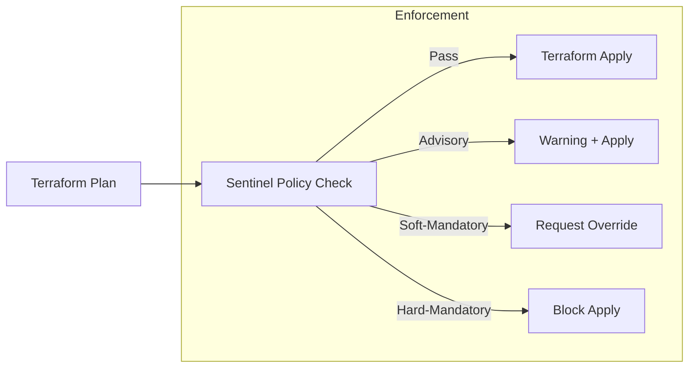

# Policy as Code (Sentinel)

Sentinel is HashiCorp's proprietary functional policy-as-code framework, designed specifically for fine-grained infrastructure governance.

## Why Sentinel?
- **Guardrails**: Prevent developers from making expensive or insecure mistakes (e.g., "No unencrypted S3 buckets").
- **Consistency**: Enforce company tagging standards globally.
- **Enforcement Levels**:
  - **Advisory**: Warning only.
  - **Soft-Mandatory**: Fails the run, but a teammate with permissions can "Override" it.
  - **Hard-Mandatory**: Fails the run completely. No overrides allowed.

## The Sentinel Workflow
Sentinel policies run **between** the `plan` and the `apply`.
1.  **Plan**: Terraform calculates changes.
2.  **Policy Check**: Sentinel inspects the plan data.
3.  **Apply**: If policy passes, infrastructure is deployed.

## Mermaid Diagram: Sentinel Lifecycle

---

## 🏗️ Real-Life Scenario: The Instance Gatekeeper
**Problem**: An organization is spending 30% more on AWS than budgeted because interns keep accidentally launching `p3.16xlarge` GPU instances for testing.
**Solution**: Deploy a Sentinel policy that restricts the `instance_type` attribute of all `aws_instance` resources to `t3.micro` or `t3.small`.
**Result**: The interns' plans are automatically blocked in the TFC UI with a message: "Error: Instance type not allowed by budget policy."

---

## ❓ Interview Questions
1.  **What are the three enforcement levels in Sentinel?**
    *   *Answer*: Advisory, Soft-Mandatory, and Hard-Mandatory.
2.  **When does Sentinel run?**
    *   *Answer*: It runs after a `plan` is successfully generated but before the `apply` is allowed to start.

---

## 🧠 Quiz Snippet (5/50+)
1.  **Is Sentinel an open-source tool?** (No, it is a HashiCorp proprietary feature)
2.  **Which enforcement level allows a manager to approve a policy violation?** (Soft-Mandatory)
3.  **True/False: Sentinel can inspect the values of variables.** (True)
4.  **What language is Sentinel written in?** (Sentinel policy language)
5.  **What is the "Hard-Mandatory" level used for?** (Critical security or compliance rules that should NEVER be broken)
