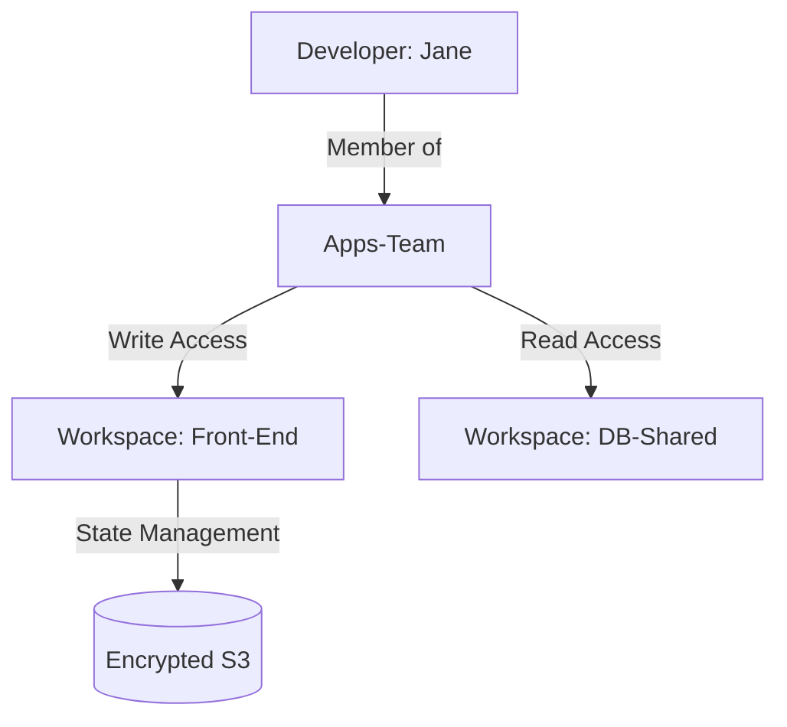

# Governance and RBAC

Role-Based Access Control (RBAC) ensures that people only have access to the infrastructure they need to manage.

## Hierarchy of Access
1.  **Organization Admins**: Full control over everything (Settings, Teams, Workspaces).
2.  **Teams**: A group of users. Permissions are granted to the *Team*, not the individual User.
3.  **Workspace Permissions**:
    - **Read**: View state and run history.
    - **Plan**: Trigger plans but not applies.
    - **Write**: Trigger applies and modify variables.
    - **Admin**: Full control over a specific workspace's settings.

## Team Management
- **Manual**: Add users via email.
- **SSO (Enterprise)**: Connect TFC to Okta, Active Directory, or Google via SAML. When a user is added to the "Cloud-Admins" group in Okta, they automatically get the right permissions in TFC.

## Mermaid Diagram: Permissions Model

---

## 🏗️ Real-Life Scenario: The Junior's Mistake
**Problem**: A new junior engineer joins the company. On their first day, they accidentally trigger a `destroy` on the production database.
**Solution**: The company uses Teams. Jane is added to the "Junior-Devs" team, which only has `Read` access to Production and `Write` access to Dev.
**Outcome**: Jane's attempt to run an apply in Production is blocked by the UI: "Error: You do not have permission to trigger an apply in this workspace."

---

## ❓ Interview Questions
1.  **Why is it better to assign permissions to Teams rather than Users?**
    *   *Answer*: It is much easier to manage. If someone leaves the company or changes departments, you just move them to a different team instead of updating 100 individual workspaces.
2.  **What is a "Team Token"?**
    *   *Answer*: It is an API token used by automation (like a CI/CD runner) to act as a member of a specific Team, avoiding the use of personal user accounts.

---

## 🧠 Quiz Snippet (5/50+)
1.  **Which permission allows triggered plans but NO applies?** (Plan)
2.  **True/False: Organization Admins can see every sensitive variable.** (False - no one can see them once saved)
3.  **What is the best way to handle hundreds of users in TFC?** (SSO/SAML integration)
4.  **Can a user belong to multiple teams?** (Yes)
5.  **Which tab in TFC shows who triggered a specific run?** (Run History / Runs)
