# Terraform Cloud (HCP Terraform) 🚀

Terraform Cloud (now part of **HashiCorp Cloud Platform - HCP Terraform**) is a managed service that provides a collaborative environment for teams to use Terraform together. It manages Terraform runs in a consistent, reliable environment and includes features for state management, access control, and policy enforcement.

---

## 1. Key Concepts

### 🏢 Organizations
The top-level container in Terraform Cloud. An organization represents a company or a large team and contains workspaces, teams, and settings.

### 🍱 Workspaces
Unlike the open-source CLI workspaces (which are just separate state files), Terraform Cloud **Workspaces** contain everything needed to manage a specific set of infrastructure:
- **State File**: Managed automatically by HCP Terraform.
- **Configuration**: Often linked to a VCS repository.
- **Variables**: Environment and Terraform variables (including secrets).
- **Run History**: A complete audit trail of every plan and apply.

### 👥 Teams & Governance
- **RBAC**: Define who can read, write, or approve runs.
- **Policy as Code**: Use Sentinel or OPA to enforce security and compliance before infrastructure is deployed.

---

## 2. Core Workflows

Terraform Cloud supports three main ways to manage infrastructure:

### 🔄 VCS-Driven Workflow (Recommended)
The "GitOps" approach. HCP Terraform integrates with your Version Control System (GitHub, GitLab, Bitbucket, Azure DevOps).
1. **Push Code**: You push a change or open a Pull Request.
2. **Speculative Plan**: HCP Terraform runs a `plan` automatically and adds a status check to the PR.
3. **Merge**: Once merged, HCP Terraform triggers an `apply` (can be automated or require manual approval).

### ⌨️ CLI-Driven Workflow
Use the Terraform CLI you know, but with remote execution.
- Local `terraform plan` and `terraform apply` commands send the configuration to HCP Terraform.
- The plan runs on HashiCorp's infrastructure, and the output is streamed back to your terminal.
- State is automatically stored in HCP Terraform.

### 🛠️ API-Driven Workflow
For advanced automation and CI/CD pipelines (e.g., Jenkins, GitHub Actions). You use the HCP Terraform API to upload configuration versions and trigger runs.

---

## 3. Policy as Code (Sentinel & OPA)

Governance is a first-class citizen in HCP Terraform.

| Feature | Description |
| :--- | :--- |
| **Sentinel** | HashiCorp's proprietary functional policy language. Fine-grained control with enforcement levels (Advisory, Soft-Mandatory, Hard-Mandatory). |
| **OPA (Rego)** | Industry-standard Open Policy Agent support. Use the same policies across your entire stack. |

**Example Sentinel Policy:**
```hcl
# Restrict AWS instance types to T2.micro
import "tfplan/v2" as tfplan

all_instances = filter tfplan.resource_changes as _, rc {
    rc.type is "aws_instance" and (rc.mode is "managed")
}

allowed_types = ["t2.micro"]

main = rule {
    all_allowed = all(all_instances) as _, instance {
        instance.change.after.instance_type in allowed_types
    }
}
```

---

## 4. Advanced Features

### 📦 Private Module Registry
A central place for your organization to share and version internal Terraform modules. It includes a provider registry and support for "no-code" provisioning.

### 💰 Cost Estimation
Uses cloud provider pricing data to estimate the monthly cost of your infrastructure changes *before* you apply them.

### 🔍 Drift Detection
HCP Terraform can periodically check your infrastructure to see if it still matches your code. If someone manually changes a resource in the AWS Console, you'll get a "Drifted" notification.

### 🔒 Variable Sets
Define a set of variables (like cloud credentials) once and apply them to multiple workspaces across your organization.

---

## 5. Getting Started: Step-by-Step

Setting up HCP Terraform is straightforward, but doing it correctly ensures a scalable and secure foundation.

### Step 1: Account & Organization
1.  **Sign Up**: Go to [app.terraform.io](https://app.terraform.io) and create a free account.
2.  **Verify Email**: Complete the verification to activate your account.
3.  **Create Organization**: Upon first login, you'll be prompted to create an **Organization**.
    - *Tip*: Use a name that represents your company or broad team (e.g., `acme-corp-devops`).

### Step 2: Connect Your Version Control System (VCS)
To enable the VCS-driven workflow, you must link your git provider.
1.  Navigate to **Settings** > **Providers** > **VCS Providers**.
2.  Click **Add VCS Provider** and choose your platform (GitHub, GitLab, Bitbucket, etc.).
3.  Follow the OAuth flow to authorize Terraform Cloud to access your repositories.
    - *Note*: You can restrict access to specific repositories later.

### Step 3: Create Your First Workspace
1.  Click **Workspaces** in the top navigation and then **Create Workspace**.
2.  Choose **Version Control Workflow**.
3.  Select your VCS provider and then the repository containing your Terraform code.
4.  **Configure Settings**: Give the workspace a name (e.g., `aws-vpc-staging`) and click **Create**.

### Step 4: Configure Variables
Your Terraform code needs credentials and parameters to run.
1.  In your workspace, go to the **Variables** tab.
2.  **Terraform Variables**: Add any variables defined in your `.tf` files (e.g., `region = "us-east-1"`).
3.  **Environment Variables**: This is where you store credentials for your cloud provider.
    - Click **Add Variable** > **Environment Variable**.
    - Key: `AWS_ACCESS_KEY_ID`, Value: `your-key-id`.
    - Key: `AWS_SECRET_ACCESS_KEY`, Value: `your-secret-key`.
    - **CRITICAL**: Check the **Sensitive** box for secrets to ensure they are encrypted and hidden from the UI/logs.

### Step 5: Start Your First Run
1.  **Speculative Plan**: Push a change to a branch and open a Pull Request. Terraform Cloud will automatically start a `plan`.
2.  **Manual Start**: In the UI, click **New Run** > **Start Plan and Apply**.
3.  **Review & Confirm**: Examine the output. If it looks correct, click **Confirm & Apply**.

### Step 6: Post-Setup Best Practices
- **Enable Notifications**: Link Slack or Email under **Settings** > **Notifications** to stay updated on run statuses.
- **Set Up Variable Sets**: If you have multiple workspaces using the same AWS keys, create a **Variable Set** in the Organization settings to share them instead of re-entering them manually for each workspace.

---

## 🏗️ Terraform Cloud VCS Workflow

The most powerful way to use Terraform Cloud is through its VCS integration, enabling a true GitOps lifecycle.

```mermaid
graph LR
    Dev[Developer] -- "1. Git Push (PR)" --> VCS[GitHub / GitLab]
    VCS -- "2. Webhook Trigger" --> TFC[HCP Terraform]
    TFC -- "3. Speculative Plan" --> PR_Check[PR status: Passed/Failed]
    PR_Check -- "4. Merge to Main" --> TFC_Apply[TFC: Trigger Apply]
    TFC_Apply -- "5. Provision" --> Cloud[AWS / Azure]
    
    style TFC fill:#f9f,stroke:#333,stroke-width:2px
    style VCS fill:#bbf,stroke:#333,stroke-width:2px
```



---

## ❓ Interview Preparation

### Top 5 Terraform Cloud Interview Questions
1. **How is a Terraform Cloud "Workspace" different from a CLI "Workspace"?** (CLI workspaces are just different state files in the same backend; TFC workspaces are comprehensive environments with their own state, variables, run history, and settings).
2. **What is a "Speculative Plan"?** (A plan triggered by a Pull Request that tells you what *would* happen if you merged, but doesn't allow an `apply`).
3. **What is Sentinel and why is it used?** (It is a Policy-as-Code framework used to enforce guardrails, such as "No EC2 instances larger than t3.medium" or "All S3 buckets must be encrypted").
4. **How do you handle cloud credentials in Terraform Cloud?** (By adding them as "Environment Variables" in the workspace or a global "Variable Set," and marking them as `sensitive` so they are encrypted and never shown in the UI).
5. **What is the "Private Module Registry"?** (An internal catalog where your company can publish and version its own validated Terraform modules for other teams to use).

---

## 📝 Practice Quiz

1. **Which TFC feature allows you to share variables across multiple workspaces?**
   - [ ] Variable Blocks
   - [ ] HCL Locals
   - [x] Variable Sets
   - [ ] Workspace Links

2. **What happens by default when you merge a PR into a branch connected to a TFC workspace?**
   - [ ] It deletes the state
   - [ ] It does nothing until you run a command locally
   - [x] It triggers a plan and (if configured) an automatic apply
   - [ ] It sends an email to the HashiCorp CEO

3. **True or False: Terraform Cloud stores your state file's run history.**
   - [x] True (You can see a complete list of every state change and download previous versions)
   - [ ] False

---

## 🏢 Real-Life Scenario: The Global Compliance Guardrail

**Requirement**: Your company security policy dictates that no developer should ever deploy a resource in a region outside of `us-east-1` or `us-west-2` to comply with data residency laws.

**Solution**:
1. **Policy as Code**: Write an **OPA (Rego)** or **Sentinel** policy that checks the `provider` or `region` attribute of all resources in a plan.
2. **Implementation**: Upload this policy to your Terraform Cloud organization.
3. **Enforcement**: Set the policy to `Hard-Mandatory`.
4. **The Result**: When an engineer tries to deploy a database in `eu-central-1` (Germany), the Terraform Cloud run will automatically fail and block the deployment before it ever happens. The engineer gets a clear error message explaining the compliance violation.

---

## 🗺️ Learning Path
- [Main Terraform Docs](../README.md)
- [State Management & Backends](../State-Management/terraform-state-guide.md)

---

This comprehensive guide to Terraform Cloud provides the foundation for secure, collaborative, and compliant infrastructure management.
