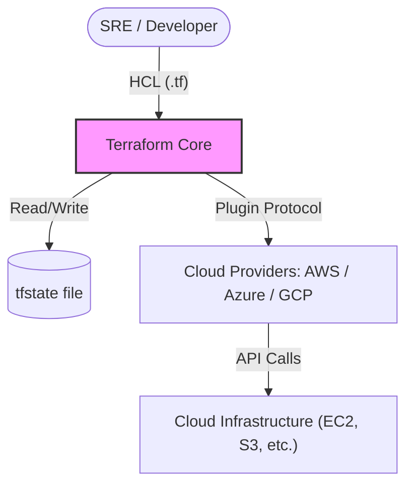

# Terraform: Infrastructure as Code (IaC)

Terraform is an open-source tool that allows you to define both cloud and on-premise resources in human-readable configuration files that you can version, reuse, and share.

---

## 🏗️ 1. HCL & State Mechanics

Terraform uses **HashiCorp Configuration Language (HCL)** to describe resources. It maintains a `terraform.tfstate` file which is the "Source of Truth" for what is actually deployed in your cloud provider.

### 🏛️ High-Level Architecture



---

## 🛠️ 2. Essential Terraform Commands

### 🚦 The Core Workflow
*When to use: The standard cycle for creating and updating infrastructure.*

```bash
# Initialize the project (Downloads providers)
terraform init

# Preview changes before they happen
terraform plan

# Deploy the infrastructure
terraform apply

# Destroy the infrastructure (Use with caution!)
terraform destroy
```

### 🔍 Inspection and Management
*When to use: Debugging and managing existing state.*

```bash
# List all resources currently in the state file
terraform state list

# Show human-readable output of current state
terraform show

# Import existing resources into Terraform management
terraform import <resource_type>.<name> <id>

# Format code to follow HCL standards
terraform fmt
```

---

## 🗺️ The Terraform Learning Path

Follow these modules in order to master Terraform:

1.  **[01-Fundamentals](./01-Fundamentals/Terraform%20Fundamentals%20Guide.md)**: HCL basics, Providers, and your first resource.
2.  **[02-HCL-and-IaC](./02-HCL-and-IaC/terraform-iac-guide.md)**: Deep dive into the mechanics of IaC and advanced HCL.
3.  **[03-State-Management](Terraform%20State%20Management%20Guide.md)**: Remote backends, locking, and drift.
4.  **[04-Modules](./04-Modules/terraform-modules-guide.md)**: Reusable infrastructure patterns.
5.  **[05-Best-Practices](./05-Best-Practices/README.md)**: Security, formatting, and performance.
6.  **[06-Terraform-Cloud](./06-Terraform-Cloud/README.md)**: Enterprise collaboration.
7.  **[07-Interview-Questions-and-Quizzes](./07-Interview-Questions-and-Quizzes/README.md)**: Test your knowledge and prepare for jobs.
8.  **[08-Real-Life-Scenarios](./08-Real-Life-Scenarios/README.md)**: Practical troubleshooting and architecture challenges.
9.  **[09-Sample-Project](./09-Sample-Project/)**: A hands-on deployment example.
10. **[10-Notes](./10-Notes/)**: Extra tips and quick references.
11. **[📺 YouTube Lessons](./Youtube_Lessons.md)**: Curated video tutorials for visual learning.

---

## 💡 Terraform Best Practices

- **Never Commit State Files**: Keep `terraform.tfstate` out of Git. Use **Remote Backends** (S3, Azure Blob, Terraform Cloud) for team collaboration.
- **Dry (Don't Repeat Yourself)**: Use **Modules** to package common infrastructure patterns.
- **Variable Documentation**: Always provide `description` and `type` for your variables.
- **Lock Your Versions**: Use a `versions.tf` file to lock provider and Terraform versions.
- **Sensitivity Matters**: Use the `sensitive = true` flag for variables containing passwords or keys to prevent them from appearing in logs.

---

## ✅ Knowledge Check
- [x] Understand HCL syntax (Resources, Variables, Outputs)
- [x] Master the Init-Plan-Apply-Destroy workflow
- [x] Configure Remote Backends (e.g., S3 with DynamoDB locking)
- [x] Build and use reusable Modules
- [x] Manage secrets with `tfvars` and Environment Variables
- [x] Pass 20+ Quiz Questions in the Assessment folder

## 🏆 Related Certifications

- **HashiCorp Certified: Terraform Associate (003)**: Validates your basic infrastructure automation skills and your understanding of Terraform.

---

## 🔗 Next Steps
- **[Ansible Integration](../04-Ansible/)** - Configure the servers Terraform deploys.
- **[Advanced AWS Projects](./Aws_Projects/)** - Build production-grade VPCs.

---
*Infrastructure is code. Treat it with the same respect as your application logic.*