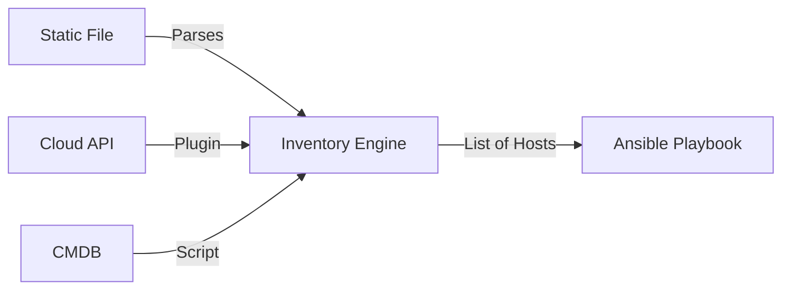

# 2. Inventory Architecture

The **Inventory** is Ansible's "Source of Truth". If a server isn't in the inventory, Ansible doesn't know it exists.

## Static vs. Dynamic



### Static Inventory (`hosts.ini` / `hosts.yml`)
Simple text files. Great for small, fixed environments (e.g., On-Prem data center with static IPs).

### Dynamic Inventory
Python code (Plugins) that queries external APIs. Essential for Cloud.
*   **AWS Plugin**: "Give me all EC2 instances with tag `Env=Prod`".
*   **Azure Plugin**: "List all VMs in Resource Group `RG-Web`".

## Inventory Variables
You can attach variables directly to hosts in the inventory (though `group_vars` is cleaner).

```ini
[webservers]
web1 ansible_host=10.0.0.1 http_port=80
web2 ansible_host=10.0.0.2 http_port=8080
```

## Real-Life Scenarios

### Scenario 1: "The Hybrid Cloud"
**Problem**: A company had legacy servers in a closet and new servers in AWS.
**Solution**: Ansible allows *multiple* inventory sources.
*   `ansible-playbook -i legacy_hosts.ini -i aws_ec2.yml site.yml`.
*   Ansible merges them into one unified list of targets.

### Scenario 2: "The Typo"
**Problem**: Admin manually added `web-04` to the static file but typed the IP wrong. Deployment failed.
**Solution**: Switched to Dynamic Inventory.
*   Now Ansible asks AWS "What is the IP of web-04?" right before running. It's always correct.

## ❓ Interview Questions

1.  **Can I have multiple inventory files?**
    *   **Answer**: Yes. You can point the `-i` flag to a *directory*, and Ansible will read every file inside it (combining static and dynamic sources).

2.  **What is the `localhost` inventory?**
    *   **Answer**: An implicit host. You don't need to define it. It refers to the Control Node itself.

## 🧠 Quiz

1.  **Which inventory type is best for Auto-Scaling Groups?**
    *   [x] Dynamic Inventory.
    *   [ ] Static Inventory.

2.  **Does Ansible support JSON inventory?**
    *   **Answer**: Yes. Dynamic inventory scripts output JSON.

3.  **If a host is in two groups, which variables does it get?**
    *   [x] Both (merged).
    *   [ ] Only the first one.
