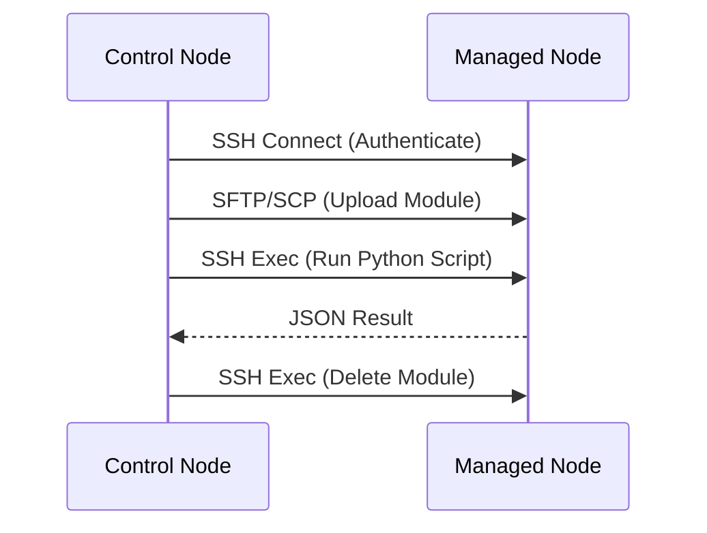

# 3. Transport Protocols

Ansible is "Agentless" because it uses the native transport protocols of the OS.

## SSH (Linux/Unix)
Ansible uses the standard **OpenSSH** client. It doesn't write its own crypto.
*   **Authentication**: Uses your existing SSH keys (`~/.ssh/id_rsa`).
*   **Config**: Respects `~/.ssh/config` (ProxyJump, Bastion hosts).

### The Connection Handshake

### SSH Pipelining
By default, Ansible opens multiple SSH connections for one task (Connect, Upload, Run, delete).
**Pipelining** reduces this to one connection.
*   **Enable**: `pipelining = True` in `ansible.cfg`.
*   **Benefit**: Massive speed boost (2x-5x faster).
*   **Requirement**: `requiretty` must be disabled in `/etc/sudoers` on the remote.

## WinRM (Windows)
Windows doesn't support SSH historically. Ansible uses **WinRM** (Windows Remote Management).
*   It's a SOAP-based protocol over HTTP/HTTPS (Port 5985/5986).
*   Requires `pywinrm` library on the Control Node.

## Real-Life Scenarios

### Scenario 1: "The Slow Connection"
**Problem**: Managing servers in Tokyo from New York. Latency made a 10-task playbook take 2 minutes.
**Analysis**: Each task opened 3 SSH connections. 30 connections * 200ms latency = 6 seconds just in overhead.
**Solution**: Enabled **SSH Pipelining**.
*   Connections reduced. Playbook time dropped to 30 seconds.

### Scenario 2: "The Bastion Host"
**Problem**: Database servers are in a private subnet. No direct SSH access.
**Solution**: Used `ProxyCommand` in `ssh_config`.
*   Ansible automatically jumps through the Bastion host transparently.

## ❓ Interview Questions

1.  **What is ControlPersist?**
    *   **Answer**: An OpenSSH feature that keeps the SSH socket open for a few seconds/minutes after a command. Ansible uses this to avoid re-authenticating for every single task in a playbook.

2.  **Why would you use `paramiko` instead of `ssh`?**
    *   **Answer**: `paramiko` is a Python implementation of SSH. It's slower but useful if the Control Node uses an ancient OS with an old OpenSSH client.

## 🧠 Quiz

1.  **Which protocol does Ansible use for Windows?**
    *   [x] WinRM.
    *   [ ] RDP.

2.  **SSH Pipelining improves performance by:**
    *   [x] Reducing the number of TCP connections.
    *   [ ] Downloading faster.

3.  **For Linux, Ansible requires an agent:**
    *   [ ] Yes.
    *   [x] No.
