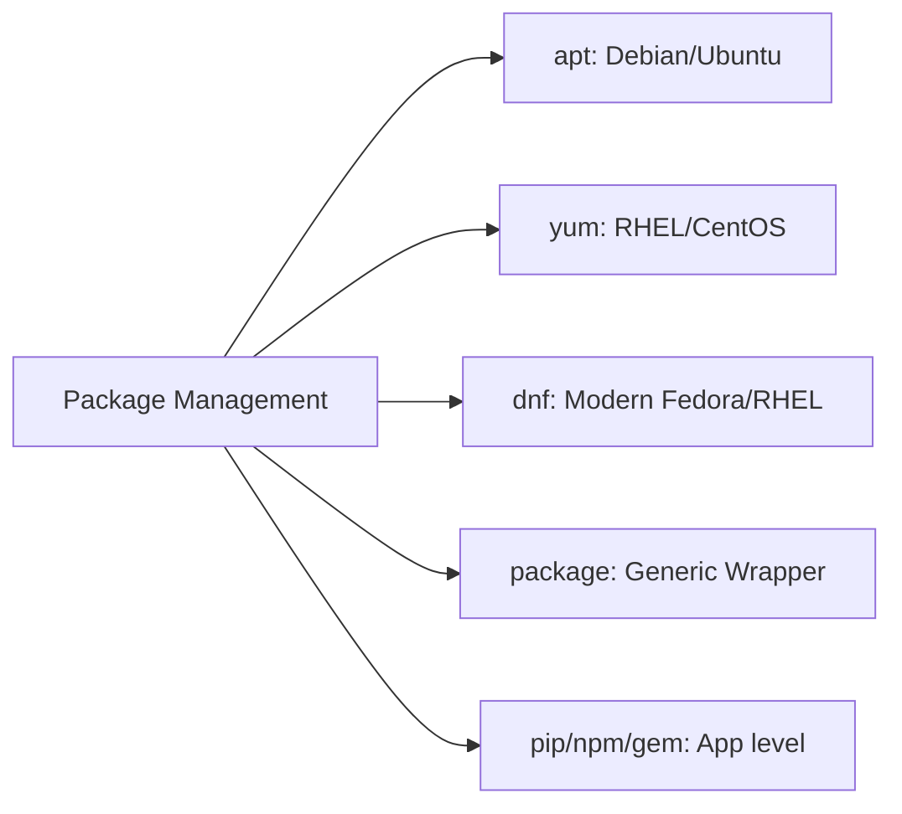

# 02. Package Management Modules

Package management is at the heart of OS configuration. Ansible provides modules for native OS package managers and application-level libraries.

## Core Modules Overview



### 1. `apt` - Debian/Ubuntu
Standard module for Debian-based systems.
```yaml
- name: Update cache and install Nginx
  apt:
    name: nginx
    state: present
    update_cache: yes
```

### 2. `yum` / `dnf` - RHEL/CentOS
Standard for RedHat-based systems.
```yaml
- name: Install Apache
  yum:
    name: httpd
    state: latest
```

### 3. `package` - The Generic Wrapper
Auto-detects the underlying package manager. Best for heterogeneous fleets.
```yaml
- name: Install Git on any OS
  package:
    name: git
    state: present
```

### 4. `pip` - Python Package Manager
Installs Python libraries, supports virtual environments.
```yaml
- name: Install Flask in venv
  pip:
    name: Flask
    virtualenv: /opt/my_app/venv
```

---

## Real-Life Scenarios

### Scenario 1: "The Unified Fleet"
**Problem**: An environment had 50 Ubuntu nodes and 50 CentOS nodes. Managing two different task lists for updates was tedious.
**Solution**: Switched to the `package` module. A single task now handles installation across the entire environment regardless of the OS flavor.

### Scenario 2: "Dependency Lock"
**Problem**: A Python app broke because it was using a globally installed `requests` library that was updated by the OS.
**Solution**: Used the `pip` module with the `virtualenv` parameter to isolate the application's dependencies.

### Scenario 3: "Security Patching"
**Problem**: 100 servers needed a critical OpenSSL update.
**Solution**: Used `yum` or `apt` with `state: latest` across the inventory. Ansible ensured every node was running the newest patched version.

---

## ❓ Interview Questions

1. **What is the benefit of using `package` instead of `apt`?**
    - Platform independence; it works on any OS supported by Ansible.
2. **How do you install multiple packages in one task?**
    - Pass a list to the `name` parameter: `name: ["git", "curl", "vim"]`.
3. **What does `update_cache: yes` do?**
    - It runs the equivalent of `apt update` or `yum makecache` before trying to install.

---

## 🧠 Quiz

1. **Which module is specific to Python libraries?**
    - [x] `pip`
    - [ ] `pypi`
2. **`state: present` means:**
    - [x] Ensure it is installed (do nothing if already there).
    - [ ] Force a reinstall.
3. **Module for RedHat 8 system:**
    - [x] `dnf`
    - [ ] `apt`
