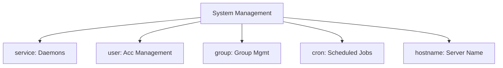

# 03. System Modules

System modules allow you to manage the core configuration of the OS, including services, user accounts, and scheduled jobs.

## Core Modules Overview



### 1. `service` - Daemon Management
Starts, stops, restarts services and ensures they start on boot.
```yaml
- name: Ensure Apache is running
  service:
    name: httpd
    state: started
    enabled: yes
```

### 2. `user` - Account Administration
Creates users, sets passwords, and handles group membership.
```yaml
- name: Create developer user
  user:
    name: alice
    shell: /bin/bash
    groups: sudo,developers
    append: yes
```

### 3. `cron` - Scheduled Tasks
Manages crontab entries without manual editing.
```yaml
- name: Nightly database backup
  cron:
    name: "db_backup"
    minute: "0"
    hour: "2"
    job: "/usr/local/bin/backup.sh"
```

### 4. `hostname` - Identity Management
Sets the system hostname.
```yaml
- name: Set server hostname
  hostname:
    name: web-server-01
```

---

## Real-Life Scenarios

### Scenario 1: "The Zombie Process"
**Problem**: A background worker process hung and needed a clean restart every time the code was updated.
**Solution**: Used a `service` task with `state: restarted` inside a handler, ensuring the process recycled only when a change was detected.

### Scenario 2: "Onboarding Automation"
**Problem**: Adding a new developer meant manually creating accounts and SSH keys across 50 servers.
**Solution**: Used the `user` module with a list of usernames. Ansible ensured every user was present, had the correct shell, and belonged to the right groups in seconds.

### Scenario 3: "Ghost Cron Jobs"
**Problem**: Old servers had random cron jobs running from employees who had long since left.
**Solution**: Used the `cron` module with `state: absent` to clean up specific jobs by name, ensuring local crontabs were standardized.

---

## ❓ Interview Questions

1. **How do you make a service start on boot?**
    - Set the `enabled` parameter to `yes`.
2. **What does `append: yes` do in the `user` module?**
    - It adds the user to the specified groups without removing them from their existing groups.
3. **Difference between `service` and `systemd` modules?**
    - `service` is a generic wrapper; `systemd` is specific to systemd and allows for features like `daemon_reload`.

---

## 🧠 Quiz

1. **Module for managing scheduled tasks:**
    - [x] `cron`
    - [ ] `schedule`
2. **To delete a user account:**
    - [x] Use `user` with `state: absent`
    - [ ] Use `remove_user`
3. **If `state: started` and service is already running:**
    - [x] Ansible reports "OK" (no change).
    - [ ] Ansible restarts the service.
