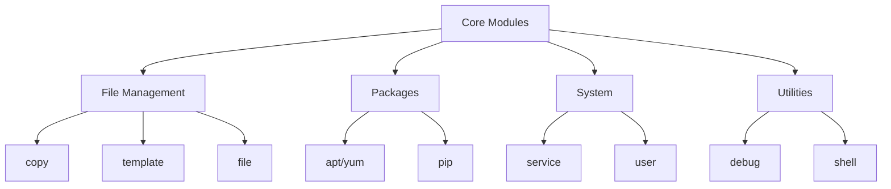

# Core Modules

Ansible ships with thousands of modules, but you will spend 90% of your time using these "Core" modules.

## 1. Module Categories



---

## 2. File Management

### `copy` vs `template`
*   **copy**: Static files. "Take this file `foo.conf` and put it on the server."
*   **template**: Dynamic files. "Take this `foo.j2`, inject variables (IP address, hostname), and save as `foo.conf`."

### `file`
Manages file attributes (permissions, ownership) and creates directories/symlinks.
```yaml
- name: Create directory
  file:
    path: /var/www/html
    state: directory
    owner: www-data
    mode: '0755'
```

### `lineinfile`
Edits a single line in an existing file. Perfect for `sshd_config`.
```yaml
- name: Disable Root Login
  lineinfile:
    path: /etc/ssh/sshd_config
    regexp: '^PermitRootLogin'
    line: 'PermitRootLogin no'
    state: present
    notify: Restart SSH
```

---

## 3. Package Management

*   **`apt` / `yum` / `dnf`**: OS-specific package managers.
*   **`package`**: Generic module. Auto-detects the OS manager. Good for mixed environments (Ubuntu + CentOS).
*   **`pip`**: Installs Python libraries (e.g., `requests`, `boto3`).

```yaml
- name: Install Git (Generic)
  package:
    name: git
    state: present
```

---

## 4. System & Utilities

### `service`
Manage daemons (Start, Stop, Restart, Enable on boot).
```yaml
- name: Start Nginx
  service:
    name: nginx
    state: started
    enabled: true
```

### `command` vs `shell`
*   **`command`**: Default. Secure. No pipes/redirects.
*   **`shell`**: Use only if you need `| grep` or `> output.txt`.

### `uri`
Interacts with Web APIs. Good for "Smoke Testing" your webserver after deployment to make sure it returns 200 OK.

---

## 5. Real-Life Scenarios

### Scenario 1: "The Configuration Manager"
**Problem**: Security required `PasswordAuthentication no` on all 500 servers.
**Solution**: Used `lineinfile` with a regex.
*   Regexp `^PasswordAuthentication` matches the line even if it's commented out or set to `yes`.
*   Ansible found the line, changed it to `no`, and restarted SSHD only if changed.

### Scenario 2: "The Package Unifier"
**Problem**: The team had RHEL 7, RHEL 8, and Ubuntu 20.04. The setup script had 3 `if` statements.
**Solution**: Switched to the `package` module.
*   `package: name=htop state=present`.
*   Ansible detected `apt` on Ubuntu and `yum`/`dnf` on RHEL automatically. Code reduced by 60%.

### Scenario 3: "The Web Request"
**Problem**: Deployment claimed "Success", but Nginx was returning 502 Bad Gateway.
**Solution**: Added a verification task at the end of the playbook.
*   `uri: url=http://localhost return_content=yes status_code=200`.
*   Now the playbook fails if the site isn't *actually* working, preventing bad releases.

---

## 6. ❓ Interview Questions

1.  **Does `lineinfile` replace the whole file?**
    *   **Answer**: No, it scans for a regular expression and replaces only that line. If you need to manage the whole file, use `copy` or `template`.

2.  **Difference between `systemd` module and `service` module?**
    *   **Answer**: `service` is a high-level wrapper that works on systemd, init.d, upstart, etc. `systemd` is specific to systemd and exposes advanced features like `daemon_reload`.

3.  **How do you create a symlink?**
    *   **Answer**: Use the `file` module with `state: link`. `src` is the target, `path` is the link name.

4.  **How do you extract a tarball?**
    *   **Answer**: Use the `unarchive` module. It can unzip locally or copy-and-unzip to the remote.

5.  **When would you use `raw` module?**
    *   **Answer**: To install Python on a fresh machine (e.g., `apt install python3 -y`) so that Ansible can start using normal modules.

6.  **Can `user` module generate SSH keys?**
    *   **Answer**: Yes, `generate_ssh_key: yes` will create `.ssh/id_rsa` for that user.

7.  **What if I need to run a task only if a file exists?**
    *   **Answer**: Use `stat` to check the file, register the result, then `when: result.stat.exists`.

8.  **Does `pip` module install to a venv?**
    *   **Answer**: Yes, using the `virtualenv` parameter.

9.  **How do you fetch a file *from* the remote server?**
    *   **Answer**: Use the `fetch` module (Remote -> Control Node). `copy` goes Control -> Remote.

10. **Is `shell` module idempotent?**
    *   **Answer**: No. It runs every time unless you use `creates=/path/to/file` parameter to tell it "Skip if this file exists".

---

## 7. 🧠 Knowledge Check (Quiz)

### File Operations
1.  **To manage directories (chmod/chown):**
    *   [x] `file`.
    *   [ ] `directory`.

2.  **`template` module uses which engine?**
    *   [x] Jinja2.
    *   [ ] Go Templates.

3.  **`lineinfile` is best for:**
    *   [x] Small edits to existing config files.
    *   [ ] Writing new files from scratch.

4.  **To download a file from the internet:**
    *   [x] `get_url`.
    *   [ ] `download`.

### Packages & System
5.  **The generic package manager module is:**
    *   [x] `package`.
    *   [ ] `install`.

6.  **To enable a service on boot:**
    *   [x] `enabled: yes`.
    *   [ ] `boot: yes`.

7.  **To restart a service ONLY if config changed:**
    *   [x] Use a Handler.
    *   [ ] Use `state: restarted`.

8.  **To add a user to a specific group:**
    *   [x] `user` module with `groups` parameter.
    *   [ ] `group` module.

9.  **`cron` module manages:**
    *   [x] Scheduled jobs (crontab).
    *   [ ] System clocks.

10. **To install Python libraries:**
    *   [x] `pip`.
    *   [ ] `npm`.

### Utilities
11. **`debug` module is used for:**
    *   [x] Printing variables to stdout.
    *   [ ] Debugging Python code.

12. **`shell` vs `command` - which is safer?**
    *   [x] `command` (no shell expansion).
    *   [ ] `shell`.

13. **To interact with a REST API:**
    *   [x] `uri`.
    *   [ ] `api`.

14. **`wait_for` is useful for:**
    *   [x] Waiting for a port to open (e.g., after reboot).
    *   [ ] Pausing for 5 seconds.

15. **To unzip a file:**
    *   [x] `unarchive`.
    *   [ ] `zip`.

### General
16. **Most modules return:**
    *   [x] JSON.
    *   [ ] XML.

17. **If `get_url` downloads a file that already matches checksum:**
    *   [x] It reports "OK" (no change).
    *   [ ] It downloads it again.

18. **Can `user` module set a password?**
    *   [x] Yes, but it must be hashed.
    *   [ ] Yes, plaintext.

19. **`filesystem` module:**
    *   [x] Creates filesystems (mkfs.ext4).
    *   [ ] Checks disk space.

20. **To register the output of a module:**
    *   [x] `register: my_var`.
    *   [ ] `output: my_var`.