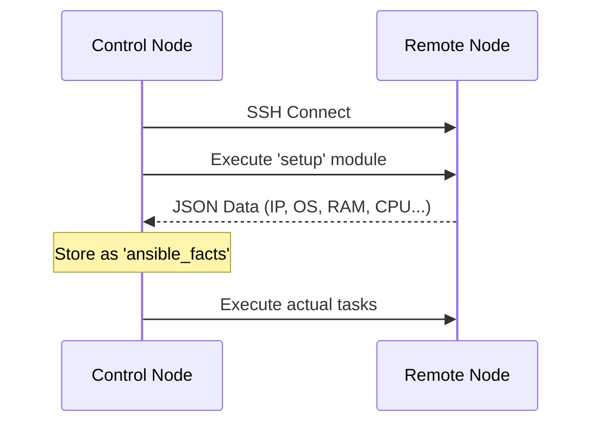

# 02. Ansible Facts

"Facts" are system-level variables that Ansible discovers about a managed node when it first connects. This process is called **Discovery** or **Gathering Facts**.

## Fact Discovery Flow

When a play starts, Ansible implicitly runs the `setup` module to gather system information.



### Common Facts
Facts are prefixed with `ansible_` (though modern Ansible allows accessing them via the `ansible_facts` dictionary).

*   **OS Info**: `ansible_os_family` (Debian, RedHat), `ansible_distribution` (Ubuntu, CentOS).
*   **Networking**: `ansible_default_ipv4.address`, `ansible_fqdn`.
*   **Hardware**: `ansible_memtotal_mb`, `ansible_processor_count`.
*   **Env**: `ansible_env` (Environment variables).

---

## Fact Caching
Gathering facts can take 1-3 seconds per host. In large environments (1000+ hosts), this adds up.
**Fact Caching** allows Ansible to store gathered facts in a file or database (Redis) so it doesn't have to re-gather them every time.

```ini
# ansible.cfg configuration
gathering = smart
fact_caching = jsonfile
fact_caching_connection = /tmp/ansible_facts
fact_caching_timeout = 86400  # 24 hours
```

---

## Real-Life Scenarios

### Scenario 1: "The Dynamic Config"
**Problem**: An Nginx load balancer needs to list the IPs of all web servers in its config.
**Solution**: Used `ansible_facts`. Each web server reports its IP via `ansible_default_ipv4.address`. The template uses this fact to build the upstream block dynamically.

### Scenario 2: "The Heterogeneous Fleet"
**Problem**: A fleet contains servers with 2GB RAM and 32GB RAM. A memory-intensive Java app must only be installed on the 32GB nodes.
**Solution**: Added a conditional:
```yaml
- name: Install Heavy App
  package: name=java-app state=present
  when: ansible_memtotal_mb >= 30000
```
Ansible automatically skips the smaller nodes based on discovered hardware facts.

---

## ❓ Interview Questions

1. **How do you manually see all facts for a host?**
    - Run `ansible <hostname> -m setup`.
2. **What module gathers facts?**
    - The `setup` module.
3. **How do you turn off fact gathering?**
    - Set `gather_facts: no` at the play level. This is useful for speeding up playbooks that don't need system info.

---

## 🧠 Quiz

1. **Facts are gathered by which module?**
    - [x] `setup`
    - [ ] `gather`
2. **Default prefix for discovered facts:**
    - [x] `ansible_`
    - [ ] `fact_`
3. **Which fact identifies the OS family?**
    - [x] `ansible_os_family`
    - [ ] `ansible_system`
