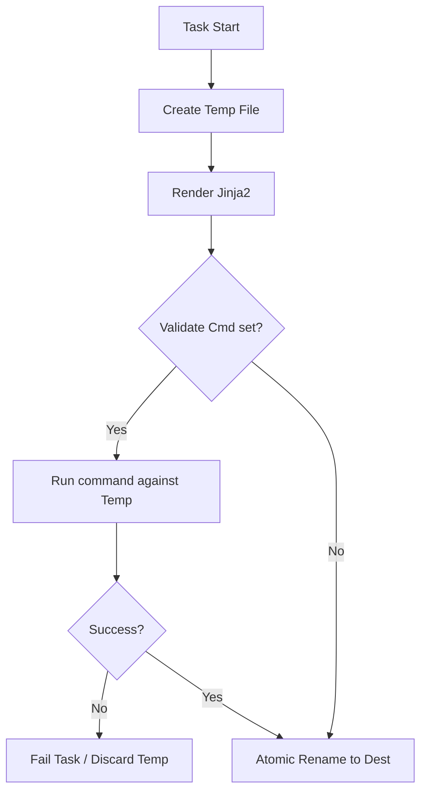

# 04. Safe Deploy & Validation

Deploying a broken configuration file can bring down an entire service. Ansible provides security features to ensure your templates are valid *before* they replace the working files.

## Validation Techniques

### 1. The `validate` Parameter
Many file modules (`copy`, `template`, `lineinfile`) allow you to run a command to verify the file's syntax before it is finalized.
*   **How it works**: Ansible creates a temporary file, runs your command against it, and only if the command returns 0 (success) does it swap the file into the real destination.

```yaml
- name: Deploy Nginx Config safely
  template:
    src: nginx.conf.j2
    dest: /etc/nginx/nginx.conf
    validate: "/usr/sbin/nginx -t -c %s"
```
*`%s` is a special variable that represents the path to the temporary file.*

### 2. Mandatory Variables
You can prevent a template from rendering if a critical variable is missing.

```jinja2
# app.conf
db_password = {{ db_pass | mandatory }}
```
If `db_pass` is missing, Ansible will error out at the template task rather than creating a broken `app.conf`.

### 3. The `ansible_managed` Header
Always tell other sysadmins that a file is managed by Ansible. This prevents manual edits from being overwritten and lost.

```jinja2
# {{ ansible_managed }}
# DO NOT EDIT THIS FILE MANUALLY
```
*The default string is: "Ansible managed: {file} modified on %Y-%m-%d %H:%M:%S by {uid} on {host}".*

---

## The Safe Replacement Flow



---

## Real-Life Scenarios

### Scenario 1: "The Broken Nginx Config"
**Problem**: An engineer forgot a semicolon in the template. The playbook ran, broke Nginx, and all traffic stopped for 5 minutes.
**Solution**: Added `validate: "/usr/sbin/nginx -t -c %s"`.
*   Result: Next time a mistake happened, the validation failed on the temporary file. Ansible stopped the execution, and the live Nginx config stayed untouched and working.

### Scenario 2: "The SSH Lockout"
**Problem**: A junior admin used `lineinfile` to change `sshd_config`, but accidentally deleted a required space. SSH wouldn't start after the reboot.
**Solution**: Added `validate: "/usr/sbin/sshd -t -f %s"`.
*   Result: Ansible detected the invalid SSH syntax and refused to apply the change, saving the team from a massive "Hands and Feet" rescue mission at the data center.

### Scenario 3: "Attribution"
**Problem**: A contractor manually changed the memory limit on a server. When Ansible ran that night, the change was reverted. The contractor was frustrated.
**Solution**: Added `{{ ansible_managed }}` to the top of all templates.
*   Result: When the contractor opened the file, they saw the "Ansible managed" header and knew to request the change via the Git repository instead of editing locally.

---

## ❓ Interview Questions

1. **What does `%s` represent in the `validate` parameter?**
    - The path to the temporary file created by Ansible.
2. **Where do you define the `ansible_managed` string?**
    - In your `ansible.cfg` file under the `[defaults]` section.
3. **Difference between `validate` and `check_mode`?**
    - `validate` runs a real command against a real temp file during a live run. `check_mode` (`--check`) is a global "Dry Run" that simulates what *would* happen without doing it.

---

## 🧠 Quiz

1. **Which filter forces a variable to exist?**
    - [x] `mandatory`
    - [ ] `required`
2. **If a `validate` command fails:**
    - [x] The task fails and the live file is NOT changed.
    - [ ] The task continues but warns you.
3. **`ansible_managed` is a:**
    - [x] Special String Variable
    - [ ] Module
