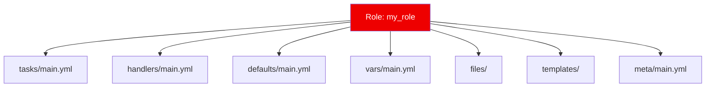

# 01. Role Standard Structure

As automation grows, keeping everything in a single Playbook becomes unmanageable. **Roles** provide a standardized directory structure to organize your tasks, variables, files, and templates into reusable packages.

## The Anatomy of a Role

When you run `ansible-galaxy init my_role`, it creates a recursive directory structure. Each folder has a specific purpose.

### Directory Breakdown

| Directory | Purpose | Key File |
| :--- | :--- | :--- |
| **`tasks/`** | The main list of steps the role executes. | `main.yml` |
| **`defaults/`** | Default variables (Lowest priority, easy to override). | `main.yml` |
| **`vars/`** | Constant variables (High priority, hard to override). | `main.yml` |
| **`handlers/`** | Service restarts triggered by `notify`. | `main.yml` |
| **`files/`** | Static files transferred via the `copy` module. | (Any) |
| **`templates/`** | Jinja2 templates processed via the `template` module. | `.j2` |
| **`meta/`** | Role metadata (Author, dependencies). | `main.yml` |

---

## `defaults/` vs `vars/`

This is a common point of confusion.
*   **`defaults/`**: Use this for variables users *should* change (e.g., `http_port: 80`). It has the lowest precedence in Ansible.
*   **`vars/`**: Use this for internal constants that users *should not* change (e.g., `apache_package_name: httpd`). It has a very high precedence.

---

## Real-Life Scenarios

### Scenario 1: "The Monolith Breaker"
**Problem**: An organization had a `site.yml` with 2,000 lines. Every time someone added a task, it risked breaking another team's configuration.
**Solution**: Refactored the playbook into functional roles: `common`, `security`, `apache`, `mariadb`.
*   Result: `site.yml` shrank to 10 lines. Teams could now update the `apache` role independently without touching the `security` logic.

### Scenario 2: "The Reusable Baseline"
**Problem**: Every new project required setting up the same users, SSH keys, and NTP servers.
**Solution**: Created a `baseline` role.
*   Whenever a new server cluster is provisioned, the first task in the playbook is always `- role: baseline`.
*   Result: Consistency across the entire infrastructure.

### Scenario 3: "Template Organization"
**Problem**: A role needed to manage Nginx, but the configuration was becoming complex with multiple `if/else` blocks inside the task file.
**Solution**: Moved all logic into a Jinja2 template in the `templates/` folder.
*   The `tasks/main.yml` now only has one simple task: `template: src=nginx.conf.j2 dest=/etc/nginx/nginx.conf`.
*   Result: Much cleaner and more readable task list.

---

## ❓ Interview Questions

1. **What is the entry point for a role's tasks?**
    - `tasks/main.yml`.
2. **Where would you store a static script that needs to be copied to the remote?**
    - In the `files/` directory of the role.
3. **Difference between `defaults/` and `vars/` in terms of precedence?**
    - `defaults/` have the lowest priority. `vars/` have a very high priority.

---

## 🧠 Quiz

1. **Command to initialize a new role structure:**
    - [x] `ansible-galaxy init`
    - [ ] `ansible-role create`
2. **Metadata like author and dependencies are found in:**
    - [x] `meta/main.yml`
    - [ ] `info/main.yml`
3. **Tasks in `handlers/main.yml` run only when:**
    - [x] They are notified by a task that "changed".
    - [ ] The playbook starts.
