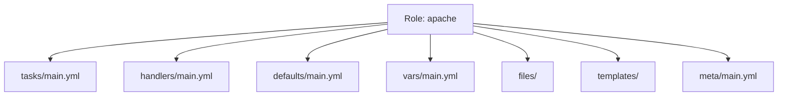

# Ansible Roles

Playbooks get messy. When your `site.yml` reaches 500 lines, it's time for **Roles**.

## 1. What is a Role?

A Role is a package of standard automation. It splits your big playbook into small, logical directories.

### Directory Structure


*   **tasks**: The main list of steps (`apt install`, `service start`).
*   **handlers**: Things triggered by tasks (`restart apache`).
*   **defaults**: Default variables (low priority, easy to override).
*   **files**: Static files for `copy`.
*   **templates**: Jinja2 files for `template`.

---

## 2. Using Roles

### Creating a Role
Don't create folders manually. Use the CLI:
```bash
ansible-galaxy init my_role_name
```

### Calling a Role in a Playbook
```yaml
---
- hosts: webservers
  roles:
    - common         # Runs first
    - nginx          # Runs second
    - { role: app, port: 8080 } # Passing vars
```

---

## 3. Ansible Galaxy & Collections

**Ansible Galaxy** is the Hub Docker equivalent.
*   **Community Roles**: Don't rewrite Nginx automation. Download `geerlingguy.nginx`.
*   **Command**: `ansible-galaxy install geerlingguy.nginx`.

### Collections (The New Standard)
In modern Ansible (2.10+), content is packaged in **Collections**.
A Collection contains: **Roles** + **Modules** + **Plugins**.
*   **Format**: `namespace.collection_name.role_name`.
*   **Installation**: `ansible-galaxy collection install community.general`.

---

## 4. Real-Life Scenarios

### Scenario 1: "The Monolith Breaker"
**Problem**: `site.yml` was 2,000 lines long. Developers were scared to touch it. Merge conflicts were daily.
**Solution**: Refactored into 5 roles: `common`, `security`, `docker`, `monitoring`, `app`.
*   Result: `site.yml` became 10 lines. Engineers could work on `monitoring` without breaking `security`.

### Scenario 2: "The Community Solution"
**Problem**: Needed to setup a complex HAProxy cluster. Estimated time to write automation: 2 weeks.
**Solution**: Found a "Verified" role on Galaxy.
*   Downloaded, configured variables to match environment.
*   Time to deploy: 2 hours.

### Scenario 3: "Sharing Logic"
**Problem**: 4 different teams (Web, Data, AI, Mobile) all needed to "Harden" Linux servers (SSH config, Firewall, Users). Hostility grew as each team did it differently.
**Solution**: Security Team wrote one `hardening` role and published it internally.
*   All teams added `- role: internal.hardening` to their playbooks.
*   Compliance achieved globally.

---

## 5. ❓ Interview Questions

1.  **What is the difference between `vars/` and `defaults/` in a role?**
    *   **Answer**: `defaults/` has the *lowest* priority (meant to be overridden). `vars/` has *high* priority (hard to override, used for constants).

2.  **Where does Ansible look for roles?**
    *   **Answer**: In the `./roles/` directory relative to the playbook, and in `/etc/ansible/roles`. Configurable via `roles_path` in `ansible.cfg`.

3.  **What is `meta/main.yml` used for?**
    *   **Answer**: Role metadata. Author info, supported platforms, and most importantly, **Dependencies** (other roles that must run first).

4.  **Can a role run more than once?**
    *   **Answer**: By default, no (deduplication). If you list it twice, it runs once. To force it, pass `allow_duplicates: true` in metadata or use different parameters.

5.  **How do you include a role dynamically?**
    *   **Answer**: `include_role` module.
        ```yaml
        - include_role:
            name: my_role
          when: some_condition
        ```

6.  **What is "Ansible Galaxy"?**
    *   **Answer**: The public repository for sharing Ansible Roles and Collections.

7.  **Why use Collections instead of just Roles?**
    *   **Answer**: Collections allow shipping custom Modules and Plugins alongside the Roles. It's a complete package format.

8.  **How do you unit test a role?**
    *   **Answer**: **Molecule**. It spins up a Docker container, runs your role, verifies the state (TestInfra), and destroys the container.

9.  **Pre_tasks vs Roles vs Post_tasks?**
    *   **Answer**: Order of execution: `pre_tasks` -> `roles` -> `tasks` -> `post_tasks`.

10. **Explain Role Dependencies.**
    *   **Answer**: Defined in `meta/main.yml`. If Role A depends on Role B, Ansible automatically runs Role B before Role A starts.

---

## 6. 🧠 Knowledge Check (Quiz)

### Structure
1.  **The command to create a role skeleton:**
    *   [x] `ansible-galaxy init`.
    *   [ ] `ansible-role create`.

2.  **Tasks go in:**
    *   [x] `tasks/main.yml`.
    *   [ ] `steps/main.yml`.

3.  **Handlers (services/restarts) go in:**
    *   [x] `handlers/main.yml`.
    *   [ ] `events/main.yml`.

4.  **Static files go in:**
    *   [x] `files/`.
    *   [ ] `static/`.

### Usage
5.  **Variables in `defaults/main.yml` are:**
    *   [x] Specific to the role but easily overridden.
    *   [ ] Global and immutable.

6.  **To download a role:**
    *   [x] `ansible-galaxy install`.
    *   [ ] `pip install`.

7.  **`meta/main.yml` is essential for:**
    *   [x] Defining dependencies.
    *   [ ] Defining tasks.

8.  **Can a role contain templates?**
    *   [x] Yes, in `templates/`.
    *   [ ] No.

9.  **If I want my role to run even if it ran before:**
    *   [x] Use `allow_duplicates` or call with different params.
    *   [ ] Ansible always runs roles twice.

10. **Collections include:**
    *   [x] Roles, Modules, and Plugins.
    *   [ ] Just Roles.

### Scenarios
11. **Refactoring a large playbook into roles improves:**
    *   [x] Reusability and Readability.
    *   [ ] Execution speed (marginally, but that's not the goal).

12. **Using a Community Role (Galaxy) requires:**
    *   [x] Reviewing the code for security.
    *   [ ] Blind trust.

13. **Molecule is used for:**
    *   [x] Testing roles.
    *   [ ] Writing roles.

14. **To override a role default:**
    *   [x] Set a variable in your inventory or playbook.
    *   [ ] Edit the role file directly (Bad practice).

15. **If you need to install a specific version of a role:**
    *   [x] Define it in `requirements.yml`.
    *   [ ] You can't.

### General
16. **Role names must contain:**
    *   [x] Alphanumeric characters and underscores.
    *   [ ] Emojis.

17. **Is `hosts:` defined inside a role?**
    *   [ ] Yes.
    *   [x] No, roles are assigned TO hosts in the playbook.

18. **Can one role call another?**
    *   [x] Yes, via dependencies or `include_role`.
    *   [ ] No.

19. **The `common` role usually contains:**
    *   [x] Base setup (Users, SSH, NTP) for all servers.
    *   [ ] Specific App logic.

20. **Is it possible to develop roles locally?**
    *   [x] Yes, pointed to by `roles_path`.
    *   [ ] No, must follow Galaxy.