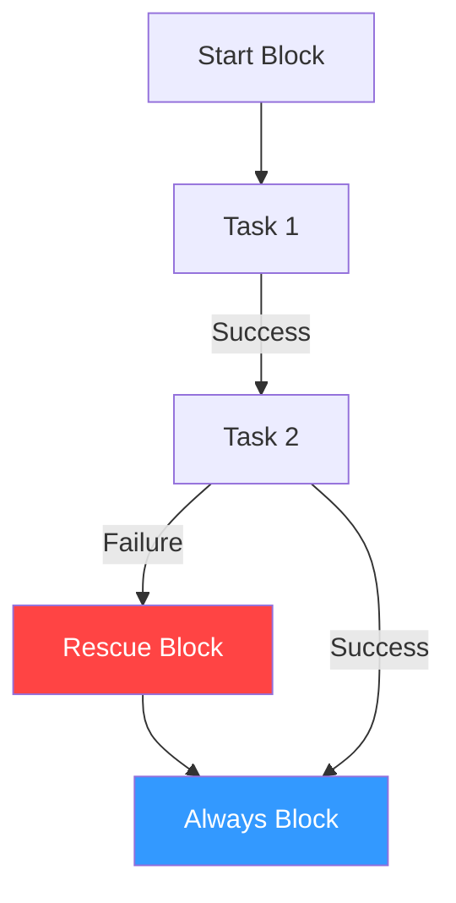

# 03. Error Handling Blocks

Ansible playbooks normally stop execution immediately if a task fails. However, for critical operations (like database migrations), you need more control. The `block`, `rescue`, and `always` structure is Ansible's version of `try-catch-finally`.

## The Flow Control Structure



### 1. `block`
Groups tasks together so they can share common attributes (like `become` or `when`) and serve as the "try" section.

### 2. `rescue`
Tasks in this section run **only if** a task within the `block` fails. This is where you perform rollbacks or cleanup.

### 3. `always`
Tasks here run regardless of success or failure. Perfect for closing connections or deleting temporary files.

---

## Example: Secure DB Upgrade

```yaml
- name: Managed Database Upgrade
  block:
    - name: Stop Application
      service: name=myapp state=stopped
    - name: Perform Upgrade
      shell: /opt/upgrade.sh
  rescue:
    - name: Rollback Upgrade
      shell: /opt/rollback.sh
    - name: Notify Team
      debug: msg="Upgrade FAILED. Rollback initiated."
  always:
    - name: Start Application
      service: name=myapp state=started
```

---

## Real-Life Scenarios

### Scenario 1: "The Atomic Rollback"
**Problem**: A script updated the production database schema but crashed halfway through, leaving the database in a corrupted, unusable state.
**Solution**: Wrapped the upgrade in a `block`. The `rescue` task ran a SQL restore from the backup taken just before the block started.
*   Result: High availability maintained even during failed updates.

### Scenario 2: "Temporary File Cleanup"
**Problem**: A playbook generated large temporary files in `/tmp`. If the playbook failed, these files would stay and eventually fill up the disk.
**Solution**: Put the file generation/processing in a `block` and the deletion in the `always` section.
*   Result: No more "disk full" alerts on the control node or managed nodes.

### Scenario 3: "External API Logging"
**Problem**: A security requirement demanded that every deployment attempt (pass or fail) be logged to a remote auditing server.
**Solution**: Used an `always` block to send a `uri` POST request with the deployment status to the auditing endpoint.
*   Result: Audit compliance achieved without manual intervention.

---

## ❓ Interview Questions

1. **What is the purpose of the `always` block?**
    - To ensure certain tasks (like cleanup or logging) run regardless of whether the preceding tasks succeeded or failed.
2. **In what situation does the `rescue` block NOT run?**
    - If all tasks within the `block` complete successfully.
3. **Can you put a `block` inside another `block`?**
    - Yes, blocks can be nested for complex logic patterns.

---

## 🧠 Quiz

1. **Which block runs only on failure?**
    - [x] `rescue`
    - [ ] `always`
2. **True or False: A `block` can have its own `when` condition.**
    - [x] True (it applies to every task inside).
    - [ ] False
3. **Can a `rescue` block itself have a `rescue` block?**
    - [x] No, nesting is only for the `block` part.
    - [ ] Yes.
