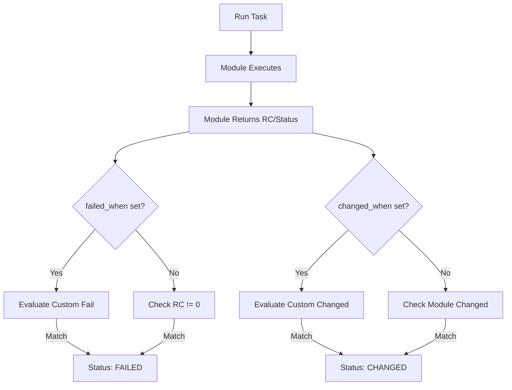

# 04. Advanced Logic Control

Sometimes Ansible's default behavior doesn't match your requirements. Commands might return non-zero codes that aren't actually "errors", or a task might report "Changed" when it only read data. Advanced logic control gives you precise power over task status.

## Customizing Task Results

| Keyword | Purpose |
| :--- | :--- |
| `failed_when` | Define custom criteria for what constitutes a "Fail". |
| `changed_when` | Define custom criteria for what constitutes a "Changed" status. |
| `ignore_errors` | Continue the playbook even if the task fails. |
| `any_errors_fatal`| Stop everything on ALL hosts if even one host fails. |

---

## 1. Custom Failures (`failed_when`)
Useful for commands that use return codes inconsistently.
```yaml
- name: Check app version
  command: /opt/myapp --version
  register: version_out
  failed_when: "'CRITICAL' in version_out.stderr"
```

## 2. Managing Status (`changed_when`)
Ensures your Ansible report is accurate. If a task just "gets" info, it shouldn't show up as Yellow (Changed).
```yaml
- name: Get current system time
  command: date
  register: current_time
  changed_when: false  # Always stays Green (OK)
```

## 3. Ignoring Errors
Use with caution. Best for non-critical tasks like cleaning up a directory that might not exist.
```yaml
- name: Clean temp folder
  file: path=/tmp/myapp state=absent
  ignore_errors: yes
```

---

## Task Status Decision Tree



---

## Real-Life Scenarios

### Scenario 1: "The False Failure"
**Problem**: The `grep` command returns exit code `1` if it finds no matches. Ansible treats this as a hard failure and stops the play.
**Solution**: Used `failed_when: false` or checked if the error was actually acceptable.
```yaml
- name: Check for user in file
  command: grep "alice" /etc/passwd
  register: grep_out
  failed_when: grep_out.rc > 1 # 1 is okay (not found), >1 is an error (file missing)
```

### Scenario 2: "Report Pollution"
**Problem**: A playbook ran 50 `command` tasks to gather info, and the final report showed "50 Changed". It was impossible to tell if any *real* changes were made.
**Solution**: Added `changed_when: false` to all informative tasks.
*   Result: The "Changed" count now accurately reflects only meaningful configuration changes.

### Scenario 3: "The Any Error counts"
**Problem**: During a firmware update on 100 servers, if even one server fails, nobody should proceed to prevent a potential mass-lockout situation.
**Solution**: Added `any_errors_fatal: true` to the play.
*   Result: Ansible stops the entire rollout the moment the first anomaly is detected.

---

## ❓ Interview Questions

1. **How do you prevent a task from being marked as 'changed'?**
    - Use `changed_when: false`.
2. **When would you use `failed_when`?**
    - When a command returns a non-zero exit code that isn't a failure, or when a command returns 0 but the output contains an error message.
3. **Difference between `ignore_errors: true` and `failed_when: false`?**
    - `ignore_errors` marks the task as failed in the logs but continues. `failed_when: false` marks the task as "OK" (success).

---

## 🧠 Quiz

1. **Keyword to force 'OK' status even if RC is not 0:**
    - [x] `failed_when: false`
    - [ ] `ignore_errors`
2. **If `any_errors_fatal: true` is set and host A fails:**
    - [x] Active tasks on host B, C, D are terminated and playbook stops.
    - [ ] Only host A stops.
3. **`changed_when: true` will force a task to be:**
    - [x] Yellow (Changed) every time.
    - [ ] Green (OK) every time.
