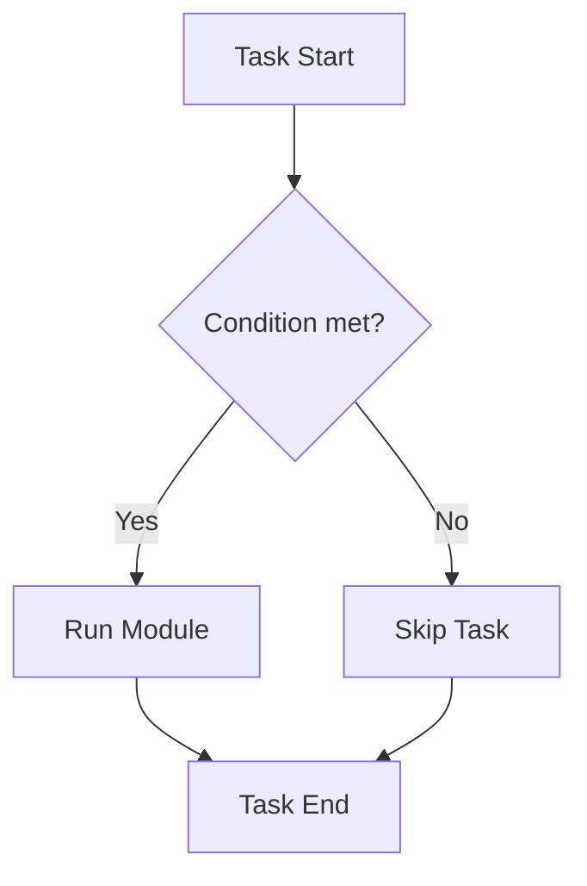

# Conditionals and Loops

Ansible playbooks are simple lists of tasks... until you need logic. "Install this ONLY if it's Ubuntu" or "Create these 50 users".

## 1. Conditionals (`when`)

The `when` clause is the `if` statement of Ansible.



### Examples
```yaml
# Simple check against a Fact
- name: Install Apache
  apt:
    name: apache2
  when: ansible_os_family == "Debian"

# Multiple Conditions (AND)
- name: Restart Webserver
  service:
    name: httpd
    state: restarted
  when:
    - ansible_os_family == "RedHat"
    - ansible_memtotal_mb > 1024

# Using Registered Variables
- name: Check file existence
  stat:
    path: /etc/custom_config
  register: file_check

- name: Copy config if missing
  copy:
    src: config.conf
    dest: /etc/custom_config
  when: not file_check.stat.exists
```

---

## 2. Loops (`loop`)

Don't copy-paste tasks. Loop over them.
*   **Old Syntax**: `with_items` (Still works, but `loop` is preferred).
*   **Standard Syntax**: `loop`.

### Looping over a List
```yaml
- name: Install packages
  apt:
    name: "{{ item }}"
    state: present
  loop:
    - git
    - curl
    - vim
```
*   `{{ item }}` is the magic variable holding the current value.

### Looping over a Dictionary (Hash)
```yaml
- name: Create users with specific groups
  user:
    name: "{{ item.name }}"
    groups: "{{ item.groups }}"
    state: present
  loop:
    - { name: 'alice', groups: 'wheel' }
    - { name: 'bob', groups: 'devs' }
```

---

## 3. Flow Control Blocks (`block`, `rescue`, `always`)

Ansible's version of `try-catch-finally`.

```yaml
- name: Upgrade Database
  block:
    - name: Stop App
      service: name=app state=stopped
    - name: Run Schema Upgrade
      command: /opt/upgrade_db.sh

  rescue:
    - name: Rollback DB
      command: /opt/restore_db.sh
    - name: Start App (Recovery)
      service: name=app state=started
    - name: Fail the play
      fail: msg="DB Upgrade failed and was rolled back."

  always:
    - name: Notify Admin
      uri: url=http://slack-webhook...
```

*   **Block**: Group tasks together.
*   **Rescue**: Only runs if a task in the `block` fails.
*   **Always**: Runs no matter what (good for cleanup).

---

## 4. Real-Life Scenarios

### Scenario 1: "The Smart Restarter"
**Problem**: Restarting Nginx caused downtime if the new config was invalid.
**Solution**:
1.  Run `nginx -t` using `command` module.
2.  Register the result.
3.  Restart Nginx `when: result.rc == 0`.
**Result**: Zero downtime from bad configs.

### Scenario 2: "User Creation Factory"
**Problem**: Onboarding a new team meant writing 10 `user` tasks.
**Solution**: Used a `loop` over a list of users defined in `vars/users.yml`.
**Result**: Adding a user is just 1 line of YAML data, not code.

### Scenario 3: "Failing Gracefully"
**Problem**: A complex deployment script would fail halfway, leaving the server in a broken "Half-Upgraded" state.
**Solution**: Wrapped the dangerous section in a `block` with a `rescue` section that reverted the changes (restored backup config).

---

## 5. ❓ Interview Questions

1.  **Difference between `loop` and `with_items`?**
    *   **Answer**: Functionally very similar. `loop` is the modern standard. `with_items` automatically flattens lists (if you give it a list of lists), `loop` does not.

2.  **Can you loop over inventory groups?**
    *   **Answer**: Yes. `loop: "{{ groups['webservers'] }}"`.

3.  **What happens if a task inside a `block` fails?**
    *   **Answer**: Execution immediately jumps to the `rescue` block (if defined). If no rescue, the play fails.

4.  **How do you check if a variable is defined in `when`?**
    *   **Answer**: `when: my_var is defined`.

5.  **Can you use loops and register together?**
    *   **Answer**: Yes. The registered variable will contain a `results` list, one for each iteration.

6.  **How do you limit a loop to the first 5 items?**
    *   **Answer**: Using Jinja2 filters: `loop: "{{ my_list[:5] }}"`.

7.  **Is `when` evaluated before or after the loop?**
    *   **Answer**: **For each item**. The task runs for the item only if the `when` condition is true for that item.

8.  **What is `until` used for?**
    *   **Answer**: Retrying a task until a condition is met.
        ```yaml
        retries: 5
        delay: 10
        until: result.status == 200
        ```

9.  **Can you break out of a loop early?**
    *   **Answer**: No, Ansible loops operate on the whole list. You can't `break`. You have to filter the list beforehand using Jinja2 `selectattr`.

10. **Does `always` run if the `rescue` block fails?**
    *   **Answer**: Yes. `always` means always, even if Ansible crashes hard.

---

## 6. 🧠 Knowledge Check (Quiz)

### Conditionals
1.  **To skip a task if a file exists:**
    *   [x] `when: not file_check.stat.exists`
    *   [ ] `skip_if: exists`

2.  **Multiple items in a `when` list imply:**
    *   [x] AND (All must be true).
    *   [ ] OR (Any must be true).

3.  **To check if a boolean variable is true:**
    *   [x] `when: my_bool`
    *   [ ] `when: my_bool == 'true'`

4.  **`failed_when` is used to:**
    *   [x] Define custom failure criteria (e.g., stderr contains "Error").
    *   [ ] skip a task.

### Loops
5.  **The current item in a loop is accessed via:**
    *   [x] `{{ item }}`
    *   [ ] `{{ this }}`

6.  **To name the loop variable something else:**
    *   [x] `loop_control: loop_var: my_item`
    *   [ ] `as: my_item`

7.  **If `loop` is used with `register`, the output has a key:**
    *   [x] `results` (list).
    *   [ ] `std_out_lines`.

8.  **Can you index a loop (0, 1, 2...)?**
    *   [x] Use `with_indexed_items` or loop `ansible_loop.index`.
    *   [ ] No.

9.  **Can `block` be looped?**
    *   [x] No. You must put the block in a separate file and `include_tasks` with a loop.
    *   [ ] Yes.

10. **Retry loops use key words:**
    *   [x] `retries` and `delay`.
    *   [ ] `try` and `wait`.

### Flow Control
11. **`block` allows you to:**
    *   [x] Group tasks for error handling.
    *   [ ] Run tasks in parallel.

12. **`rescue` is effectively:**
    *   [x] A "Catch" block for errors.
    *   [ ] A help command.

13. **`always` runs:**
    *   [x] Regardless of success or failure.
    *   [ ] Only on success.

14. **`any_errors_fatal: true` means:**
    *   [x] If one host fails, stop the entire playbook on ALL hosts.
    *   [ ] Ignore errors.

15. **To abort the play deliberately:**
    *   [x] `fail` module.
    *   [ ] `stop` module.

### General
16. **Is `when` case-sensitive?**
    *   [x] Yes (strings are).
    *   [ ] No.

17. **Can you conditionally import a role?**
    *   [x] Yes (`when` on `include_role`).
    *   [ ] No.

18. **Logical OR in `when`:**
    *   [x] `when: cond1 or cond2`
    *   [ ] `when: [cond1, cond2]` (This is AND).

19. **If a variable is undefined in a `when` statement:**
    *   [x] It errors out. Use `is defined`.
    *   [ ] It evaluates to false.

20. **`changed_when: false`:**
    *   [x] Forces the task to report "OK" (Green) instead of "Changed" (Yellow).
    *   [ ] Skips the task.