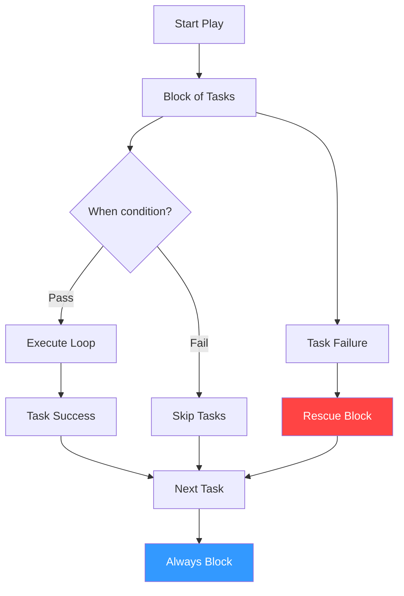

# Conditionals and Loops

Ansible playbooks are simple lists of tasks... until you need logic. This section walks through the core components that turn tasks into intelligent automation.

## 📚 Learning Path

| # | Topic | Description | Key Areas |
| :--- | :--- | :--- | :--- |
| **01** | [**Conditional Execution**](./01-Conditional-Execution/README.md) | Smart Task Skipping | `when`, logical operators |
| **02** | [**Looping Mechanics**](./02-Looping-Mechanics/README.md) | Mass Configuration | `loop`, `until`, `retries` |
| **03** | [**Error Handling Blocks**](./03-Error-Handling-Blocks/README.md) | Flow Control | `block`, `rescue`, `always` |
| **04** | [**Advanced Logic Control**](./04-Advanced-Logic-Control/README.md) | Overriding Status | `failed_when`, `changed_when` |

---

## 🏗️ Execution Flow



## Quick Start

### Simple Conditional
```yaml
- name: Run on Debian ONLY
  apt: name=nginx state=present
  when: ansible_os_family == "Debian"
```

### Simple Loop
```yaml
- name: Install list
  package: name="{{ item }}" state=present
  loop: [git, curl, vim]
```

Please proceed to **[01-Conditional-Execution](./01-Conditional-Execution/README.md)**.