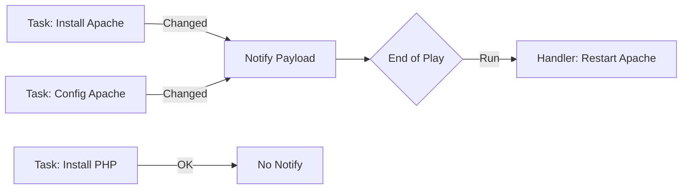

# Error Handling and Debugging

Things go wrong. Services crash, disks fill up, and typos happen. Ansible is programmed to **Fail Fast**.

## 1. Failure Modes

By default, if a task fails on a host, Ansible stops executing on that host immediately.

### Ignoring Errors
Sometimes failure is expected (e.g., checking if a file exists using `command`).
```yaml
- name: Run a risky script
  command: /opt/maybe_fails.sh
  ignore_errors: yes
```

### Force Handlers
If a task fails, Handlers (like "Restart Apache") are skipped by default. This leaves the system in an inconsistent state.
*   **Solution**: `force_handlers: True` in `ansible.cfg` or the playbook. This ensures notified handlers run even if a later task crashes.

### Max Fail Percentage
In a batch of 100 servers, maybe you can tolerate 10 failures, but not 50.
```yaml
- hosts: webservers
  max_fail_percentage: 30%
  serial: 10
```
*   If >30% of the batch fails, Ansible aborts the *entire* playbook to prevent a mass outage.

---

## 2. Debugging Tools

### The `debug` Module
The `printf` of Ansible.
```yaml
- name: Print variable
  debug:
    var: result.stdout

- name: Print message
  debug:
    msg: "System memory is {{ ansible_memtotal_mb }} MB"
```

### Verbosity (`-v`)
*   `-v`: Show task results.
*   `-vv`: Show task inputs/outputs.
*   `-vvv`: Show connection details (SSH).
*   `-vvvv`: Connection debugging (OpenSSH internal logs). **Use this for permission denied errors.**

---

## 3. Handlers (Deferred Execution)

Handlers are special tasks that only run if notified.
*   **Behavior**:
    1.  Task reports `changed`.
    2.  Handler is "flagged".
    3.  At the *end of the play*, all flagged handlers run.
    4.  Handlers run once, even if notified 50 times.



### Flushing Handlers
To force handlers to run *now* instead of later:
```yaml
- meta: flush_handlers
```

---

## 4. Real-Life Scenarios

### Scenario 1: "The Flaky Service"
**Problem**: An old cleanup script returned exit code 1 even when it worked. This stopped the playbook.
**Solution**:
```yaml
- command: /opt/cleanup.sh
  register: result
  failed_when: "'CRITICAL' in result.stdout"
```
*   We overrode the failure definition. Now it only fails if it prints "CRITICAL".

### Scenario 2: "The Rolling Restart"
**Problem**: Deploying to 100 web nodes. If the app config is broken, we take down 100% of traffic.
**Solution**:
```yaml
serial: 10
```
*   Ansible updates 10 hosts. If they succeed, it moves to the next 10. If they fail, it stops. Max impact: 10%.

### Scenario 3: "The Silent Failure"
**Problem**: A script `reset_db.sh` was running every time, but Ansible reported "Changed: False".
**Solution**:
```yaml
- command: /opt/reset_db.sh
  register: out
  changed_when: "'Reset complete' in out.stdout"
```
*   Now Ansible accurately reports Yellow/Green status based on the script output.

---

## 5. ❓ Interview Questions

1.  **What happens if I define two handlers with the same name?**
    *   **Answer**: Only the last one defined is used. Avoid this.

2.  **How do you debug an SSH connection issue?**
    *   **Answer**: run `ansible-playbook -vvvv`. Look for the path to the SSH key and the specific exit code from OpenSSH.

3.  **Does `ignore_errors: yes` turn the task result Green?**
    *   **Answer**: No, it turns it **Red** (Failed) but allows the playbook to continue.

4.  **What is `any_errors_fatal`?**
    *   **Answer**: A setting that stops the execution on *all* hosts if *any* host fails. Useful for multi-node clusters where partial deployment is lethal.

5.  **Can handlers notify other handlers?**
    *   **Answer**: Yes. A "Restart Apache" handler could notify a "Check HTTP Status" handler.

6.  **What does the `assert` module do?**
    *   **Answer**: It acts like a unit test inside the playbook.
        ```yaml
        - assert:
            that:
              - result.rc == 0
        ```

7.  **How do you pause a playbook for user input?**
    *   **Answer**: `pause` module. `prompt: "Press Enter to continue"`.

8.  **Difference between `fail` and `assert`?**
    *   **Answer**: `fail` unconditionally crashes (unless `when` is used). `assert` evaluates a condition and crashes if it's false.

9.  **What is a "Strategy"?**
    *   **Answer**: Controls execution flow. `linear` (default) vs `free` (fast as possible, no waiting for other hosts).

10. **How do you see all variables for a host?**
    *   **Answer**: `ansible -m setup` (Facts) or use the debug module with `var=hostvars[inventory_hostname]`.

---

## 6. 🧠 Knowledge Check (Quiz)

### Error Handling
1.  **To continue after a failure:**
    *   [x] `ignore_errors: yes`
    *   [ ] `continue_on_error: yes`

2.  **To stop deployment if 20% of hosts fail:**
    *   [x] `max_fail_percentage: 20`
    *   [ ] `stop_at: 20`

3.  **`serial: 1` means:**
    *   [x] Run on one host at a time (Rolling).
    *   [ ] Run only once.

4.  **`failed_when` overrides:**
    *   [x] The standard exit code check.
    *   [ ] The module logic.

### Debugging
5.  **Most verbose debugging flag:**
    *   [x] `-vvvv`
    *   [ ] `-d`

6.  **`debug` module runs on:**
    *   [x] The Control Node (prints to screen).
    *   [ ] The Remote Node (prints to syslog).

7.  **To pause execution for 5 minutes:**
    *   [x] `pause: minutes=5`
    *   [ ] `wait: 300`

### Handlers
8.  **Handlers run:**
    *   [x] At the end of the play.
    *   [ ] Immediately after notification.

9.  **If a task reports "OK" (Green):**
    *   [x] Handlers are NOT notified.
    *   [ ] Handlers ARE notified.

10. **`meta: flush_handlers`:**
    *   [x] Runs handlers immediately.
    *   [ ] Clears handlers without running them.

### Scenarios
11. **SSH "Permission Denied" usually means:**
    *   [x] Wrong private key or wrong user.
    *   [ ] Firewall blocking port 22.

12. **SSH "Connection Timed Out" usually means:**
    *   [x] Firewall / Network issue.
    *   [ ] Wrong key.

13. **To see what changed in a file:**
    *   [x] Run with `--diff`.
    *   [ ] Run with `--changes`.

14. **If a handler restarts a service, does it restart for every change?**
    *   [x] No, only once per play (deduplicated).
    *   [ ] Yes.

15. **Strategy `free` allows:**
    *   [x] Fast hosts to finish without waiting for slow hosts.
    *   [ ] Free execution without authentication.

### General
16. **Is `assert` included in Core?**
    *   [x] Yes.
    *   [ ] No.

17. **Can you ignore unreachable hosts?**
    *   [x] `ignore_unreachable: yes`
    *   [ ] No.

18. **The `debugger` keyword:**
    *   [x] Drops you into an interactive TUI on failure (2.5+).
    *   [ ] Emails you.

19. **Exit code 0 means:**
    *   [x] Success.
    *   [ ] Failure.

20. **Can you force a task to report "Changed"?**
    *   [x] `changed_when: true`
    *   [ ] `force_change: yes`