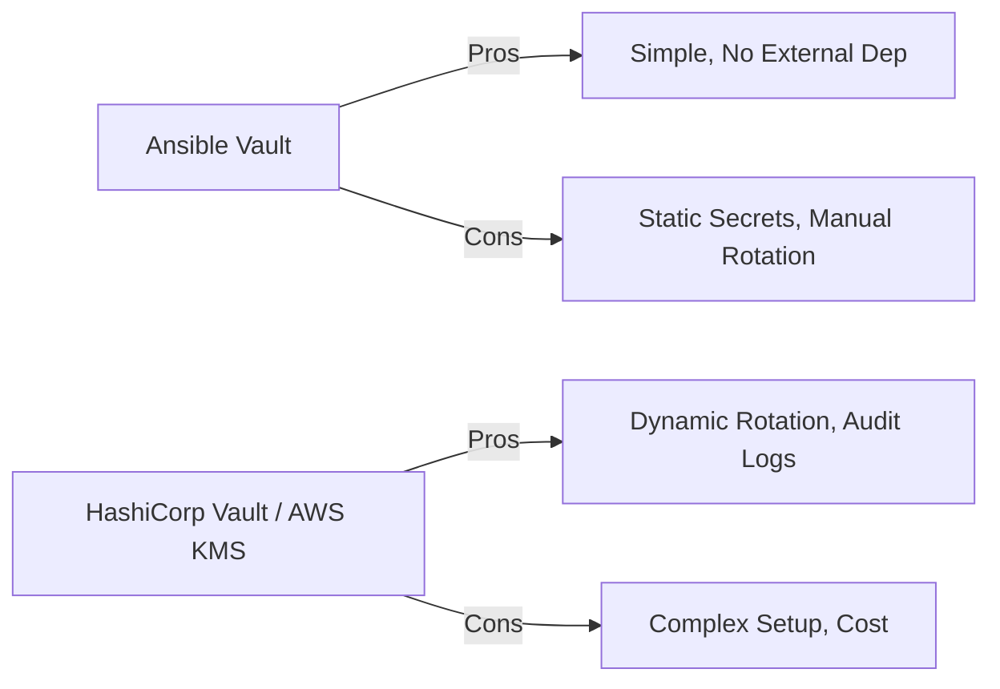

# 04. Security Best Practices

Encryption is only as strong as its weakest link. Using Ansible Vault effectively requires following strict security standards to ensure passwords aren't leaked and data remains protected.

## The Secret Tier List

Where should you store your secrets?

| Tier | Method | Security Level | Best Use Case |
| :--- | :--- | :--- | :--- |
| **Bronze** | Entire File Encryption | Low-Mid | Small projects, hiding variable names. |
| **Silver** | String Encryption (`encrypt_string`) | Mid-High | Standard DevOps, keeps YAML readable. |
| **Gold** | Vault IDs + Role Scoping | High | Enterprise repos with multiple teams. |
| **Platinum**| External KMS (HashiCorp Vault) | Maximum | Highly regulated environments, dynamic secrets. |

---

## Best Practices Checklist

1.  **NEVER commit password files**: Always add `.vault_pass` or similar to `.gitignore`.
2.  **Use `encrypt_string`**: It makes your YAML files easier to debug because the keys are visible.
3.  **Rotate Passwords**: Use `ansible-vault rekey` at least once a year or whenever a team member leaves.
4.  **Use Different Passwords per Environment**: Use a weak password for Dev and a strong, complex one for Production.
5.  **Audit Vault Usage**: Log which CI jobs are accessing the secrets.

---

## Comparison: Vault vs. Cloud KMS

---

## Real-Life Scenarios

### Scenario 1: "The Former Employee"
**Problem**: An employee was fired but still had the Vault password written in a personal notebook.
**Solution**: The Security team initiated a "Global Rekey".
*   Result: By the time the former employee got home, the password they knew was useless. All automation was updated with the new key via the CI/CD secret manager.

### Scenario 2: "The Debugging Disaster"
**Problem**: A developer decrypted a whole file to check one variable, then forgot to re-encrypt it and pushed the plaintext file to Git.
**Solution**: Switched the entire organization to `encrypt_string`.
*   Result: Because strings are never "decrypted" permanently on disk (they are only decrypted in memory during the run), the risk of accidental plaintext commits was eliminated.

### Scenario 3: "The Weak Link"
**Problem**: A team used the same easy-to-guess password for their personal dev vault and the corporate production vault.
**Solution**: Implemented a policy forcing the use of Vault IDs.
*   Result: `prod@.prod_pass` required an 18-character key stored in a hardware module, while `dev@prompt` could be a simple 8-character string for developer convenience.

---

## ❓ Interview Questions

1. **Why is `encrypt_string` generally preferred over whole-file encryption?**
    - It allows variable names to remain readable, improving documentation and reducing the need to decrypt the entire file for simple maintenance.
2. **How do you handle password rotation in Ansible?**
    - Using the `ansible-vault rekey` command on all encrypted files.
3. **Does Ansible decrypt secrets to the remote host?**
    - No. Decryption happens on the Control Node. The cleartext data is then sent over the encrypted SSH tunnel to the remote host.

---

## 🧠 Quiz

1. **Default rotation tool in Ansible:**
    - [x] `rekey`
    - [ ] `rotate`
2. **True or False: Most companies use the same password for Dev and Prod Vaults.**
    - [x] False (security risk).
    - [ ] True.
3. **If you accidental commit a plaintext password, you should:**
    - [x] Change the password immediately and scrub Git history.
    - [ ] Just re-encrypt the file.
