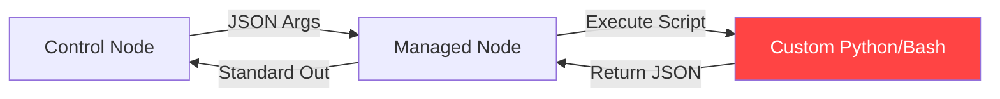

# 01. Module Development Basics

Ansible is powerful because it is extensible. While there are thousands of built-in modules, sometimes you need to perform custom logic that is too complex for a standard Playbook.

## The JSON Bridge

The fundamental design of an Ansible module is simple: it is a standalone script that communicates with the Ansible engine via **JSON**.

### How it works:
1.  **Transport**: Ansible copies the module script to the remote managed node.
2.  **Input**: Ansible passes arguments as a JSON string to the script's standard input or via a temporary file.
3.  **Execution**: The script runs on the remote host (not the control node).
4.  **Output**: The script prints a JSON object to standard output. Ansible parses this object to determine if the task succeeded, failed, or changed.

## Why use Python?

While you *can* write a module in any language (Bash, Ruby, Go) that can parse JSON, **Python** is the gold standard for Ansible because:
*   **Helper Libraries**: Ansible provides the `AnsibleModule` utility class that handles 90% of the boilerplate code.
*   **Consistency**: Most managed nodes already have Python installed (since it's a requirement for Ansible itself).
*   **Rich Ecosystem**: Access to libraries like `requests`, `boto3`, or `psutil` makes system interaction easy.

---

## Real-Life Scenarios

### Scenario 1: "The Performance Wall"
**Problem**: A playbook needed to process 20,000 log lines to find a specific pattern and update a database. Doing this with `shell`, `grep`, and `register` took 10 minutes per host.
**Solution**: Wrote a custom Python module using `re` (regex) and `sqlite3`.
*   Result: The execution time dropped from 10 minutes to 2 seconds. Python processed the file in-memory and returned a simple `changed: true` result.

### Scenario 2: "The Legacy API Wrapper"
**Problem**: An internal configuration management system had a proprietary API that required a complex 3-step authentication handshake. Using the `uri` module was creating unreadable and fragile playbooks.
**Solution**: Encapsulated the handshake logic in a custom module `my_internal_api`.
*   Result: The playbook became a single line: `my_internal_api: key=val`. The complexity was hidden inside the Python module.

### Scenario 3: "Beyond Shell Pipes"
**Problem**: An engineer was using a 5-line `shell` task with pipes (`|`), `awk`, and `sed` to extract a specific configuration value. It broke every time the software version slightly changed.
**Solution**: Used a custom module that parsed the configuration file using a proper parser (like `configparser` or `yaml`).
*   Result: The automation became robust and maintainable. Error handling was implemented in Python to provide clear messages instead of "Command failed with rc 1".

---

## ❓ Interview Questions

1. **What is the primary communication format between Ansible and a module?**
    - JSON.
2. **On which node does a custom module execute?**
    - The Managed (Remote) node.
3. **What happens to the module script after it finishes execution?**
    - Ansible automatically deletes the temporary script and associated files from the remote node.

---

## 🧠 Quiz

1. **Ansible modules are primarily written in:**
    - [x] Python
    - [ ] YAML
2. **To see the JSON output of a module, run with:**
    - [x] `-vv` or higher
    - [ ] `-s`
3. **A module must print its result to:**
    - [x] Standard Output (stdout)
    - [ ] A specific log file
