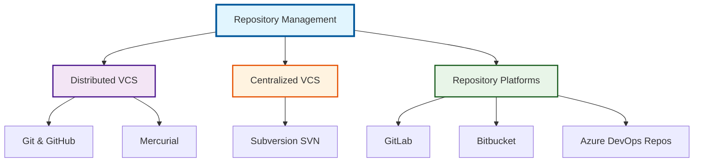
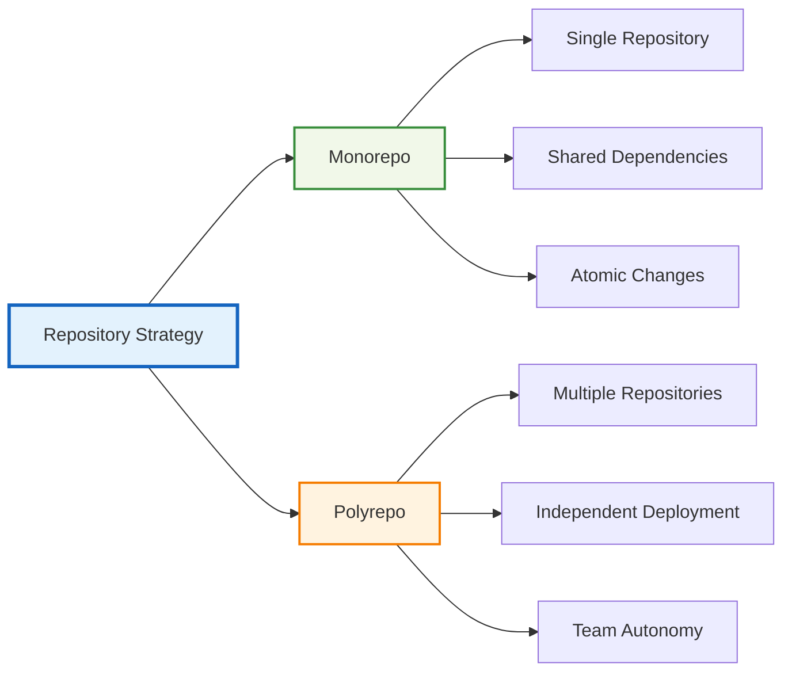

# 📚 Repository Management - Complete Version Control Systems

Welcome to the **Repository Management** module - your comprehensive guide to mastering version control systems used in enterprise DevOps environments. This module covers all major repository technologies from Git to enterprise solutions.

---

## 🎯 Learning Objectives

By completing this module, you will:
- Master multiple version control systems (Git, Mercurial, SVN)
- Understand repository hosting platforms (GitHub, GitLab, Bitbucket, Azure DevOps)
- Implement enterprise repository strategies and workflows
- Configure advanced branching strategies and policies
- Integrate repositories with CI/CD pipelines
- Implement security and compliance for source code management

---

## 📊 Module Overview

---

## 🗂️ Repository Technologies Covered

### 🔄 Distributed Version Control Systems
| Technology | Market Share | Use Cases | Enterprise Ready |
|------------|-------------|-----------|------------------|
| **Git** | 87.2% | Modern development, Open source, DevOps | ✅ |
| **Mercurial** | 3.2% | Large codebases, Facebook/Google legacy | ✅ |

### 🏢 Centralized Version Control Systems
| Technology | Market Share | Use Cases | Enterprise Ready |
|------------|-------------|-----------|------------------|
| **Subversion (SVN)** | 4.8% | Legacy enterprise, Large binary files | ✅ |

### ☁️ Repository Hosting Platforms
| Platform | Market Share | Key Features | Pricing Model |
|----------|-------------|--------------|---------------|
| **GitHub** | 73% | Actions, Copilot, Security | Freemium |
| **GitLab** | 17% | Complete DevOps platform | Freemium |
| **Bitbucket** | 13% | Atlassian integration | Freemium |
| **Azure DevOps** | 12% | Microsoft ecosystem | Freemium |

---

## 📂 Module Structure

### 🔰 [01-Git-GitHub](./01-Git-GitHub/)
**The Foundation of Modern DevOps**
- Git fundamentals and advanced concepts
- GitHub platform mastery
- GitHub Actions and automation
- Enterprise GitHub strategies
- Security and compliance

### 🦊 [02-GitLab](./02-GitLab/)
**Complete DevOps Platform**
- GitLab architecture and administration
- CI/CD pipeline mastery
- Security scanning and compliance
- Container registry and package management
- Enterprise deployment strategies

### 🪣 [03-Bitbucket](./03-Bitbucket/)
**Atlassian Ecosystem Integration**
- Bitbucket fundamentals
- Atlassian tool integration (Jira, Confluence)
- Bitbucket Pipelines
- Enterprise administration
- Migration strategies

### 🔷 [04-Azure-DevOps-Repos](./04-Azure-DevOps-Repos/)
**Microsoft Ecosystem Repository Management**
- Azure Repos fundamentals
- Integration with Azure DevOps Services
- Branch policies and security
- Enterprise Active Directory integration
- Hybrid cloud strategies

### 🐍 [05-Mercurial](./05-Mercurial/)
**High-Performance Distributed VCS**
- Mercurial fundamentals
- Large repository management
- Migration from/to Git
- Enterprise deployment
- Performance optimization

### 📁 [06-Subversion-SVN](./06-Subversion-SVN/)
**Enterprise Centralized Version Control**
- SVN architecture and concepts
- Enterprise administration
- Migration strategies to Git
- Legacy system integration
- Binary file management

---

## 🏗️ Enterprise Repository Architecture Patterns

### 🌟 Monorepo vs Polyrepo Strategy

### 🔄 Branching Strategies Comparison

| Strategy | Complexity | Release Frequency | Team Size | Best For |
|----------|------------|-------------------|-----------|----------|
| **Git Flow** | High | Scheduled | Large | Traditional releases |
| **GitHub Flow** | Low | Continuous | Small-Medium | Continuous deployment |
| **GitLab Flow** | Medium | Flexible | Any | Feature-based development |
| **Trunk-based** | Low | Very High | Any | DevOps/CI-CD focused |

---

## 🛠️ Repository Management Tools & Integrations

### 📊 Monitoring & Analytics
- **Repository insights and metrics**
- **Code quality analysis integration**
- **Security vulnerability scanning**
- **Compliance and audit trails**

### 🔐 Security & Access Control
- **Branch protection rules**
- **Code signing and verification**
- **Secrets management**
- **Access control and permissions**

### 🚀 CI/CD Integration
- **Webhook configurations**
- **Pipeline triggers**
- **Artifact management**
- **Deployment strategies**

---

## 🧪 Hands-On Labs & Scenarios

### Lab 1: Multi-Platform Repository Setup
**Objective**: Set up the same project across GitHub, GitLab, and Bitbucket
**Skills**: Platform comparison, migration strategies, feature parity

### Lab 2: Enterprise Branching Strategy Implementation
**Objective**: Implement Git Flow with automated branch protection
**Skills**: Branch policies, automation, compliance

### Lab 3: Repository Migration Project
**Objective**: Migrate from SVN to Git with history preservation
**Skills**: Migration tools, history conversion, team training

### Lab 4: Security Hardening Across Platforms
**Objective**: Implement security best practices across all platforms
**Skills**: Security scanning, access control, compliance

---

## 📋 Assessment & Certification Preparation

### 🎯 Quiz Topics (25+ Questions)
- Version control system comparisons
- Platform-specific features and limitations
- Enterprise repository strategies
- Security and compliance requirements
- Migration and integration scenarios

### 🏆 Certification Alignment
- **GitHub Foundations Certification**
- **GitLab Certified Associate**
- **Atlassian Certified Professional**
- **Microsoft Azure DevOps Engineer Expert**

---

## 🔗 Integration with Other Modules

### Prerequisites
- **[Git Basics](../../1-Beginner/09-Git-GitHub/)** - Fundamental Git knowledge
- **[CI/CD Fundamentals](../04-CI-CD/)** - Pipeline integration concepts

### Next Steps
- **[Advanced CI/CD](../04-CI-CD/)** - Repository-triggered pipelines
- **[Security](../../3-Advanced/04-Security/)** - Repository security hardening
- **[Enterprise Cloud](../../3-Advanced/08-Enterprise-Cloud/)** - Cloud repository strategies

---

## 📚 Additional Resources

### 📖 Essential Reading
- [Pro Git Book](https://git-scm.com/book) - Comprehensive Git reference
- [GitLab Handbook](https://about.gitlab.com/handbook/) - GitLab best practices
- [Atlassian Git Tutorials](https://www.atlassian.com/git/tutorials) - Git workflow guides

### 🎥 Video Resources
- [Git and GitHub for Beginners](https://www.youtube.com/watch?v=RGOj5yH7evk)
- [GitLab CI/CD Tutorial](https://www.youtube.com/watch?v=qP2-q9SsPqc)
- [Enterprise Git Workflows](https://www.youtube.com/watch?v=aJnFGMclhU8)

### 🛠️ Tools & Utilities
- [Git Extensions](https://gitextensions.github.io/) - Git GUI for Windows
- [SourceTree](https://www.sourcetreeapp.com/) - Free Git client
- [GitKraken](https://www.gitkraken.com/) - Cross-platform Git GUI

---

## 🎯 Success Metrics

Upon completion of this module, you should be able to:
- [ ] Set up and configure multiple repository platforms
- [ ] Implement enterprise branching strategies
- [ ] Migrate repositories between different systems
- [ ] Configure security and compliance policies
- [ ] Integrate repositories with CI/CD pipelines
- [ ] Troubleshoot common repository issues
- [ ] Design repository architecture for enterprise scale

---

**"Version control is not just about code - it's about controlling the evolution of your entire digital infrastructure."**

*Master repository management to become the architect of collaborative development.*