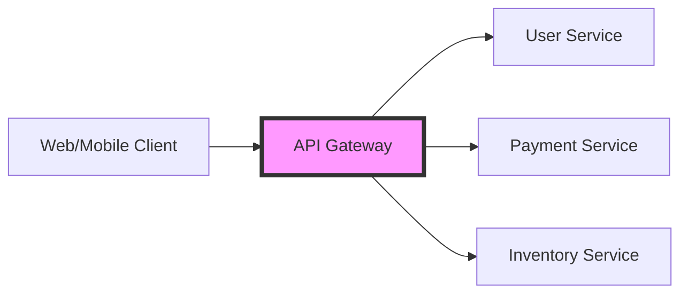

# API Gateways & Security (Intermediate)

As applications scale from single servers to microservices, how we manage, secure, and monitor APIs becomes more complex. This module covers the "Middle Layer" of API management.

---

## 1. The API Gateway Pattern

An **API Gateway** is a single entry point for all clients. It sits in front of your microservices and handles cross-cutting concerns.

### What it does:
- **Routing**: Sends the request to the correct microservice based on the URL.
- **Authentication/Authorization**: Verifies who the user is before they reach the service.
- **Rate Limiting**: Prevents a single user from overwhelming the system with too many requests.
- **Load Balancing**: Distributes traffic across multiple instances of a service.
- **Aggregation**: Combines data from multiple services into one response.

### Diagram:

---

## 2. API Security Fundamentals

### Authentication (AuthN) - "Who are you?"
- **Basic Auth**: Simple username/password sent in the header (Insecure without HTTPS).
- **API Keys**: A long string (like a password) sent with every request.
- **OAuth2 / OpenID Connect**: The modern standard for delegated access (e.g., "Login with Google").

### Authorization (AuthZ) - "What can you do?"
- **RBAC (Role-Based Access Control)**: "Admins" can delete, "Users" can only read.
- **Scopes**: Granular permissions (e.g., `read:profile`, `write:settings`).

### JWT (JSON Web Tokens)
A compact way to securely transmit information between parties as a JSON object.
- **Header**: Type of token and algorithm.
- **Payload**: User info and expiration.
- **Signature**: Ensures the token hasn't been tampered with.

---

## 3. Rate Limiting & Throttling

To protect backend services, we limit the number of requests a client can make in a given time window (e.g., 100 requests per minute).

- **Token Bucket Algorithm**: Common method for handling burstiness.
- **Fixed Window**: Simple but can cause spikes at the edge of windows.

---

## 4. API Documentation (Swagger/OpenAPI)

DevOps engineers often manage the infrastructure that hosts documentation.
- **OpenAPI (Spec)**: A standard way to describe your API structure (paths, parameters, responses).
- **Swagger (Tools)**: The UI that renders the spec so developers can test the API.

---

## Real-World Scenarios

### Scenario 1: Preventing a DDoS Attack
**Context**: A public API is being bombarded with thousands of requests from a specific IP range.
**Solution**: The DevOps engineer configures the API Gateway (e.g., AWS API Gateway or Kong) to block those IPs and applies a stricter Rate Limit for all non-authenticated users.

### Scenario 2: Legacy Migration
**Context**: A company is moving from a monolithic app to microservices.
**Solution**: Use an API Gateway as a "Strangler Fig" pattern. Route certain paths (e.g., `/v1/users`) to the new microservice while keeping other traffic going to the old monolith.

---

## Interview Questions (Intermediate)

1. **What is the difference between an API Gateway and a Load Balancer?**
   - A Load Balancer works at Layer 4/7 to distribute traffic. An API Gateway handles higher-level concerns like Auth, transformation, and rate limiting.
2. **Explain how JWT works in a stateless environment.**
   - The server doesn't store session data. It encodes user info into the JWT and signs it. The client sends it back, and the server verifies the signature to trust the data.
3. **What is "Rate Limiting" and why is it important in DevOps?**
   - It restricts the number of calls to an API to prevent resource exhaustion and ensure fair usage.
4. **Define OAuth2.**
   - An industry-standard protocol for authorization that allows third-party apps to access data without seeing the user's password.
5. **What is "CORS" (Cross-Origin Resource Sharing)?**
   - A security feature in browsers that restricts how resources on a web page can be requested from another domain.

---

## Knowledge Quiz

1. **Which component acts as a single entry point for microservices?**
   - A) Database
   - B) API Gateway
   - C) Cache
   - D) CI Server

2. **A JWT's main purpose is:**
   - A) To encrypt all data
   - B) To securely transmit information/claims as a signed object
   - C) To store passwords in the database
   - D) To speed up network requests

3. **Rate Limiting is primarily used for:**
   - A) Improving SEO
   - B) Preventing API abuse/overload
   - C) Creating backups
   - D) Formatting JSON

4. **Which Auth flow is standard for "Login with external provider"?**
   - A) Basic Auth
   - B) API Keys
   - C) OAuth2
   - D) NTLM

5. **Swagger is used for:**
   - A) Writing unit tests
   - B) API Documentation and Testing
   - C) Building Docker images
   - D) Deploying to Kubernetes

<b>View Answers</b>

1: B, 2: B, 3: B, 4: C, 5: B

