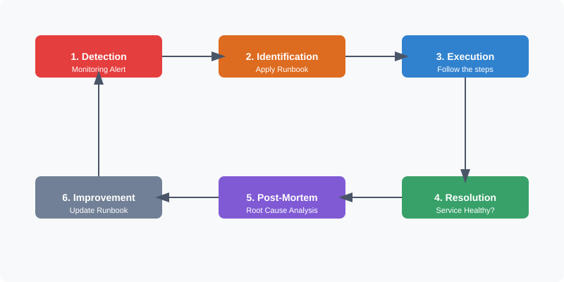

# Runbooks & Operational Procedures

In the world of DevOps, automation is king, but documentation is the law. **Runbooks** and **Standard Operating Procedures (SOPs)** are the foundational documents that ensure your systems are maintainable, recoverable, and accessible to the entire team.

---

## 📖 1. What is a Runbook?

A **Runbook** is a detailed, step-by-step guide for performing a specific operational task or resolving a known issue. While a **Playbook** (like Ansible) defines the *state* of the infrastructure via code, a **Runbook** defines the *human or automated process* to achieve a goal.

### Runbook vs. Playbook (The DevOps Distinction)

| Feature | Runbook | Playbook (e.g., Ansible) |
| :--- | :--- | :--- |
| **Purpose** | Process & Troubleshooting | Automation & Configuration |
| **Format** | Document (Markdown, Wiki) | Code (YAML, Python) |
| **Executed By** | Humans or Automation | Orchestration Engine |
| **Focus** | "What to do if X fails" | "Make the server look like Y" |

---

## 🛠️ 2. Types of Runbooks

### 🟢 Manual Runbooks
Written instructions for humans. Used for complex decisions, legacy systems, or tasks that require physical intervention.
*Example: "How to manually failover the physical database rack."*

### 🟡 Hybrid Runbooks (Semi-Automated)
Contains snippets of scripts or CLI commands that a human executes or triggers. These combine manual decision-making with automated execution.
*Example: "To clear the cache, run this script: `./scripts/purge_cache.sh`."*

### 🔵 Automated Runbooks (Auto-Remediation)
Code that is triggered by an alert. The system detects a failure and executes a fix without human intervention.
*Example: "AWS Lambda triggered by CloudWatch to restart an unstable EC2 instance."*

---

## 🔄 3. The Incident Lifecycle

Runbooks are most critical during an active incident. They guide the engineer through the lifecycle of a problem:

---

## 📝 4. Standard Runbook Template

Every runbook should follow a consistent structure to ensure speed during high-stress situations.

### [Module-Name-001]: Service Recovery
**Owner:** On-call Team Member
**Severity:** P1/P2

#### 🔍 Service Description
Briefly explain what the service does and its dependencies.

#### 🚨 Trigger Conditions
- HTTP 5xx errors > 5% in 1 minute.
- Memory usage > 90%.

#### 🏃 Procedures (Step-by-Step)
1. **Verify the Issue:** `curl -I http://service.internal/health`
2. **Check Logs:** `docker logs --tail 100 service_name`
3. **Restart Service:** `docker compose restart service_name`
4. **Scale if needed:** `docker compose scale service_name=3`

#### 📞 Escalation Path
If the issue persists for > 15 minutes, contact the **Database Administrator** or **Infrastructure Lead**.

---

## 💡 Best Practices

- **Keep it Updated:** An outdated runbook is more dangerous than no runbook.
- **Searchable:** Use clear titles and tags.
- **Testable:** Periodically "Game Day" your runbooks (Chaos Engineering) to ensure they work.
- **Store in Repo:** Keep your operational docs close to your code (GitOps for Docs).

---

## ✅ Knowledge Check
- [ ] Do you know where the runbooks for your current project are stored?
- [ ] Can an engineer who didn't write the service follow your recovery steps?
- [ ] Are your runbooks version-controlled?

---
*Next Step: Learn how to automate these procedures using **[Ansible Playbooks](../03-Ansible/)**.*
