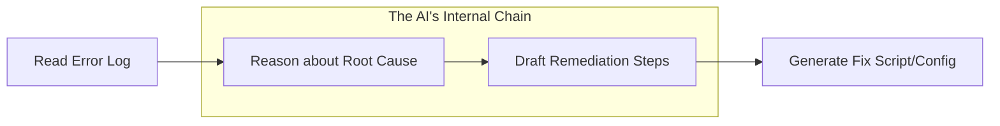

# DevOps Prompt Engineering - Intermediate Level

Scaling from simple scripts to complex automation requires advanced prompting techniques. At this level, we focus on **Chain-of-Thought (CoT)** and structured **Runbook** generation.

---

## 1. Chain-of-Thought (CoT) Prompting

CoT encourages the AI to "think out loud" before providing the final answer. This is crucial for troubleshooting complex infrastructure issues.

### The Technique
Append your prompt with: *"Let's think step-by-step"* or *"Explain your reasoning before providing the solution."*

### Mermaid: Troubleshooting Flow

---

## 2. Automating DevOps Runbooks

A common intermediate task is converting a messy incident log into a clean, repeatable **Runbook**.

**Intermediate Level Prompt:**
> "You are a Lead SRE. I will provide you with a series of Slack messages and terminal logs from a recent production outage. 
> 
> **Goal**: Generate a Markdown Runbook for this specific issue.
> **Format**: 
> 1. Symptoms
> 2. Root Cause Analysis
> 3. Step-by-step Remediation
> 4. Verification steps
> 5. Post-mortem Action items
> 
> **Logs to Analyze**: [Insert Logs Here]"

---

## 3. Practical Example: K8s Troubleshooting

**Prompt:**
> "I am getting `ImagePullBackOff` on a Kubernetes pod. 
> **Task**: Perform a Chain-of-Thought diagnosis. List the 5 most likely causes (e.g., registry auth, typo, quota) and give me the `kubectl` commands to verify each.
> **Constraint**: Don't just give the answer; explain *why* each command is used."

---

## 4. Interview Questions (Intermediate)

1. **What is 'Few-Shot' prompting and how does it help in CI/CD?**
   - Providing 2-3 examples of a task (e.g., successful Jenkinsfile snippets) to guide the AI in generating a new one that matches your company's standards.
2. **How do you use 'Role-Based' prompting for Security reviews?**
   - By asking the AI to "Act as a Pen-tester" or "Security Compliance auditor" to analyze a Terraform plan for public S3 buckets or open firewall ports.
3. **What is 'Temperature' in LLM settings?**
   - A setting that controls "creativity." For DevOps (code/config), we use low temperature (0.1 - 0.2) for predictable, accurate results.

---

## 5. Knowledge Quiz

1. **Which technique increases model accuracy on logical tasks?**
   - A) Shorter prompts
   - B) Chain-of-Thought
   - C) Zero-shot
   - D) Deleting constraints

2. **In Runbook automation, why do we provide logs as context?**
   - A) To make the prompt longer
   - B) To ground the AI in factual data vs. general knowledge
   - C) To test the AI's reading speed

3. **True/False: A 'System Prompt' is used to define the AI's behavior throughout a whole session.**
   - Answer: **True**.

---

## Next Steps
Proceed to the **[Advanced Level](../../3-Advanced/10-Prompt-Engineering/README.md)** to explore Agentic Workflows and Autonomous Remediation.
