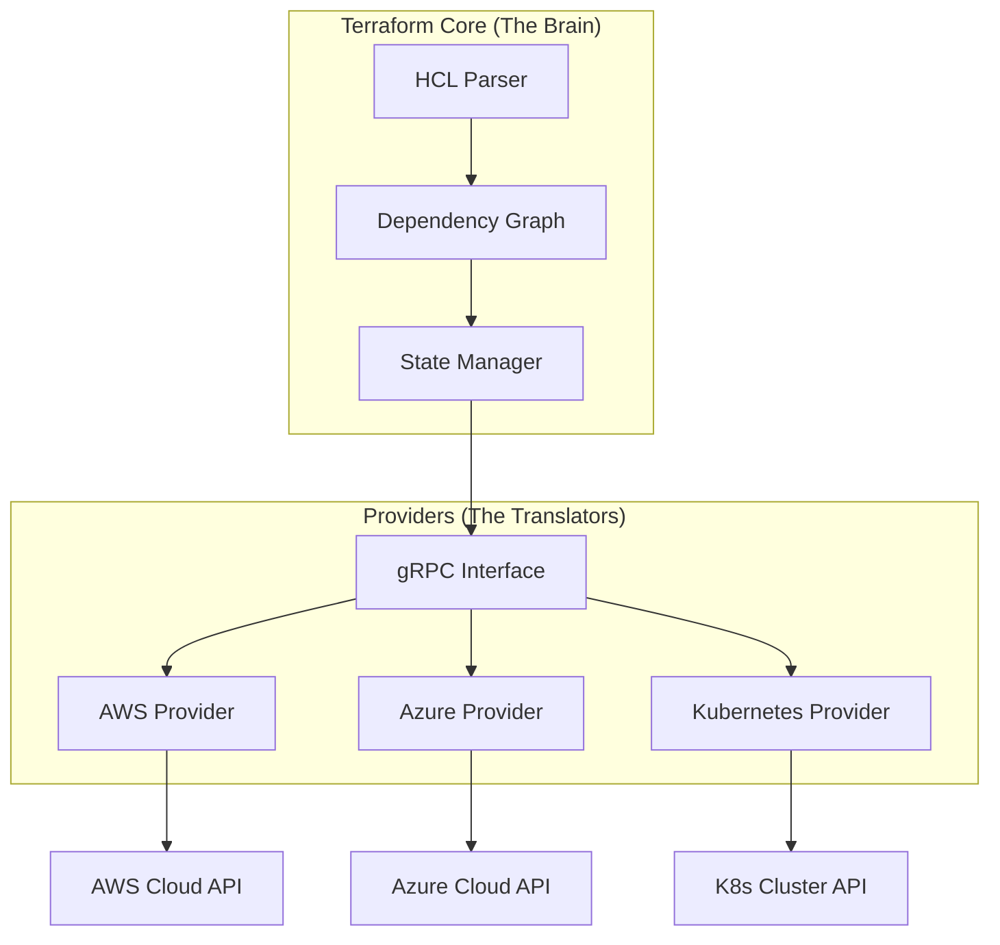

# The Deep Dive:
Welcome to Day 1 of your Infrastructure as Code (IaC) journey. Today, we go beyond the surface of Terraform to understand why it has become the industry standard for cloud orchestration and how you can master its architecture.

---
## 🏗️ 1. Orchestration vs. Configuration Management
One of the most common points of confusion in DevOps is the difference between tools like **Terraform** and **Ansible**.

| Feature | Terraform (Orchestration) | Ansible (Config Management) |
| :--- | :--- | :--- |
| **Primary Goal** | Provisioning Infrastructure (VPC, VMs, DBs) | Configuring OS/Apps (Installing Nginx, Users) |
| **Architecture** | Agentless (API-based) | Agentless (SSH/WinRM-based) |
| **Approach** | **Declarative** (Desired State) | **Procedural/Imperative** (Step-by-Step) |
| **State** | State-aware (Tracks what it created) | Stateless (Checks system state via SSH) |
### The Power of Declarative Code
In a **Declarative** model, you define *what* you want (e.g., "I want 3 servers"). If you run the code again, Terraform sees you already have 3 servers and does nothing. This is called **Idempotency**.

---
## 🧩 2. Architectural Deep Dive

Terraform’s strength lies in its modular, plugin-based architecture.

### A. Terraform Core
Written in Go, the Core is the brain of the operation. It is responsible for:
- **Reading Configuration**: Parsing HCL files.
- **State Management**: Comparing the current state to the desired state.
- **Dependency Graph (DAG)**: Building a mathematical map to determine which resources can be created in parallel.
### B. Providers (The Translators)
Terraform Core does not know how AWS or GCP works. It uses **Providers** as translators.
- Providers are external binaries that communicate with Core via **gRPC**.
- Each provider translates HCL commands into specific API calls (e.g., `aws_instance` becomes an `ec2:RunInstances` call).


### C. The State File (`terraform.tfstate`)
The State file is the "Source of Truth." It bridges the gap between your code and reality.
- **Metadata**: It stores IDs of real-world resources.
- **Performance**: It allows Terraform to know the state of thousands of resources without querying the Cloud APIs every time.
- **Locking**: When used with a remote backend (S3/GCS), it prevents two engineers from running `apply` at the same time and corrupting the environment.

---

## 🚀 3. The Terraform Lifecycle (The Inner Loop)
A DevOps engineer performs these steps hundreds of times a day in this order:
### Core Development Workflow
1.  **`terraform fmt`**:
    - Formats your code to HashiCorp's standard style.
    - Automatically fixes indentation, spacing, and alignment.
    - **Best Practice**: Run before every commit or enable "Format on Save" in your IDE.

2.  **`terraform validate`**:
    - Validates the syntax and internal consistency of your configuration.
    - Checks for typos, missing required arguments, and invalid references.
    - **Runs offline** - doesn't require provider credentials or network access.

3.  **`terraform init`**:
    - Initializes the working directory (run once per project or when providers change).
    - Downloads required Provider plugins into the `.terraform/` folder.
    - Sets up the backend for state storage.
    - **Re-run when**: Adding new providers or changing backend configuration.

4.  **`terraform plan`**:
    - Performs a "Dry Run" against real infrastructure.
    - Compares code vs. state vs. reality.
    - Generates an execution plan (What will be Created, Changed, or Destroyed).
    - **Always review** the plan output before applying.

5.  **`terraform apply`**:
    - Executes the plan after confirmation.
    - Makes actual API calls to the cloud.
    - Updates the `terraform.tfstate` file with new resource information.

### Additional Essential Commands

#### **`terraform show`**
- **Purpose**: Display current state or saved plan in human-readable format.
- **Usage**: 
  - `terraform show` - Shows current state
  - `terraform show planfile` - Shows a saved plan
- **When to use**: Debugging resource configurations, reviewing what's currently deployed, or inspecting a plan before applying.
- **Example Output**: Shows resource attributes, IDs, and current configuration.
#### **`terraform output`**
- **Purpose**: Display output values from your configuration.
- **Usage**:
  - `terraform output` - Shows all outputs
  - `terraform output instance_ip` - Shows specific output
  - `terraform output -json` - JSON format for scripting
- **When to use**: Getting deployment results (IPs, URLs, resource IDs) for use in other systems or CI/CD pipelines.
- **Real-world example**: Retrieving load balancer DNS name to update DNS records.
#### **`terraform refresh`** (<font color="#ff0000">Legacy - Use with Caution</font>)
- **Purpose**: Update state file with real-world resource status.
- **Modern approach**: `terraform plan -refresh-only` (Terraform 0.15.4+)
- **When to use**: Rarely needed - when you suspect state drift or after manual changes.
- **Warning**: Can cause issues if resources were modified outside Terraform.
#### **`terraform destroy`**
- **Purpose**: Gracefully removes all resources managed by the current configuration.
- **Usage**:
  - `terraform destroy` - Interactive confirmation
  - `terraform destroy -auto-approve` - Skip confirmation (dangerous!)
  - `terraform destroy -target=aws_instance.web` - Destroy specific resource
- **When to use**: Tearing down environments, cleaning up after testing.
- **Best Practice**: Always run `terraform plan -destroy` first to review what will be deleted.
#### **Advanced Troubleshooting Commands**
These commands are essential for production environments and complex state management scenarios.
##### **`terraform state` - State File Surgery**
The most powerful and dangerous set of commands for direct state manipulation.
**Core State Operations:**
```bash
# List all resources currently tracked
terraform state list

# Show detailed information about a specific resource
terraform state show aws_instance.web_server

# Remove a resource from state (doesn't destroy the actual resource)
terraform state rm aws_instance.web_server

# Move/rename a resource in state
terraform state mv aws_instance.old_name aws_instance.new_name

# Replace a resource provider (useful for provider migrations)
terraform state replace-provider registry.terraform.io/hashicorp/aws hashicorp/aws
```
#### **Real-World Scenarios:**
- **Scenario 1**: You renamed a resource in code but Terraform wants to destroy/recreate it
  - **Solution**: Use `terraform state mv` to update the state without touching infrastructure
- **Scenario 2**: A resource was manually deleted from AWS but still exists in state
  - **Solution**: Use `terraform state rm` to clean up the state file
- **Scenario 3**: You need to transfer resource ownership between Terraform configurations
  - **Solution**: Export with `terraform state show`, then import into new configuration
##### **`terraform import` - Adopt Existing Infrastructure**
Brings existing cloud resources under Terraform management.
**Usage Patterns:**
```bash
# Import an existing AWS EC2 instance
terraform import aws_instance.web i-1234567890abcdef0

# Import an existing S3 bucket
terraform import aws_s3_bucket.data my-existing-bucket

# Import with module path
terraform import module.vpc.aws_vpc.main vpc-12345678
```

**Step-by-Step Import Process:**
1. **Write the resource configuration** in your `.tf` file (without running apply)
2. **Run the import command** with the resource's cloud ID
3. **Run `terraform plan`** to see if configuration matches reality
4. **Adjust configuration** until plan shows no changes

**Real-World Scenarios:**
- **Legacy Infrastructure**: Bringing manually created resources under IaC control
- **Team Handoffs**: Taking over infrastructure from another team
- **Disaster Recovery**: Rebuilding Terraform state after state file loss
##### **`terraform taint` - Force Resource Recreation**
Marks a resource as "tainted" so it will be destroyed and recreated on next apply.
**Usage:**
```bash
# Taint a specific resource
terraform taint aws_instance.web_server

# Untaint if you change your mind
terraform untaint aws_instance.web_server

# Taint a resource in a module
terraform taint module.database.aws_db_instance.main
```

**When to Use Taint:**
- **Corrupted Resources**: When a resource is in a bad state but Terraform doesn't detect it
- **Security Incidents**: Force recreation of potentially compromised resources
- **Configuration Drift**: When manual changes can't be reverted through normal plan/apply
- **Testing**: Validate that your infrastructure can be recreated reliably

**Modern Alternative (Terraform 0.15.2+):**
```bash
# Replace command (more explicit than taint)
terraform apply -replace=aws_instance.web_server
```

##### **`terraform workspace` - Multi-Environment Management**
Manage multiple environments (dev, staging, prod) with the same configuration.

**Workspace Operations:**
```bash
# List all workspaces (* indicates current)
terraform workspace list

# Create a new workspace
terraform workspace new staging
terraform workspace new production

# Switch between workspaces
terraform workspace select staging
terraform workspace select production

# Show current workspace
terraform workspace show

# Delete a workspace (must be empty)
terraform workspace delete old-environment
```

**Workspace-Aware Configuration:**
```hcl
# Use workspace name in resource naming
resource "aws_instance" "web" {
  ami           = "ami-12345678"
  instance_type = terraform.workspace == "production" ? "t3.large" : "t3.micro"
  
  tags = {
    Name        = "web-server-${terraform.workspace}"
    Environment = terraform.workspace
  }
}

# Workspace-specific variable files
# terraform.tfvars.staging
# terraform.tfvars.production
```

**Best Practices:**
- **Separate State**: Each workspace maintains its own state file
- **Naming Convention**: Use consistent workspace names across teams
- **Variable Management**: Use workspace-specific `.tfvars` files
- **Production Safety**: Never run experimental commands in production workspace
##### **Emergency Recovery Commands**
**`terraform force-unlock`** - Break state locks:
```bash
# When state is locked due to interrupted operations
terraform force-unlock LOCK_ID
```
**`terraform refresh`** - Sync state with reality:
```bash
# Modern approach (Terraform 0.15.4+)
terraform plan -refresh-only
terraform apply -refresh-only

# Legacy approach (use with caution)
terraform refresh
```
**Debugging and Inspection:**
```bash
# Enable detailed logging
export TF_LOG=DEBUG
terraform plan

# Save plan for inspection
terraform plan -out=tfplan
terraform show tfplan

# Validate configuration without accessing remote state
terraform validate
```
### The Complete Inner Loop
```bash
# 1. Format and validate (every code change)
terraform fmt
terraform validate

# 2. Initialize (once per project)
terraform init

# 3. Plan and apply (deployment cycle)
terraform plan
terraform apply

# 4. Verify deployment
terraform show
terraform output
```
---
## 📄 4. HCL Syntax: The Building Blocks
HashiCorp Configuration Language (HCL) is designed to be human-readable but machine-efficient.
### A. The Resource Block
The most important block. It defines a piece of infrastructure.
```hcl
resource "aws_instance" "web_server" {
  ami           = "ami-0c55b159cbfafe1d0" # Image ID
  instance_type = "t3.micro"              # Hardare size

  tags = {
    Name = "HelloWorld"
  }
}
```
### B. Variables & Outputs
- **Variables**: Input parameters to make your code reusable.
- **Outputs**: Information you want to see after deployment (like an IP address).
---
## 🛡️ 5. SRE Best Practices: Day 1 Standards
1.  **Never Hardcode**: Use variables for regions, environment names, and secrets.
2.  **Remote State**: Never keep your state file on your laptop. If your laptop dies, you lose control of your infrastructure.
3.  **Version Pinning**: Always pin your Terraform version and Provider versions to prevent "breaking changes" from automatic updates.
4.  **Formatting**: Always run `terraform fmt` before committing. Clean code is easier to debug during a production outage.
---
## 🌟 Real-Life Scenario: The Parallelization Miracle
**Situation**: You need to deploy a complex network consisting of a VPC, 50 Subnets, and 100 Security Group rules.

**The Manual Way**: Creating these one by one would take hours.
**The Terraform Way**: Because Terraform builds a **DAG**, it realizes that all 50 subnets are independent of each other. It spawns 50 parallel API calls, deploying the entire network in seconds rather than hours. This is the power of the **Dependency Graph**.

---
## ❓ Knowledge Check
1.  **Why is `terraform init` required for every new project?**
    - To download the specific provider binaries required by your code.
2.  **What happens if you change a resource manually in the AWS Console?**
    - This is called **Configuration Drift**. The next time you run `plan`, Terraform will detect the change and attempt to revert the resource to the state defined in your code.
3.  **Is HCL case-sensitive?**
    - Yes, resource names and attributes are case-sensitive.
