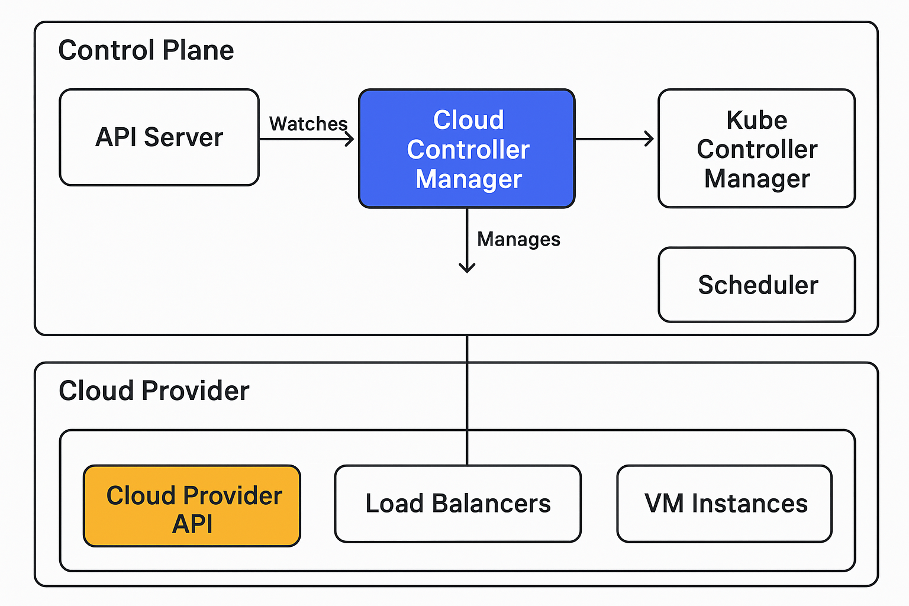
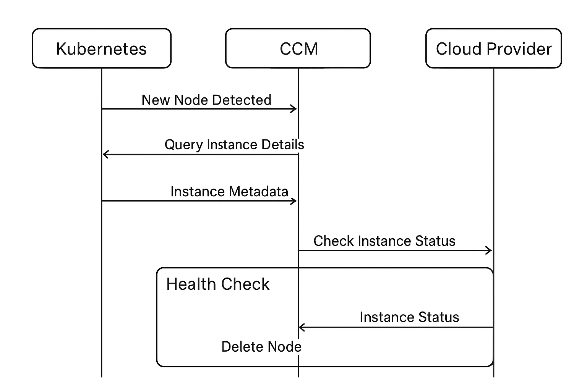
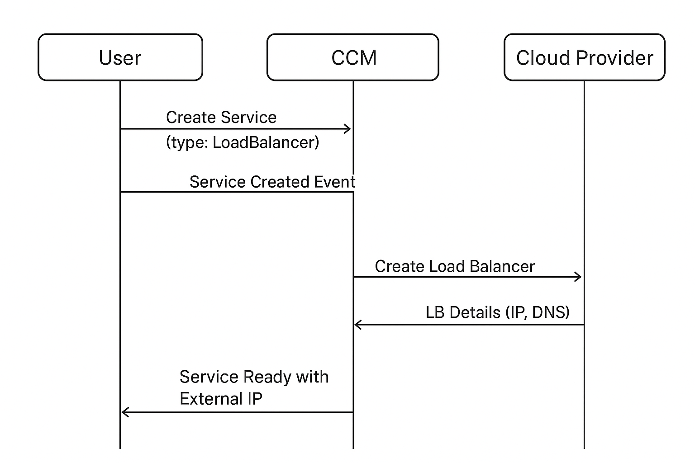
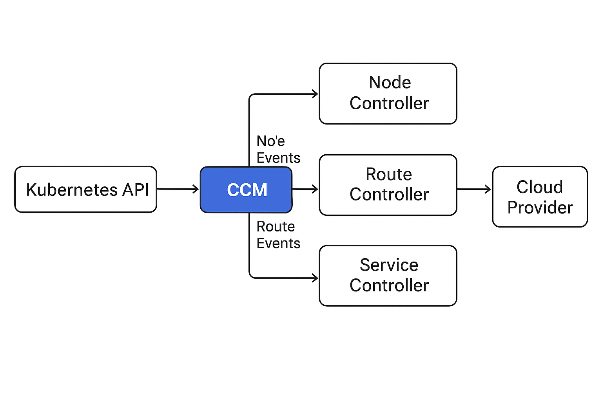
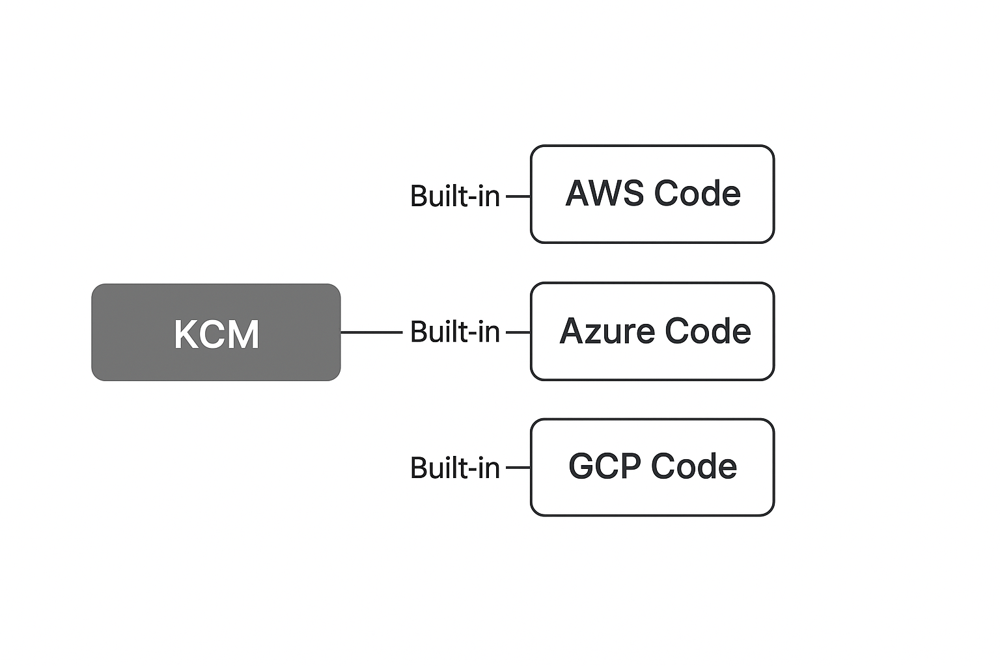
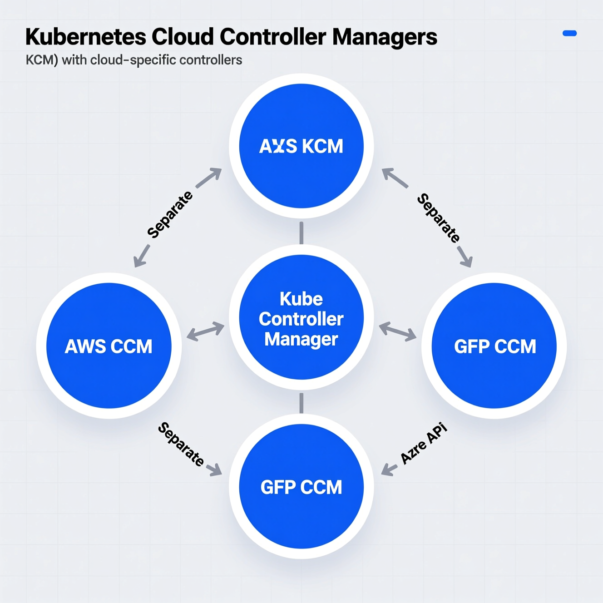

# Cloud Controller Manager (CCM)

## Overview

The **Cloud Controller Manager** (CCM) is a Kubernetes control plane component that embeds cloud-specific control logic. It allows you to link your cluster into your cloud provider's API and separates out the components that interact with that cloud platform from components that only interact with your cluster.

By decoupling the interoperability logic between Kubernetes and the underlying cloud infrastructure, the CCM enables cloud providers to release features at a different pace compared to the main Kubernetes project.

## Purpose and Benefits

### Key Purposes

1. **Cloud Integration**: Connects Kubernetes cluster to cloud provider APIs
2. **Separation of Concerns**: Decouples cloud-specific code from Kubernetes core
3. **Independent Evolution**: Allows cloud providers to develop features independently
4. **Vendor Neutrality**: Keeps Kubernetes core cloud-agnostic

### Benefits

- **Flexibility**: Cloud providers can update their integration without waiting for Kubernetes releases
- **Maintainability**: Cleaner separation between cloud-specific and cloud-agnostic code
- **Scalability**: Easier to add new cloud provider support
- **Reduced Core Complexity**: Kubernetes core remains focused on orchestration logic

## Architecture


## Core Components

The Cloud Controller Manager runs the following controllers:

### 1. Node Controller

**Responsibilities:**
- Initializes nodes with cloud-specific zone/region labels
- Initializes nodes with cloud-specific instance details (type, size)
- Obtains the node's network addresses and hostname
- Checks the cloud provider to determine if a node has been deleted from the cloud after it stops responding

**Workflow:**


### 2. Route Controller

**Responsibilities:**
- Configures routes in the cloud networking layer
- Ensures pods on different nodes can communicate
- Sets up network routing tables for pod-to-pod communication

**Purpose:**
- Required for proper pod networking across nodes
- Ensures network connectivity in cloud environments
- Manages cloud network route tables

### 3. Service Controller

**Responsibilities:**
- Creates, updates, and deletes cloud load balancers
- Manages LoadBalancer type services
- Configures cloud load balancer health checks
- Updates load balancer configurations when service endpoints change

**Service Types Handled:**
- **LoadBalancer**: Creates external cloud load balancers
- Integrates with cloud provider's native load balancing solutions

**Example Flow:**


## How It Works

### 1. Initialization

When the CCM starts:
1. Authenticates with the cloud provider API
2. Initializes cloud-specific controllers
3. Begins watching Kubernetes API for relevant resources
4. Syncs existing resources with cloud state

### 2. Event-Driven Operation

The CCM operates on an event-driven model:



### 3. Reconciliation Loop

Each controller runs a reconciliation loop:
1. **Watch**: Monitor Kubernetes resources
2. **Compare**: Check current state vs. desired state
3. **Action**: Make cloud API calls to reconcile differences
4. **Update**: Update Kubernetes resource status

## Configuration

### Enabling Cloud Controller Manager

The CCM is typically deployed as a pod or static pod in the cluster:

```yaml
apiVersion: v1
kind: Pod
metadata:
  name: cloud-controller-manager
  namespace: kube-system
spec:
  containers:
  - name: cloud-controller-manager
    image: k8s.gcr.io/cloud-controller-manager:v1.28.0
    command:
    - /usr/local/bin/cloud-controller-manager
    - --cloud-provider=<provider-name>
    - --leader-elect=true
    - --use-service-account-credentials=true
    - --allocate-node-cidrs=true
    - --configure-cloud-routes=true
```

### Common Flags

| Flag | Description |
|------|-------------|
| `--cloud-provider` | Name of the cloud provider |
| `--cloud-config` | Path to cloud provider configuration file |
| `--leader-elect` | Enable leader election for high availability |
| `--use-service-account-credentials` | Use separate service accounts for each controller |
| `--configure-cloud-routes` | Enable route controller |
| `--allocate-node-cidrs` | Allocate and set node CIDR ranges |

## Cloud Provider Integration

### Supported Cloud Providers

Major cloud providers with CCM implementations:

- **AWS**: AWS Cloud Controller Manager
- **Azure**: Azure Cloud Controller Manager
- **GCP**: GCE Cloud Controller Manager
- **OpenStack**: OpenStack Cloud Controller Manager
- **vSphere**: vSphere Cloud Controller Manager
- **Alibaba Cloud**: Alibaba Cloud Controller Manager

### Provider-Specific Features

Each cloud provider may implement additional features:

- **AWS**: ELB/ALB integration, Route53 DNS, EC2 instance management
- **Azure**: Azure Load Balancer, Azure Disk management, VMSS integration
- **GCP**: Google Cloud Load Balancing, GCE instance groups, persistent disks

## Migration from In-Tree to Out-of-Tree

Historically, cloud provider code was built into the Kubernetes core. The CCM represents a shift to an **out-of-tree** model:

### In-Tree (Legacy)



### Out-of-Tree (Modern)



### Migration Steps

1. Deploy cloud-specific CCM
2. Configure kubelet with `--cloud-provider=external`
3. Remove `--cloud-provider` flag from kube-controller-manager
4. Restart affected components

## Security Considerations

### Authentication and Authorization

- **Service Accounts**: Each controller should use dedicated service accounts
- **RBAC**: Proper Role-Based Access Control configuration required
- **Cloud Credentials**: Securely manage cloud provider credentials

### Best Practices

1. **Least Privilege**: Grant minimal required permissions
2. **Secret Management**: Use Kubernetes secrets for cloud credentials
3. **Network Policies**: Restrict CCM network access
4. **Audit Logging**: Enable audit logs for CCM operations

```yaml
apiVersion: v1
kind: ServiceAccount
metadata:
  name: cloud-controller-manager
  namespace: kube-system
---
apiVersion: rbac.authorization.k8s.io/v1
kind: ClusterRole
metadata:
  name: system:cloud-controller-manager
rules:
- apiGroups: [""]
  resources: ["nodes"]
  verbs: ["get", "list", "watch", "update", "patch", "delete"]
- apiGroups: [""]
  resources: ["services"]
  verbs: ["get", "list", "watch", "update", "patch"]
- apiGroups: [""]
  resources: ["events"]
  verbs: ["create", "patch", "update"]
```

## Troubleshooting

### Common Issues

#### 1. CCM Not Starting

**Symptoms**: CCM pod in CrashLoopBackOff

**Possible Causes**:
- Incorrect cloud provider credentials
- Missing cloud configuration file
- Network connectivity issues

**Solution**:
```bash
# Check CCM logs
kubectl logs -n kube-system <ccm-pod-name>

# Verify cloud credentials
kubectl get secret -n kube-system <cloud-credential-secret>

# Check CCM configuration
kubectl describe pod -n kube-system <ccm-pod-name>
```

#### 2. Load Balancer Not Created

**Symptoms**: Service remains in pending state

**Solution**:
```bash
# Check service status
kubectl describe service <service-name>

# Check CCM logs for service controller
kubectl logs -n kube-system <ccm-pod-name> | grep -i service

# Verify cloud provider quotas and permissions
```

#### 3. Node Not Ready

**Symptoms**: Nodes show "NotReady" status

**Solution**:
```bash
# Check node conditions
kubectl describe node <node-name>

# Verify CCM can reach cloud API
kubectl logs -n kube-system <ccm-pod-name> | grep -i node

# Check node controller status
```

## Monitoring and Observability

### Metrics

The CCM exposes Prometheus metrics for monitoring:

- `cloudprovider_*_api_request_duration_seconds`: Cloud API request latency
- `cloudprovider_*_api_request_errors_total`: Cloud API request errors
- `workqueue_*`: Controller work queue metrics

### Health Checks

```bash
# Check CCM health endpoints
kubectl get --raw /healthz/ping
kubectl get --raw /metrics
```

## Summary

The Cloud Controller Manager is a critical component that:

- ✅ Decouples cloud-specific logic from Kubernetes core
- ✅ Manages cloud resources (nodes, routes, load balancers)
- ✅ Enables independent cloud provider feature development
- ✅ Provides a clean interface between Kubernetes and cloud infrastructure
- ✅ Supports multiple cloud providers through a plugin architecture

> [!IMPORTANT]
> When running Kubernetes on a cloud provider, the CCM is essential for proper cluster operation. It ensures nodes are properly initialized, networking is configured correctly, and services can expose external endpoints.

## References

- [Kubernetes Documentation - Cloud Controller Manager](https://kubernetes.io/docs/concepts/architecture/cloud-controller/)
- [Kubernetes Enhancement Proposal - Out-of-Tree Cloud Provider](https://github.com/kubernetes/enhancements/tree/master/keps/sig-cloud-provider)
- [Cloud Provider Interface (CPI) Documentation](https://github.com/kubernetes/cloud-provider)
