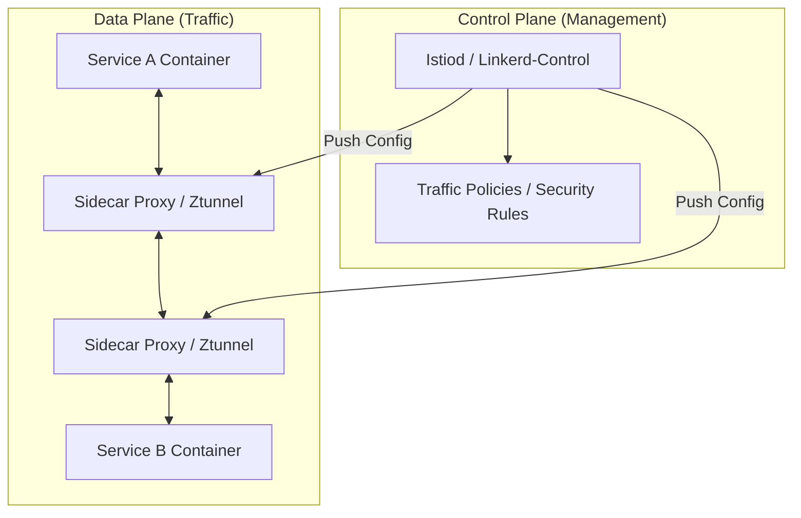

# Advanced Kubernetes: Service Mesh Deep Dive

A **Service Mesh** is a dedicated infrastructure layer for facilitating service-to-service communications between microservices. It offloads critical responsibilities like traffic management, security, and observability from the application code to the infrastructure.

---

## 🏛️ Architecture: Control Plane vs. Data Plane

Modern service meshes are divided into two distinct logical layers:



1.  **Data Plane**: A set of intelligent proxies (Envoy, Linkerd-proxy, or Ztunnel) deployed alongside application code. They intercept all network traffic to apply policies.
2.  **Control Plane**: The management layer that provides configuration, discovery, and certificate management to the data plane.

---

## 🏎️ Popular Solutions

### 1. Istio (The Industry Standard)
Istio is the most feature-rich and widely adopted mesh. It recently introduced a major architectural evolution:

#### 🔹 Sidecar Mode (Classical)
Every pod has an Envoy proxy container.
- **Pros**: Granular L7 control, established.
- **Cons**: High resource overhead (CPU/RAM per pod), complex upgrades.

#### 🔹 Ambient Mesh (Modern / Sidecar-less)
Splits the proxy responsibilities into two layers:
- **Ztunnel (L4)**: A shared node-level proxy for secure transport (mTLS).
- **Waypoint Proxy (L7)**: An optional per-namespace proxy for complex routing.
- **Pros**: 90%+ reduction in resource usage, zero-restart upgrades for apps.

### 2. Linkerd (Simplicity & Performance)
Linkerd is famous for being "lightweight" and focusing on the core essentials.
- **Data Plane**: Written in **Rust** for extreme safety and speed.
- **Philosophy**: Avoids the "knobs and dials" complexity of Istio. If it doesn't need to be configurable, it isn't.

### 3. Cilium Service Mesh (eBPF Powered)
Leverages eBPF in the Linux kernel to handle traffic.
- **Identity-based**: Uses eBPF for security rather than IP addresses.
- **L7 without sidecars**: Can offload L7 processing to node-level proxies or kernel space.

---

## 🚦 Advanced Traffic Management

### Canary Testing (Traffic Shifting)
Split traffic between stable (v1) and experimental (v2) versions.

```yaml
apiVersion: networking.istio.io/v1beta1
kind: VirtualService
metadata:
  name: billing-svc
spec:
  hosts:
    - billing.prod.svc.cluster.local
  http:
  - route:
    - destination:
        host: billing-svc
        subset: v1
      weight: 95
    - destination:
        host: billing-svc
        subset: v2
      weight: 5
```

### Chaos Engineering: Fault Injection
Simulate failures (latencies or 503s) to test application resilience.

```yaml
spec:
  http:
  - fault:
      delay:
        percentage:
          value: 10
        fixedDelay: 5s
    route:
    - destination:
        host: my-db-svc
```

### Resilience: Circuit Breaking
Stop sending traffic to an unhealthy service before it cascades into a total system failure.

```yaml
spec:
  host: search-api
  trafficPolicy:
    outlierDetection:
      consecutive5xxErrors: 3
      interval: 10s
      baseEjectionTime: 30s
```

---

## 🔒 Zero-Trust Security (mTLS)

Service meshes automate **Mutual TLS (mTLS)**. Each service receives its own X.509 certificate, refreshed automatically.

1.  **PeerAuthentication**: Defines if mTLS is REQUIRED or OPTIONAL.
2.  **AuthorizationPolicy**: Defines WHO can talk to WHOM (White-listing).

**Example: Allowing only the 'Order' service to talk to 'Payment' service.**
```yaml
apiVersion: security.istio.io/v1beta1
kind: AuthorizationPolicy
metadata:
  name: payment-accessor
spec:
  selector:
    matchLabels:
      app: payment
  rules:
  - from:
    - source:
        principals: ["cluster.local/ns/prod/sa/order-service-account"]
```

---

## 📊 Comparison Matrix

| Feature | Istio (Sidecar) | Istio (Ambient) | Linkerd | Cilium Mesh |
| :--- | :--- | :--- | :--- | :--- |
| **Complexity** | High | Medium | Low | Medium |
| **Performance** | Resource-heavy | Very High | Excellent | Leader |
| **L7 Control** | Extreme | High | Essential | High |
| **Upgrade Risk** | High (App restart) | Zero | Low | Low |
| **Proxies** | Envoy | Ztunnel + Waypoint | linkerd2-proxy | eBPF + Envoy |

---

## 🛠️ When to avoid a Service Mesh?
> [!WARNING] 
> Do not install a Service Mesh just because it's "cool."
- **Small Clusters**: If you have < 10 microservices, the overhead of a mesh exceeds its value.
- **Performance-Critical L4**: If you only need simple load balancing, use K8s Services/CNI.
- **Complex Latency Budgets**: Adding a proxy hop adds ~1-5ms of latency.

---

**Next Module**: Secure your enterprise cluster with **[Enterprise Security (DevSecOps)](../04-Security/README.md)**.
