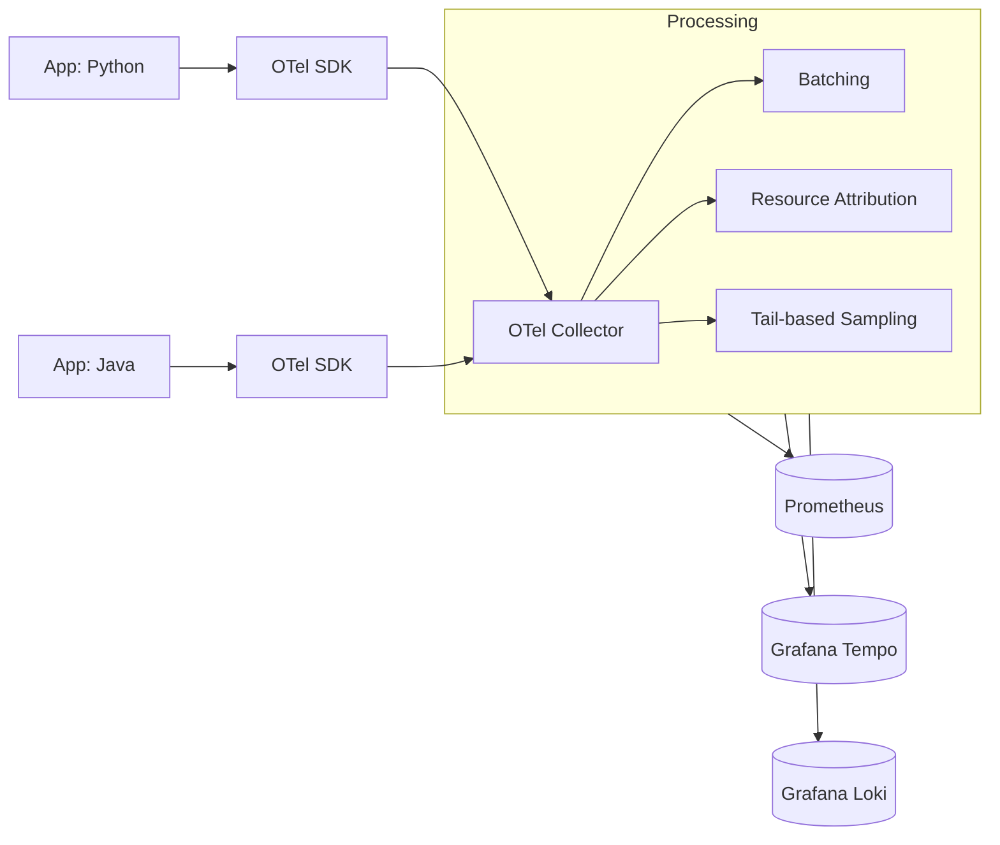

# Observability: Mastering Cluster Insights

Monitoring tells you *if* a system is failing; Observability helps you understand *why*. In a world of hundreds of microservices, knowing that a server is "up" is just the beginning.

---

## 🏛️ The Three Pillars of Observability

A complete observability strategy requires correlating three distinct types of data:

### 1. Metrics (Numerical History)
- **Tool**: [Prometheus](../../00-Resources/01-Scripts-Code/Prometheus/) & Grafana.
- **Example Alerting Rule**:
```yaml
groups:
- name: example
  rules:
  - alert: HighRequestLatency
    expr: job:request_latency_seconds:mean5m{job="my-app"} > 0.5
    for: 10m
    labels:
      severity: page
    annotations:
      summary: "High request latency on {{ $labels.instance }}"
```

### 2. Logs (Textual Evidence)
- **Tool**: ELK Stack (Elasticsearch, Logstash, Kibana) or Loki.
- **Example Logstash Gork Filter**:
```ruby
filter {
  grok {
    match => { "message" => "%{IP:client_ip} %{USER:ident} %{USER:auth} \[%{HTTPDATE:timestamp}\] \"%{WORD:method} %{URIPATHPARAM:request} HTTP/%{NUMBER:http_version}\" %{NUMBER:response_code} %{NUMBER:bytes}" }
  }
}
```

### 3. Traces (The Request Journey)
- **Tool**: OpenTelemetry (OTel), Jaeger, or AWS X-Ray.
- **Goal**: Correlation IDs that link logs and metrics to a specific user request.

---

## 🔄 The OpenTelemetry (OTel) Pipeline

OpenTelemetry is the industry standard for standardizing how we collect telemetry without vendor lock-in.



---

## 🛡️ Enterprise Strategies

### Sampling Strategies
In high-traffic systems, you cannot save 100% of traces (too expensive).
- **Head-based Sampling**: Deciding to trace at the start of the request (consistent but might miss errors).
- **Tail-based Sampling**: Inspecting the whole trace before deciding to save it (save all errors, discard 90% of successes).

### High Cardinality
Adding specific labels (like `user_id` or `order_id`) to metrics to pinpoint issues for specific customers.

### Unified Dashboards
Combining logs, metrics, and traces into a single Grafana view (ServiceLens).

## 4. Advanced Sub-Modules

### ☸️ [Kube-Prometheus-Stack](./01-Kube-Prometheus-Stack/README.md)
The Kubernetes-native monitoring solution. Learn the Operator pattern, CRDs (ServiceMonitors/PrometheusRules), and Helm-based deployment for production clusters.

### 🪵 [ELK Stack](./03-Logging-ELK/README.md)
Advanced log management and search. Master the ingestion flow (Beats -> Logstash -> ES -> Kibana) and set up production-grade log processing pipelines.

---

**Cloud Observability**: See how to implement these patterns in AWS using [CloudWatch and X-Ray](../08-Enterprise-Cloud/17-Observability-Governance/README.md).
