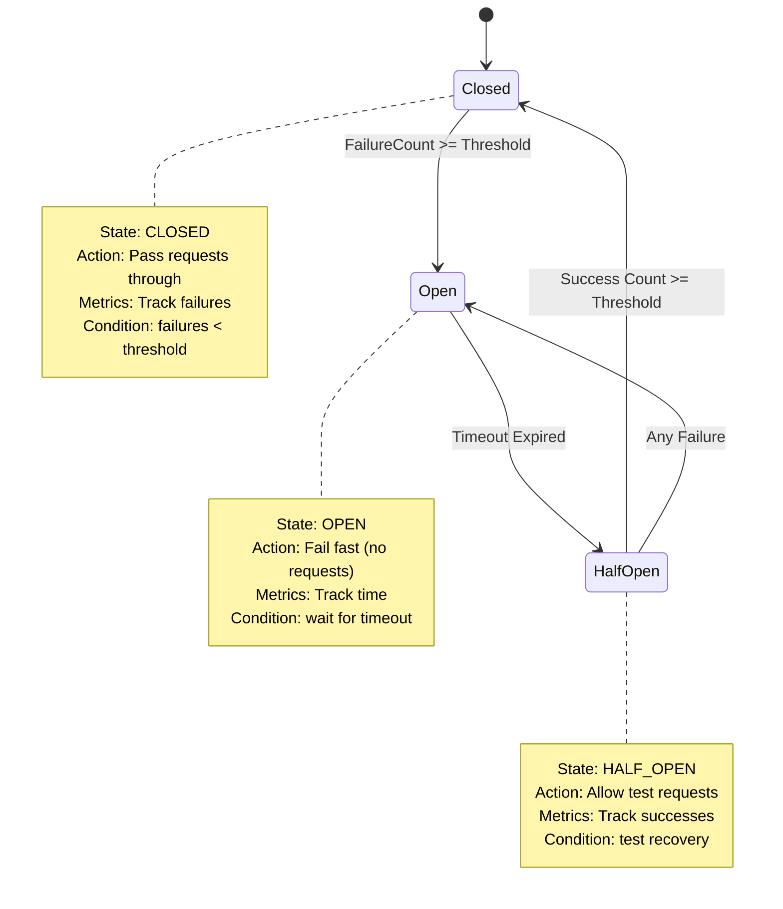

# Service Mesh and Resilience Patterns

**Deep Dive** | Circuit Breakers, Bulkheads, and Service Mesh Implementation

---

## 📋 Overview

This guide explores advanced resiliency patterns implemented at both the application level and infrastructure layer (service mesh).

**Key Topics:**
- Circuit Breaker implementation details
- Bulkhead pattern for resource isolation
- Service Mesh configuration (Istio/Linkerd)
- Retry strategies and backoff algorithms

---

## 🔌 Circuit Breaker Pattern - Deep Dive

### State Machine Implementation



### Production-Grade Implementation (Go)

```go
package circuitbreaker

import (
    "errors"
    "sync"
    "time"
)

type State int

const (
    StateClosed State = iota
    StateOpen
    StateHalfOpen
)

type CircuitBreaker struct {
    mu              sync.RWMutex
    state           State
    failures        uint64
    successes       uint64
    lastFailureTime time.Time
    
    // Configuration
    maxFailures     uint64
    timeout         time.Duration
    halfOpenMaxReq  uint64
    
    // Callbacks
    onStateChange   func(from, to State)
}

type Config struct {
    MaxFailures    uint64        // Open after N failures
    Timeout        time.Duration // Time to wait before Half-Open
    HalfOpenMaxReq uint64        // Max concurrent requests in Half-Open
}

func NewCircuitBreaker(cfg Config) *CircuitBreaker {
    return &CircuitBreaker{
        state:          StateClosed,
        maxFailures:    cfg.MaxFailures,
        timeout:        cfg.Timeout,
        halfOpenMaxReq: cfg.HalfOpenMaxReq,
    }
}

func (cb *CircuitBreaker) Call(fn func() error) error {
    if !cb.canProceed() {
        return errors.New("circuit breaker is OPEN")
    }
    
    err := fn()
    
    if err != nil {
        cb.recordFailure()
        return err
    }
    
    cb.recordSuccess()
    return nil
}

func (cb *CircuitBreaker) canProceed() bool {
    cb.mu.RLock()
    defer cb.mu.RUnlock()
    
    switch cb.state {
    case StateClosed:
        return true
    case StateOpen:
        // Check if timeout has elapsed
        if time.Since(cb.lastFailureTime) > cb.timeout {
            cb.setState(StateHalfOpen)
            return true
        }
        return false
    case StateHalfOpen:
        // Allow limited concurrent requests
        return cb.successes < cb.halfOpenMaxReq
    default:
        return false
    }
}

func (cb *CircuitBreaker) recordFailure() {
    cb.mu.Lock()
    defer cb.mu.Unlock()
    
    cb.failures++
    cb.lastFailureTime = time.Now()
    
    switch cb.state {
    case StateClosed:
        if cb.failures >= cb.maxFailures {
            cb.setState(StateOpen)
        }
    case StateHalfOpen:
        // Any failure in Half-Open goes back to Open
        cb.setState(StateOpen)
    }
}

func (cb *CircuitBreaker) recordSuccess() {
    cb.mu.Lock()
    defer cb.mu.Unlock()
    
    switch cb.state {
    case StateClosed:
        // Reset failure count on success
        cb.failures = 0
    case StateHalfOpen:
        cb.successes++
        if cb.successes >= cb.halfOpenMaxReq {
            // Recovery successful
            cb.setState(StateClosed)
            cb.failures = 0
            cb.successes = 0
        }
    }
}

func (cb *CircuitBreaker) setState(newState State) {
    oldState := cb.state
    cb.state = newState
    
    if cb.onStateChange != nil {
        cb.onStateChange(oldState, newState)
    }
    
    log.Printf("[Circuit Breaker] State changed: %v -> %v", oldState, newState)
}

// Metrics
func (cb *CircuitBreaker) State() State {
    cb.mu.RLock()
    defer cb.mu.RUnlock()
    return cb.state
}

func (cb *CircuitBreaker) Metrics() map[string]interface{} {
    cb.mu.RLock()
    defer cb.mu.RUnlock()
    
    return map[string]interface{}{
        "state":    cb.state.String(),
        "failures": cb.failures,
        "successes": cb.successes,
    }
}
```

### Usage Example

```go
func main() {
    cb := circuitbreaker.NewCircuitBreaker(circuitbreaker.Config{
        MaxFailures:    5,
        Timeout:        30 * time.Second,
        HalfOpenMaxReq: 3,
    })
    
    // Set callback for state changes
    cb.OnStateChange(func(from, to circuitbreaker.State) {
        metrics.RecordCircuitBreakerStateChange(from, to)
        alerting.Notify("Circuit breaker state: %v -> %v", from, to)
    })
    
    // Use circuit breaker
    err := cb.Call(func() error {
        return callExternalPaymentService()
    })
    
    if err != nil {
        if err.Error() == "circuit breaker is OPEN" {
            // Fallback logic
            return useCachedPaymentResult()
        }
        return err
    }
}
```

---

## 🚢 Bulkhead Pattern - Implementation

### Thread Pool Isolation

```go
package bulkhead

import (
    "context"
    "errors"
    "sync"
)

type Bulkhead struct {
    semaphore chan struct{}
    name      string
    metrics   *BulkheadMetrics
}

type BulkheadMetrics struct {
    mu              sync.RWMutex
    totalRequests   uint64
    rejectedRequests uint64
    activeRequests  uint64
}

func NewBulkhead(name string, maxConcurrent int) *Bulkhead {
    return &Bulkhead{
        semaphore: make(chan struct{}, maxConcurrent),
        name:      name,
        metrics:   &BulkheadMetrics{},
    }
}

func (b *Bulkhead) Execute(ctx context.Context, fn func() error) error {
    b.metrics.incrementTotal()
    
    select {
    case b.semaphore <- struct{}{}:
        // Acquired slot
        b.metrics.incrementActive()
        defer func() {
            <-b.semaphore
            b.metrics.decrementActive()
        }()
        
        return fn()
        
    case <-ctx.Done():
        return ctx.Err()
        
    default:
        // Bulkhead full
        b.metrics.incrementRejected()
        return errors.New("bulkhead full: request rejected")
    }
}

func (b *BulkheadMetrics) incrementTotal() {
    b.mu.Lock()
    defer b.mu.Unlock()
    b.totalRequests++
}

func (b *BulkheadMetrics) incrementActive() {
    b.mu.Lock()
    defer b.mu.Unlock()
    b.activeRequests++
}

func (b *BulkheadMetrics) decrementActive() {
    b.mu.Lock()
    defer b.mu.Unlock()
    b.activeRequests--
}

func (b *BulkheadMetrics) incrementRejected() {
    b.mu.Lock()
    defer b.mu.Unlock()
    b.rejectedRequests++
}

func (b *BulkheadMetrics) Snapshot() map[string]uint64 {
    b.mu.RLock()
    defer b.mu.RUnlock()
    
    return map[string]uint64{
        "total":    b.totalRequests,
        "active":   b.activeRequests,
        "rejected": b.rejectedRequests,
    }
}
```

### Multi-Service Bulkhead Architecture

```go
package main

import (
    "context"
    "time"
)

// Create separate bulkheads for different service tiers
var (
    criticalBulkhead    = bulkhead.NewBulkhead("critical", 50)
    normalBulkhead      = bulkhead.NewBulkhead("normal", 30)
    backgroundBulkhead  = bulkhead.NewBulkhead("background", 20)
)

func callCriticalService() error {
    ctx, cancel := context.WithTimeout(context.Background(), 5*time.Second)
    defer cancel()
    
    return criticalBulkhead.Execute(ctx, func() error {
        return paymentService.ProcessPayment(...)
    })
}

func callNormalService() error {
    ctx, cancel := context.WithTimeout(context.Background(), 10*time.Second)
    defer cancel()
    
    return normalBulkhead.Execute(ctx, func() error {
        return inventoryService.CheckStock(...)
    })
}

func callBackgroundService() error {
    ctx, cancel := context.WithTimeout(context.Background(), 30*time.Second)
    defer cancel()
    
    return backgroundBulkhead.Execute(ctx, func() error {
        return analyticsService.TrackEvent(...)
    })
}
```

---

## 🕸️ Service Mesh - Istio Configuration

### Circuit Breaker with Istio

```yaml
apiVersion: networking.istio.io/v1beta1
kind: DestinationRule
metadata:
  name: payment-service-circuit-breaker
  namespace: production
spec:
  host: payment-service.production.svc.cluster.local
  
  trafficPolicy:
    connectionPool:
      tcp:
        maxConnections: 100
      http:
        http1MaxPendingRequests: 10
        http2MaxRequests: 100
        maxRequestsPerConnection: 2
    
    # Circuit Breaker Configuration
    outlierDetection:
      consecutive5xxErrors: 5
      interval: 30s
      baseEjectionTime: 30s
      maxEjectionPercent: 50
      minHealthPercent: 50
      
      # Time-based outlier detection
      splitExternalLocalOriginErrors: true
      consecutiveLocalOriginFailures: 5
      consecutiveGatewayErrors: 5
  
  # Subsets for different versions
  subsets:
  - name: v1
    labels:
      version: v1
    trafficPolicy:
      outlierDetection:
        consecutive5xxErrors: 3  # More aggressive for old version
        
  - name: v2
    labels:
      version: v2
    trafficPolicy:
      outlierDetection:
        consecutive5xxErrors: 10  # More lenient for new version
```

### Retry Configuration with Istio

```yaml
apiVersion: networking.istio.io/v1beta1
kind:VirtualService
metadata:
  name: order-service-retries
  namespace: production
spec:
  hosts:
  - order-service
  
  http:
  - route:
    - destination:
        host: order-service
        subset: v1
    
    # Retry configuration
    retries:
      attempts: 3
      perTryTimeout: 2s
      retryOn: 5xx,reset,connect-failure,refused-stream
      
      # Exponential backoff (automatic in Istio)
      retryRemoteLocalities: true
    
    # Global timeout
    timeout: 10s
    
    # Fault injection for testing
    fault:
      delay:
        percentage:
          value: 0.1  # 10% of requests
        fixedDelay: 3s
      abort:
        percentage:
          value: 0.01  # 1% of requests
        httpStatus: 503
```

### Bulkhead with Istio (Resource Limits)

```yaml
apiVersion: networking.istio.io/v1beta1
kind: DestinationRule
metadata:
  name: inventory-service-bulkhead
  namespace: production
spec:
  host: inventory-service.production.svc.cluster.local
  
  trafficPolicy:
    # Connection pool limits (Bulkhead)
    connectionPool:
      tcp:
        maxConnections: 100
        connectTimeout: 30ms
        tcpKeepalive:
          time: 7200s
          interval: 75s
      
      http:
        http1MaxPendingRequests: 50
        http2MaxRequests: 100
        maxRequestsPerConnection: 2
        maxRetries: 3
        idleTimeout: 300s
        h2UpgradePolicy: UPGRADE
```

---

## 🔄 Advanced Retry Strategies

### Exponential Backoff with Jitter

```python
import random
import time
from functools import wraps

class RetryStrategy:
    def __init__(
        self,
        max_attempts=5,
        base_delay=0.1,
        max_delay=10.0,
        exponential_base=2,
        jitter=True
    ):
        self.max_attempts = max_attempts
        self.base_delay = base_delay
        self.max_delay = max_delay
        self.exponential_base = exponential_base
        self.jitter = jitter
    
    def calculate_delay(self, attempt):
        """Calculate delay with exponential backoff and jitter"""
        # Exponential backoff
        delay = min(
            self.max_delay,
            self.base_delay * (self.exponential_base ** attempt)
        )
        
        if self.jitter:
            # Full jitter: random between 0 and calculated delay
            delay = random.uniform(0, delay)
        
        return delay
    
    def __call__(self, func):
        @wraps(func)
        def wrapper(*args, **kwargs):
            last_exception = None
            
            for attempt in range(self.max_attempts):
                try:
                    return func(*args, **kwargs)
                except Exception as e:
                    last_exception = e
                    
                    if attempt == self.max_attempts - 1:
                        raise
                    
                    delay = self.calculate_delay(attempt)
                    print(f"Attempt {attempt + 1} failed. Retrying in {delay:.2f}s...")
                    time.sleep(delay)
            
            raise last_exception
        
        return wrapper

# Usage
@RetryStrategy(max_attempts=5, base_delay=0.2, max_delay=5.0)
def call_flaky_service():
    response = requests.post('http://payment-svc/charge', json={...})
    response.raise_for_status()
    return response.json()
```

### Retry Budget Pattern

```go
package retrybudget

import (
    "sync"
    "time"
)

// RetryBudget prevents retry storms by limiting retry rate
type RetryBudget struct {
    mu sync.Mutex
    
    windowSize      time.Duration
    maxRetryRatio   float64
    
    requests        []time.Time
    retries         []time.Time
}

func NewRetryBudget(windowSize time.Duration, maxRetryRatio float64) *RetryBudget {
    return &RetryBudget{
        windowSize:    windowSize,
        maxRetryRatio: maxRetryRatio,
        requests:      make([]time.Time, 0),
        retries:       make([]time.Time, 0),
    }
}

func (rb *RetryBudget) RecordRequest() {
    rb.mu.Lock()
    defer rb.mu.Unlock()
    
    now := time.Now()
    rb.requests = append(rb.requests, now)
    rb.cleanup(now)
}

func (rb *RetryBudget) CanRetry() bool {
    rb.mu.Lock()
    defer rb.mu.Unlock()
    
    now := time.Now()
    rb.cleanup(now)
    
    requestCount := len(rb.requests)
    retryCount := len(rb.retries)
    
    if requestCount == 0 {
        return true
    }
    
    currentRatio := float64(retryCount) / float64(requestCount)
    return currentRatio < rb.maxRetryRatio
}

func (rb *RetryBudget) RecordRetry() bool {
    if !rb.CanRetry() {
        return false
    }
    
    rb.mu.Lock()
    defer rb.mu.Unlock()
    
    rb.retries = append(rb.retries, time.Now())
    return true
}

func (rb *RetryBudget) cleanup(now time.Time) {
    cutoff := now.Add(-rb.windowSize)
    
    // Remove old requests
    rb.requests = filterTimeSlice(rb.requests, cutoff)
    rb.retries = filterTimeSlice(rb.retries, cutoff)
}

func filterTimeSlice(times []time.Time, cutoff time.Time) []time.Time {
    result := make([]time.Time, 0)
    for _, t := range times {
        if t.After(cutoff) {
            result = append(result, t)
        }
    }
    return result
}
```

---

## 📊 Monitoring & Metrics

### Prometheus Metrics for Circuit Breaker

```go
import "github.com/prometheus/client_golang/prometheus"

var (
    circuitBreakerState = prometheus.NewGaugeVec(
        prometheus.GaugeOpts{
            Name: "circuit_breaker_state",
            Help: "Current state of circuit breaker (0=Closed, 1=Open, 2=HalfOpen)",
        },
        []string{"service", "method"},
    )
    
    circuitBreakerFailures = prometheus.NewCounterVec(
        prometheus.CounterOpts{
            Name: "circuit_breaker_failures_total",
            Help: "Total number of failures recorded by circuit breaker",
        },
        []string{"service", "method"},
    )
    
    circuitBreakerRejections = prometheus.NewCounterVec(
        prometheus.CounterOpts{
            Name: "circuit_breaker_rejections_total",
            Help: "Total number of requests rejected by open circuit breaker",
        },
        []string{"service", "method"},
    )
)

func init() {
    prometheus.MustRegister(
        circuitBreakerState,
        circuitBreakerFailures,
        circuitBreakerRejections,
    )
}

// Update metrics
func (cb *CircuitBreaker) setState(newState State) {
    oldState := cb.state
    cb.state = newState
    
    // Update Prometheus metric
    circuitBreakerState.WithLabelValues(cb.service, cb.method).Set(float64(newState))
    
    if cb.onStateChange != nil {
        cb.onStateChange(oldState, newState)
    }
}
```

### Grafana Dashboard Query Examples

```promql
# Circuit breaker state over time
circuit_breaker_state{service="payment-service"}

# Rejection rate
rate(circuit_breaker_rejections_total[5m])

# Bulkhead utilization
bulkhead_active_requests / bulkhead_max_concurrent

# Retry budget exhaustion
(retry_budget_retries_total / retry_budget_requests_total) > 0.2
```

---

## 🎯 Best Practices

### 1. Circuit Breaker Thresholds

```yaml
Service Type:
  Critical (Payment): 3 failures, 60s timeout
  Important (Inventory): 5 failures, 30s timeout
  Background (Analytics): 10 failures, 10s timeout
```

### 2. Bulkhead Sizing

```
Total Threads = Critical + Normal + Background
100 = 50 + 30 + 20

Critical (50%): Payment, Auth
Normal (30%): Order, Catalog
Background (20%): Analytics, Logging
```

### 3. Retry Strategy Selection

| Scenario | Strategy | Config |
|----------|----------|--------|
| Transient network errors | Exponential backoff with jitter | 3 attempts, 100ms-5s |
| Rate-limited API | Fixed delay | 5 attempts, wait for 429 header |
| Database connection | Linear backoff | 10 attempts, 1s interval |
| Idempotent operations | Aggressive retry | 5 attempts, exponential |
| Non-idempotent | No retry | Circuit breaker only |

---

## 📚 Additional Resources

- **[Circuit Breaker Patterns](./CIRCUIT_BREAKER_PATTERNS.md)**
- **[Istio Traffic Management](./ISTIO_TRAFFIC_MANAGEMENT.md)**
- **[Retry Best Practices](./RETRY_BEST_PRACTICES.md)**
- **[Service Mesh Comparison](./SERVICE_MESH_COMPARISON.md)**

---

**Last Updated:** 2026-01-19  
**Complexity:** Advanced  
**Maintainer:** DevOps Curriculum Team
