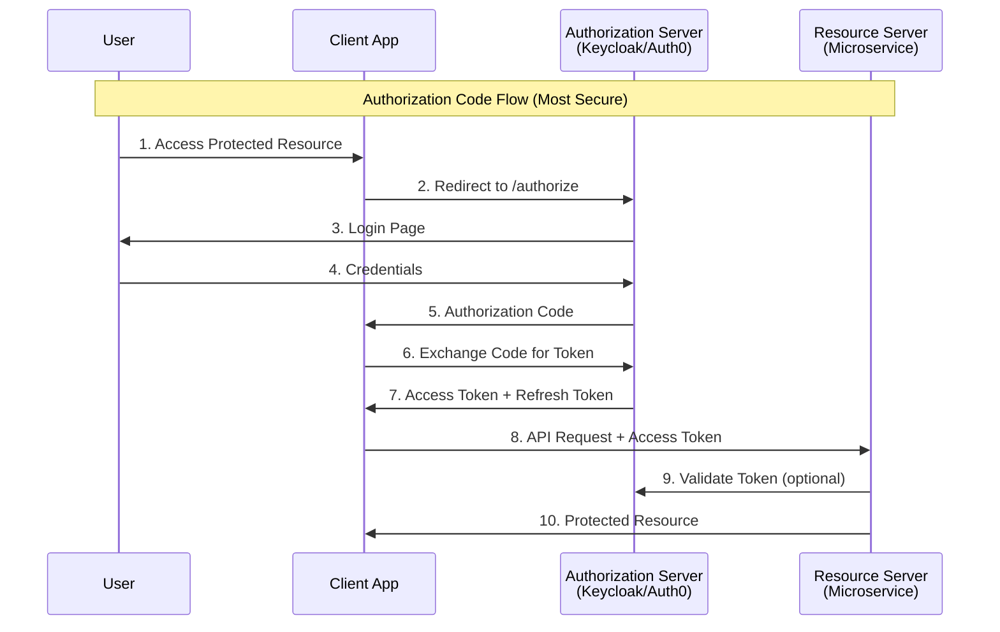
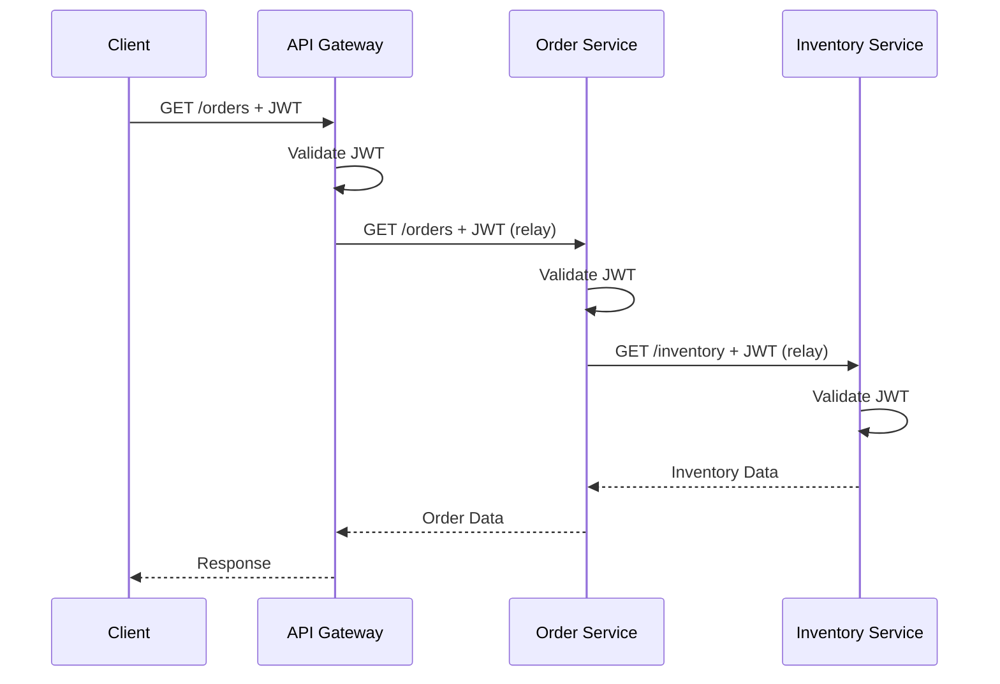
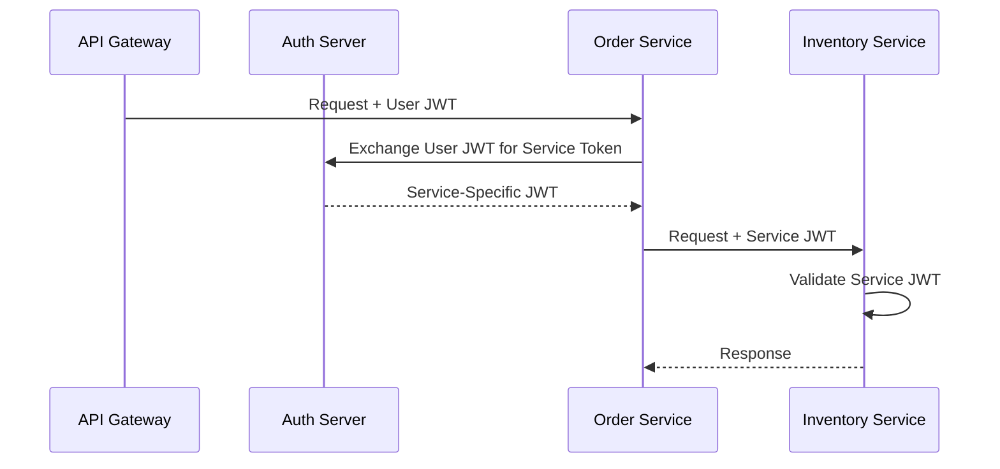

# OAuth2 and JWT Propagation in Microservices

**Deep Dive** | Identity and authentication across distributed services

---

## 📋 Overview

In microservices architectures, managing authentication and authorization across distributed services is critical. This guide covers OAuth2 flows, JWT token propagation, and security best practices.

**Key Topics:**
- OAuth2 authorization flows
- JWT structure and validation
- Token propagation patterns
- Service-to-service authentication
- Security best practices

---

## 🔐 OAuth2 Fundamentals

### Authorization Flows



### OAuth2 Grant Types

| Grant Type | Use Case | Security Level |
|------------|----------|----------------|
| **Authorization Code** | Web apps, mobile apps | ⭐⭐⭐⭐⭐ Highest |
| **PKCE Extension** | Mobile/SPA (public clients) | ⭐⭐⭐⭐⭐ Highest |
| **Client Credentials** | Service-to-service | ⭐⭐⭐⭐ High |
| **Resource Owner Password** | Trusted first-party apps | ⭐⭐ Low (deprecated) |
| **Implicit Flow** | Legacy SPAs | ⭐ Very Low (deprecated) |

---

## 🎟️ JWT (JSON Web Token) Structure

### JWT Anatomy

A JWT consists of three Base64URL-encoded parts separated by dots (`.`):

```
eyJhbGciOiJSUzI1NiIsInR5cCI6IkpXVCJ9.
eyJzdWIiOiIxMjM0NTY3ODkwIiwibmFtZSI6IkpvaG4gRG9lIiwiaWF0IjoxNTE2MjM5MDIyfQ.
SflKxwRJSMeKKF2QT4fwpMeJf36POk6yJV_adQssw5c

Header.Payload.Signature
```

#### 1. Header

```json
{
  "alg": "RS256",
  "typ": "JWT",
  "kid": "key-id-123"
}
```

#### 2. Payload (Claims)

```json
{
  "sub": "user-123",
  "name": "John Doe",
  "email": "john.doe@example.com",
  "roles": ["user", "admin"],
  "permissions": ["orders:read", "orders:write"],
  
  "iss": "https://auth.example.com",
  "aud": ["api.example.com", "admin.example.com"],
  "exp": 1705690995,
  "iat": 1705687395,
  "nbf": 1705687395,
  "jti": "unique-token-id-789"
}
```

**Standard Claims:**
- `iss` (Issuer): Who created the token
- `sub` (Subject): User identifier
- `aud` (Audience): Intended recipient(s)
- `exp` (Expiration): Token expiry timestamp
- `iat` (Issued At): Token creation timestamp
- `nbf` (Not Before): Token valid after timestamp
- `jti` (JWT ID): Unique token identifier

#### 3. Signature

```javascript
HMACSHA256(
  base64UrlEncode(header) + "." +
  base64UrlEncode(payload),
  secret_or_private_key
)
```

---

## 🔄 Token Propagation Patterns

### Pattern 1: Token Relay (Pass-Through)

**Concept:** Forward the original user token to downstream services.



**Pros:**
- ✅ Simple implementation
- ✅ End-to-end user context
- ✅ Audit trail preserved

**Cons:**
- ❌ Token exposure across services
- ❌ Each service validates token (overhead)
- ❌ User permissions may not match service needs

**Implementation (Go):**

```go
package middleware

import (
    "context"
    "net/http"
    "strings"
    "github.com/golang-jwt/jwt/v5"
)

type JWTMiddleware struct {
    publicKey []byte
}

func (m *JWTMiddleware) ValidateAndPropagate(next http.Handler) http.Handler {
    return http.HandlerFunc(func(w http.ResponseWriter, r *http.Request) {
        // Extract token from Authorization header
        authHeader := r.Header.Get("Authorization")
        if authHeader == "" {
            http.Error(w, "missing authorization header", http.StatusUnauthorized)
            return
        }
        
        tokenString := strings.TrimPrefix(authHeader, "Bearer ")
        
        // Validate JWT
        token, err := jwt.Parse(tokenString, func(token *jwt.Token) (interface{}, error) {
            return m.publicKey, nil
        })
        
        if err != nil || !token.Valid {
            http.Error(w, "invalid token", http.StatusUnauthorized)
            return
        }
        
        // Extract claims
        claims := token.Claims.(jwt.MapClaims)
        
        // Add to context
        ctx := context.WithValue(r.Context(), "user_id", claims["sub"])
        ctx = context.WithValue(ctx, "roles", claims["roles"])
        
        // Propagate token to downstream service
        client := &http.Client{}
        req, _ := http.NewRequest("GET", "http://inventory-service/stock", nil)
        req.Header.Set("Authorization", authHeader)  // Relay token
        
        resp, err := client.Do(req)
        // ... handle response
        
        next.ServeHTTP(w, r.WithContext(ctx))
    })
}
```

---

### Pattern 2: Token Exchange (OAuth2 Token Exchange - RFC 8693)

**Concept:** Exchange user token for a service-specific token.



**Implementation (Python):**

```python
import requests
from jose import jwt

class TokenExchangeClient:
    def __init__(self, auth_server_url, client_id, client_secret):
        self.auth_server_url = auth_server_url
        self.client_id = client_id
        self.client_secret = client_secret
    
    def exchange_token(self, user_token, target_audience):
        """Exchange user token for service-specific token"""
        
        response = requests.post(
            f"{self.auth_server_url}/oauth2/token",
            data={
                'grant_type': 'urn:ietf:params:oauth:grant-type:token-exchange',
                'subject_token': user_token,
                'subject_token_type': 'urn:ietf:params:oauth:token-type:jwt',
                'requested_token_type': 'urn:ietf:params:oauth:token-type:jwt',
                'audience': target_audience,
                'client_id': self.client_id,
                'client_secret': self.client_secret,
            },
            headers={'Content-Type': 'application/x-www-form-urlencoded'}
        )
        
        response.raise_for_status()
        return response.json()['access_token']
    
    def call_inventory_service(self, user_token):
        # Exchange token for inventory service audience
        service_token = self.exchange_token(
            user_token,
            target_audience='inventory-service'
        )
        
        # Call inventory service with new token
        inventory_response = requests.get(
            'http://inventory-service/api/stock',
            headers={'Authorization': f'Bearer {service_token}'}
        )
        
        return inventory_response.json()
```

---

### Pattern 3: Service Account Pattern

**Concept:** Services authenticate with their own credentials.

```yaml
# Kubernetes ServiceAccount
apiVersion: v1
kind: ServiceAccount
metadata:
  name: order-service
  namespace: production
---
apiVersion: rbac.authorization.k8s.io/v1
kind: Role
metadata:
  name: order-service-role
  namespace: production
rules:
- apiGroups: [""]
  resources: ["secrets"]
  verbs: ["get", "list"]
---
apiVersion: rbac.authorization.k8s.io/v1
kind: RoleBinding
metadata:
  name: order-service-binding
  namespace: production
subjects:
- kind: ServiceAccount
  name: order-service
roleRef:
  kind: Role
  name: order-service-role
  apiGroup: rbac.authorization.k8s.io
```

**mTLS with Service Accounts:**

```go
package main

import (
    "crypto/tls"
    "crypto/x509"
    "io/ioutil"
    "net/http"
)

func createMTLSClient() *http.Client {
    // Load client certificate
    cert, err := tls.LoadX509KeyPair(
        "/var/run/secrets/tls/tls.crt",
        "/var/run/secrets/tls/tls.key",
    )
    if err != nil {
        panic(err)
    }
    
    // Load CA certificate
    caCert, err := ioutil.ReadFile("/var/run/secrets/ca/ca.crt")
    if err != nil {
        panic(err)
    }
    
    caCertPool := x509.NewCertPool()
    caCertPool.AppendCertsFromPEM(caCert)
    
    // Configure TLS
    tlsConfig := &tls.Config{
        Certificates: []tls.Certificate{cert},
        RootCAs:      caCertPool,
        MinVersion:   tls.VersionTLS13,
    }
    
    return &http.Client{
        Transport: &http.Transport{
            TLSClientConfig: tlsConfig,
        },
    }
}

func callServiceWithMTLS() {
    client := createMTLSClient()
    
    resp, err := client.Get("https://inventory-service:8443/api/stock")
    if err != nil {
        panic(err)
    }
    defer resp.Body.Close()
    
    // Process response
}
```

---

## 🛡️ JWT Validation Best Practices

### Comprehensive Validation (Python)

```python
from jose import jwt, JWTError
from datetime import datetime, timedelta
import requests

class JWTValidator:
    def __init__(self, issuer, audience, jwks_url):
        self.issuer = issuer
        self.audience = audience
        self.jwks_url = jwks_url
        self.jwks_cache = None
        self.jwks_cache_time = None
    
    def get_public_key(self, kid):
        """Fetch public key from JWKS endpoint"""
        
        # Cache for 1 hour
        if (self.jwks_cache is None or 
            datetime.now() - self.jwks_cache_time > timedelta(hours=1)):
            
            response = requests.get(self.jwks_url)
            self.jwks_cache = response.json()
            self.jwks_cache_time = datetime.now()
        
        # Find key by kid (Key ID)
        for key in self.jwks_cache['keys']:
            if key['kid'] == kid:
                return jwt.construct_key(key, algorithm='RS256')
        
        raise ValueError(f"Key {kid} not found in JWKS")
    
    def validate_token(self, token):
        """Validate JWT with comprehensive checks"""
        
        try:
            # Decode header to get kid
            unverified_header = jwt.get_unverified_header(token)
            kid = unverified_header['kid']
            
            # Get public key
            public_key = self.get_public_key(kid)
            
            # Decode and validate
            claims = jwt.decode(
                token,
                public_key,
                algorithms=['RS256'],
                issuer=self.issuer,
                audience=self.audience,
                options={
                    'verify_signature': True,
                    'verify_exp': True,
                    'verify_nbf': True,
                    'verify_iat': True,
                    'verify_aud': True,
                    'verify_iss': True,
                    'require_exp': True,
                    'require_iat': True,
                }
            )
            
            # Additional custom validation
            if 'scope' not in claims:
                raise ValueError("Token missing 'scope' claim")
            
            if not self.has_required_scope(claims['scope'], 'orders:read'):
                raise ValueError("Insufficient permissions")
            
            return claims
            
        except JWTError as e:
            raise ValueError(f"Invalid token: {e}")
    
    def has_required_scope(self, token_scopes, required_scope):
        """Check if token has required scope"""
        if isinstance(token_scopes, str):
            token_scopes = token_scopes.split(' ')
        return required_scope in token_scopes

# Usage
validator = JWTValidator(
    issuer='https://auth.example.com',
    audience='api.example.com',
    jwks_url='https://auth.example.com/.well-known/jwks.json'
)

try:
    claims = validator.validate_token(token)
    user_id = claims['sub']
    permissions = claims.get('permissions', [])
except ValueError as e:
    # Handle invalid token
    return {'error': str(e)}, 401
```

---

## 🔗 Service Mesh Integration

### Istio JWT Authentication

```yaml
apiVersion: security.istio.io/v1beta1
kind: RequestAuthentication
metadata:
  name: jwt-auth
  namespace: production
spec:
  selector:
    matchLabels:
      app: order-service
  jwtRules:
  - issuer: "https://auth.example.com"
    jwksUri: "https://auth.example.com/.well-known/jwks.json"
    audiences:
    - "api.example.com"
    outputPayloadToHeader: "x-jwt-payload"
    forwardOriginalToken: true
---
apiVersion: security.istio.io/v1beta1
kind: AuthorizationPolicy
metadata:
  name: require-jwt
  namespace: production
spec:
  selector:
    matchLabels:
      app: order-service
  action: ALLOW
  rules:
  - from:
    - source:
        requestPrincipals: ["*"]
    when:
    - key: request.auth.claims[roles]
      values: ["admin", "user"]
  - to:
    - operation:
        methods: ["GET"]
        paths: ["/health"]
```

---

## 📊 Security Best Practices

### 1. Token Expiration

```yaml
Access Token Lifetime:
  Short-lived: 15 minutes
  Refresh Token: 7 days
  Rotate refresh tokens on each use
```

### 2. Scope Management

```json
{
  "scope": "orders:read orders:write inventory:read",
  "permissions": [
    "orders:create",
    "orders:update",
    "orders:delete",
    "inventory:reserve"
  ]
}
```

### 3. Token Storage

| Location | Security | Use Case |
|----------|----------|----------|
| Memory (JavaScript variable) | ⭐⭐ Low | Not recommended |
| LocalStorage | ⭐ Very Low | Avoid |
| SessionStorage | ⭐⭐ Low | Better than LocalStorage |
| HTTP-only Cookie | ⭐⭐⭐⭐ High | **Recommended** for web |
| Secure Storage (Mobile) | ⭐⭐⭐⭐⭐ Highest | **Recommended** for mobile |

### 4. Token Revocation

```python
import redis

class TokenBlacklist:
    def __init__(self):
        self.redis_client = redis.Redis(host='localhost', port=6379, db=0)
    
    def revoke_token(self, jti, exp):
        """Add token to blacklist until expiration"""
        ttl = exp - int(time.time())
        if ttl > 0:
            self.redis_client.setex(f"blacklist:{jti}", ttl, "1")
    
    def is_revoked(self, jti):
        """Check if token is revoked"""
        return self.redis_client.exists(f"blacklist:{jti}") > 0

# Middleware
def check_token_revocation(token):
    claims = jwt.decode(token, verify=False)
    jti = claims.get('jti')
    
    if blacklist.is_revoked(jti):
        raise ValueError("Token has been revoked")
```

---

## 🧪 Testing JWT Flows

### Mock JWT Generator (Testing)

```python
import jwt
from datetime import datetime, timedelta

def create_test_jwt(user_id="test-user", roles=["user"], custom_claims=None):
    """Create a test JWT for integration testing"""
    
    now = datetime.utcnow()
    
    payload = {
        'sub': user_id,
        'iss': 'https://test-auth.example.com',
        'aud': 'api.example.com',
        'exp': now + timedelta(hours=1),
        'iat': now,
        'nbf': now,
        'jti': 'test-jwt-123',
        'roles': roles,
        'permissions': ['orders:read', 'orders:write']
    }
    
    if custom_claims:
        payload.update(custom_claims)
    
    # Sign with test private key
    token = jwt.encode(payload, private_key, algorithm='RS256')
    
    return token

# Usage in tests
def test_order_creation():
    token = create_test_jwt(user_id='user-456', roles=['admin'])
    
    response = client.post(
        '/api/orders',
        json={'items': [...]},
        headers={'Authorization': f'Bearer {token}'}
    )
    
    assert response.status_code == 201
```

---

## 📚 Additional Resources

- **[OAuth2 Flows Deep Dive](./OAUTH2_FLOWS.md)**
- **[JWT Security Checklist](./JWT_SECURITY_CHECKLIST.md)**
- **[mTLS Configuration](./MTLS_CONFIGURATION.md)**
- **[Service Mesh Security](./SERVICE_MESH_SECURITY.md)**

---

**Last Updated:** 2026-01-19  
**Complexity:** Advanced  
**Maintainer:** DevOps Curriculum Team
