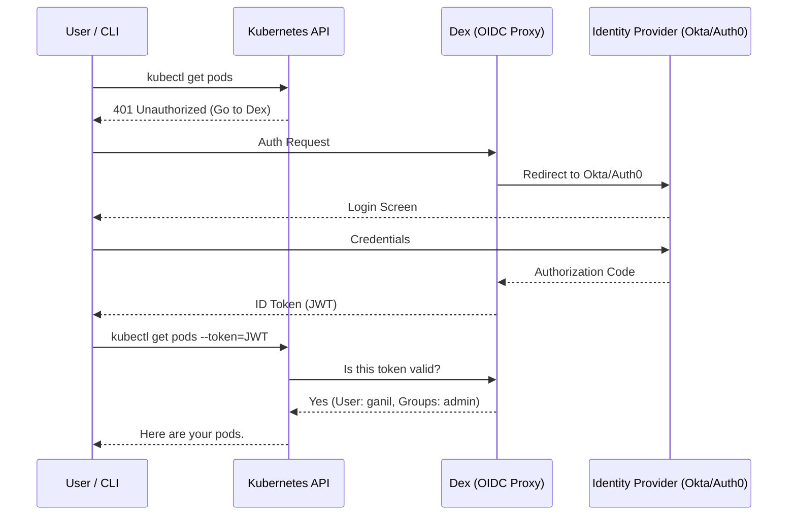

# 🔐 Advanced Identity Federation (OIDC & SAML)

> **"Identity is the new perimeter. Centralize trust, delegate access."**

## 📚 Overview

As fleets grow across multiple clouds and clusters, managing individual users becomes impossible. **Identity Federation** allows you to use a central identity provider (IdP) to authenticate and authorize users across all your services using standards like **OIDC (OpenID Connect)** and **SAML (Security Assertion Markup Language)**.

## 🎯 Learning Objectives

- ✅ Master the flow of **OIDC (OAuth 2.0 based)** vs. **SAML**.
- ✅ Implement **Dex Identity Proxy** to federate K8s with Auth0/GitHub.
- ✅ Configure **Single Sign-On (SSO)** for internal developer portals.
- ✅ Manage **Granular RBAC** via OIDC claims and groups.

## 🗺️ Module Structure

1. **[🔴 01-OIDC-SAML-Fundamentals](./01-OIDC-SAML-Fundamentals/)**
   - OAuth 2.0 Scopes and ID Tokens.
   - SAML XML assertions vs. JWT.
2. **[🔴 02-Identity-Proxy-Dex](./02-Identity-Proxy-Dex/)**
   - Installing Dex in Kubernetes.
   - Connecting Dex to upstream connectors (LDAP, Google, GitHub).

---

## 🏗️ Visual: OIDC Federation Flow



---

### Configuration: Dex GitHub Connector

```yaml
connectors:
- type: github
  id: github
  name: GitHub
  config:
    clientID: $GITHUB_CLIENT_ID
    clientSecret: $GITHUB_CLIENT_SECRET
    redirectURI: https://dex.example.com/callback
    orgs:
    - name: my-devops-org
      teams:
      - admins
```

## 📋 Professional Pattern: "Group-Based Access"
Never map individual users to Kubernetes Roles. Always use **OIDC Group Scopes**. Map your GitHub/Okta teams to K8s `ClusterRoleBindings`. If a user joins the "SRE" team in Okta, they should automatically inherit the "sre-admin" role in all Kubernetes clusters via Dex.

---
**Next Step**: Start with [OIDC & SAML Fundamentals](./01-OIDC-SAML-Fundamentals/) 🚀
