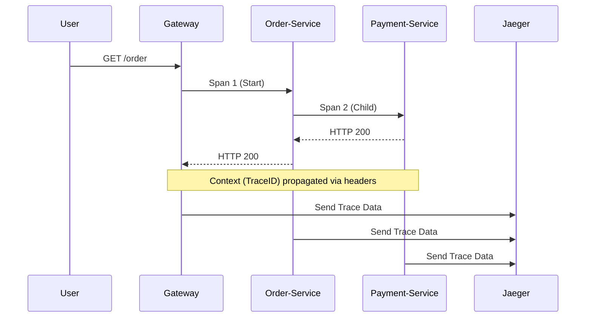

# 📊 Service Mesh Observability (Kiali & Jaeger)

> **"If you can't see the traffic, you can't optimize the latency."**

## 📚 Overview

In a microservices architecture, a single user request can hop across dozens of services. **Service Mesh Observability** provides the "X-ray vision" needed to track these requests. This module covers **Distributed Tracing** with **Jaeger** and **Service Graph Visualization** with **Kiali**, allowing you to identify bottlenecks and visualize traffic flow in real-time.

## 🎯 Learning Objectives

- ✅ Implement **Distributed Tracing** across polyglot services.
- ✅ Master **Kiali Service Graph** interpretation (Traffic Health, SPDY).
- ✅ Analyze **Span Latency** and root cause "Long Tail" performance issues.
- ✅ Configure **Sampling Strategies** to balance visibility vs. overhead.
- ✅ Correlate Service Mesh metrics with application logs.

## 🗺️ Module Structure

1. **[🔴 01-Tracing-Fundamentals](./01-Tracing-Fundamentals/)**
   - Context Propagation: Headers (x-request-id, b3).
   - Jaeger Collector vs. Agent architecture.
2. **[🔴 02-Service-Graph-Visualization](./02-Service-Graph-Visualization/)**
   - Kiali dynamic topology maps.
   - Circuit Breaker and Retry visibility.

---

## 🏗️ Visual: Distributed Tracing Span Flow



---

## 🛠️ Code: Istio Jaeger Configuration

```yaml
apiVersion: install.istio.io/v1alpha1
kind: IstioOperator
spec:
  meshConfig:
    enableTracing: true
    defaultConfig:
      tracing:
        sampling: 100.0 # Capture every request for dev/debug
        zipkin:
          address: jaeger-collector.istio-system:9411
```

## 📋 Professional Pattern: "The 99th Percentile Audit"

Don't just look at average latency. Use Jaeger to filter for the **p99 (99th percentile)** latencies. These are the requests that "feel slow" to users. By examining the span details of these outliers, you can often find unoptimized database queries or external API timeouts that are hidden in the "average" performance metrics.

---
**Next Step**: Start with [Tracing Fundamentals](./01-Tracing-Fundamentals/) 🚀
