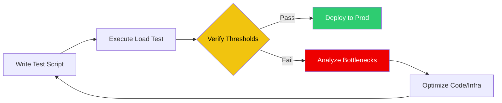

# 🚀 Automated Performance Testing (Locust & k6)

> **"If you don't break it in testing, your users will break it in production."**

## 📚 Overview

Reliability isn't just about code correctness; it's about performance under pressure. This module covers **Automated Performance Testing**, moving from manual load tests to integrated **Performance Gates** in CI/CD. We explore **k6** (JavaScript-based, high performance) and **Locust** (Python-based, high scalability) to simulate thousands of concurrent users and identify system breaking points.

## 🎯 Learning Objectives

- ✅ Design and execute **Load**, **Stress**, and **Soak** tests.
- ✅ Master **k6 script development** (Checks, Thresholds, and Scenarios).
- ✅ Orchestrate **distributed load generation** using Locust.
- ✅ Implement **Performance Gates** in CI/CD (blocking PRs on latency regressions).
- ✅ Analyze metrics: **RPS**, **Latency Percentiles (p95/p99)**, and **Error Rates**.

## 🗺️ Module Structure

1. **[🔴 01-Load-Testing-Foundations](./01-Load-Testing-Foundations/)**
   - Writing your first test script.
   - Understanding User behavior simulation.
2. **[🔴 02-CI-CD-Performance-Gates](./02-CI-CD-Performance-Gates/)**
   - Integrating k6 with GitHub Actions.
   - Setting hard failure thresholds.

---

## 🏗️ Visual: The Performance Testing Lifecycle



---

## 🛠️ Code: k6 Performance Thresholds

A script that fails the CI build if the 95th percentile response time exceeds 500ms.

```javascript
import http from 'k6/http';
import { check, sleep } from 'k6';

export const options = {
  thresholds: {
    http_req_duration: ['p(95)<500'], // 95% of requests must be below 500ms
  },
  stages: [
    { duration: '30s', target: 50 }, // ramp up to 50 users
    { duration: '1m', target: 50 },  // stay at 50 users
  ],
};

export default function () {
  const res = http.get('https://api.myapp.com/health');
  check(res, { 'status was 200': (r) => r.status == 200 });
  sleep(1);
}
```

## 📋 Professional Pattern: "The Performance Budget"

Treat performance like a financial budget. Define **SLIs (Service Level Indicators)** for every service. If a new PR increases the p99 latency by more than 10%, the build fails automatically. This prevents "latency creep" where small, unmonitored changes eventually lead to a degraded user experience.

---
**Next Step**: Start with [Load Testing Foundations](./01-Load-Testing-Foundations/) 🚀
