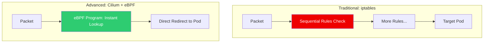

# 🐝 Advanced K8s Networking (Cilium & eBPF)

> **"Traditional networking stops at the kernel; eBPF lives inside it."**

## 📚 Overview

As Kubernetes networking scales, traditional technologies like `iptables` become a bottleneck. **Cilium** leverages **eBPF (Extended Berkeley Packet Filter)** to provide high-performance networking, security, and observability directly in the Linux kernel. This module covers replacing the standard CNI with Cilium to gain transparent encryption, advanced network policies, and deep visibility into every packet.

## 🎯 Learning Objectives

- ✅ Understand the **eBPF data plane** and its advantages over iptables.
- ✅ Install and configure **Cilium** as the Kubernetes CNI.
- ✅ Implement **Hubble Observability** for real-time service-level visibility.
- ✅ Create **CiliumNetworkPolicies** (L7-aware constraints).
- ✅ Configure **Transparent Encryption** (IPsec/WireGuard) between nodes.

## 🗺️ Module Structure

1. **[🔴 01-Cilium-eBPF-Fundamentals](./01-Cilium-eBPF-Fundamentals/)**
   - Kernel hooks vs. User-space proxies.
   - The Cilium agent and Operator architecture.
2. **[🔴 02-Network-Policy-and-Observability](./02-Network-Policy-and-Observability/)**
   - Hubble dynamic service maps.
   - L7 enforcement (HTTP method/path filtering).

---

## 🏗️ Visual: The eBPF Networking Advantage



---

## 🛠️ YAML: L7 Network Policy (Cilium)

A policy that only allows GET requests to the `/public` path on the `api-service`.

```yaml
apiVersion: "cilium.io/v2"
kind: CiliumNetworkPolicy
metadata:
  name: "l7-visibility"
spec:
  endpointSelector:
    matchLabels:
      app: api-service
  ingress:
  - fromEndpoints:
    - matchLabels:
        app: frontend
    toPorts:
    - ports:
      - port: "80"
        protocol: TCP
      rules:
        http:
        - method: "GET"
          path: "/public"
```

## 📋 Professional Pattern: "Transparent Security"

Don't force developers to manage certificates or mTLS logic in their code. Use **Cilium Transparent Encryption**. By enabling a single flag in the Cilium configuration, the kernel automatically encrypts all traffic between nodes using WireGuard or IPsec. This provides at-rest security for data in flight without the performance overhead or complexity of a full service mesh sidecar.

---
**Next Step**: Start with [Cilium eBPF Fundamentals](./01-Cilium-eBPF-Fundamentals/) 🚀
