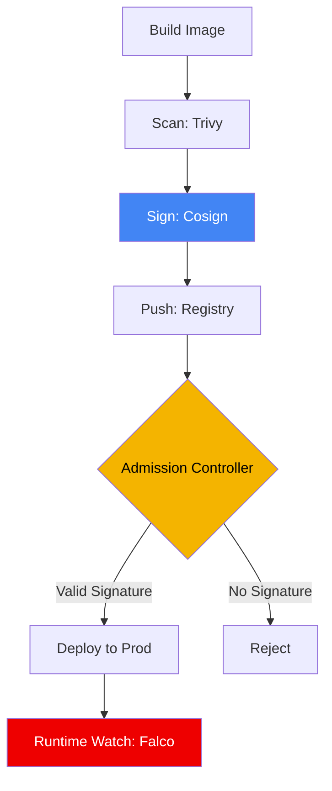

# 🔴 Cloud Compliance & Runtime Security (Advanced)

## 📚 Overview

At the enterprise level, static analysis is not enough. You must monitor what is actually happening inside your running containers and ensure that the images being deployed haven't been tampered with. This module covers **Runtime Security (Falco)** and **Image Signing (Cosign)**.

## 🎯 Learning Objectives

- ✅ Implement **Falco** to detect anomalous activity (e.g., shell opened in a pod).
- ✅ Set up **Cosign** to sign images and verify signatures at deployment.
- ✅ Implement **Admission Controllers** (Kyverno/Gatekeeper) to enforce signed-only deployments.
- ✅ Build a response pipeline for real-time security alerts.

---

## 🏗️ Visual: The Secure Supply Chain (Advanced)



---

## 🛡️ Runtime Security: Falco
Falco uses eBPF to monitor system calls. It alerts you when things happen that shouldn't, like a process spawned in a production container.

**Example Falco Rule:**
```yaml
- rule: Shell in Container
  desc: A shell was spawned in a container with a terminal
  condition: container_started and proc.name = "sh"
  output: "Shell spawned in container (user=%user.name container=%container.id)"
  priority: WARNING
```

---

## 🖋️ Image Validation: Cosign
Cosign allows you to sign your images so that only trusted images are run in your cluster.

1.  **Generate Keys**: `cosign generate-key-pair`
2.  **Sign**: `cosign sign --key cosign.key my-registry/my-app:1.0`
3.  **Verify**: `cosign verify --key cosign.pub my-registry/my-app:1.0`

---
**Next Step**: [Runtime Security with Falco](./01-Runtime-Security-Falco/) 🚀
