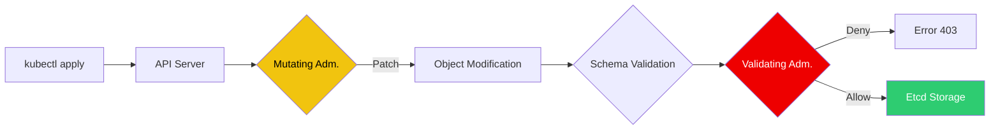

# 🛡️ Kubernetes Admission Controllers (OPA/Gatekeeper)

> **"Policy is the new perimeter. If it doesn't match the rules, it doesn't enter the cluster."**

## 📚 Overview

As Kubernetes environments grow, manual governance becomes impossible. **Admission Controllers** act as gatekeepers that intercept requests to the Kubernetes API server before they are persisted. This module focuses on using **Open Policy Agent (OPA)** and **Gatekeeper** to enforce "Policy as Code"—ensuring every resource meets security, cost, and operational standards.

## 🎯 Learning Objectives

- ✅ Master the **Admission Webhook** lifecycle (Mutating vs. Validating).
- ✅ Install and configure **OPA Gatekeeper** in a cluster.
- ✅ Write **Rego Policies** to enforce resource constraints.
- ✅ Implement **Mutation Policies** (e.g., automatically injecting labels).
- ✅ Understand the difference between **Constraints** and **ConstraintTemplates**.

## 🗺️ Module Structure

1. **[🔴 01-Admission-Controller-Architecture](./01-Admission-Controller-Architecture/)**
   - The API Server Pipeline.
   - External Webhooks and Security.
2. **[🔴 02-OPA-Gatekeeper-Policies](./02-OPA-Gatekeeper-Policies/)**
   - Writing Rego for the real world.
   - Audit vs. Enforce modes.

---

## 🏗️ Visual: The Admission Controller Pipeline



---

## 🛠️ Code: Rego Policy (Require Labels)

A policy that blocks any deployment missing an `owner` label.

```rego
package k8srequiredlabels

violation[{"msg": msg, "details": {}}] {
  provided := {label | input.review.object.metadata.labels[label]}
  required := {"owner"}
  missing := required - provided
  count(missing) > 0
  msg := sprintf("You must provide labels: %v", [missing])
}
```

## 📋 Professional Pattern: "Shift-Left Governance"

Don't wait for the Admission Controller to reject a developer's PR. Use **`gator`** (the Gatekeeper CLI) or **`opa test`** in your CI/CD pipeline to validate Kubernetes manifests against your OPA policies *before* they are even sent to the cluster. This provides instant feedback and prevents broken deployments from reaching the API server.

---
**Next Step**: Start with [Admission Controller Architecture](./01-Admission-Controller-Architecture/) 🚀
