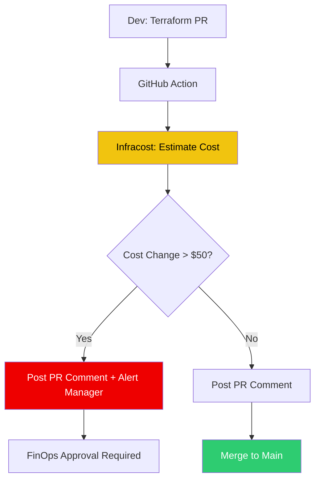

# 💸 Infrastructure Cost Governance (Infracost)

> **"Finance is the final gate. If you can't afford the infra, you can't run the app."**

## 📚 Overview

Cloud waste is a billion-dollar problem. **Infrastructure Cost Governance** shifts cost management "left" by calculating the price of infrastructure changes *before* they are applied. This module focuses on using **Infracost** integrated with GitHub Actions and OIDC to provide real-time cost feedback on every Pull Request.

## 🎯 Learning Objectives

- ✅ Install and configure the **Infracost CLI**.
- ✅ Generate **Cost Estimates** for Terraform/OpenTofu plans.
- ✅ Implement **Cost Policies** (e.g., blocking PRs that exceed budget).
- ✅ Configure **OIDC authentication** for secure, keyless cloud pricing lookups.
- ✅ Automate **Cost Comments** in PRs to empower developers.

## 🗺️ Module Structure

1. **[🔴 01-Cost-as-Code-Foundations](./01-Cost-as-Code-Foundations/)**
   - The breakdown of cloud pricing models.
   - Using `infracost diff` to see delta costs.
2. **[🔴 02-OIDC-Cost-Automation](./02-OIDC-Cost-Automation/)**
   - Securely connecting GitHub to Cloud Pricing APIs.
   - Organization-wide cost governance strategies.

---

## 🏗️ Visual: The FinOps Pull Request Flow



---

## 🛠️ YAML: Infracost GitHub Action with OIDC

```yaml
name: Infracost
on: [pull_request]

jobs:
  infracost:
    runs-on: ubuntu-latest
    permissions:
      contents: read
      pull-requests: write # Required to post comments
    steps:
      - uses: actions/checkout@v3
      - name: Setup Infracost
        uses: infracost/actions/setup@v2
        with:
          api-key: ${{ secrets.INFRACOST_API_KEY }}

      - name: Generate Infracost JSON
        run: infracost breakdown --path terraform/ --format json --out-file infracost.json

      - name: Post Cost Comment
        uses: infracost/actions/comment@v2
        with:
          path: infracost.json
          behavior: update # Update existing comment instead of posting new ones
```

## 📋 Professional Pattern: "Cost Guardrails"

Don't just observe costs; enforce them. Implement **Cost Guardrails**: If a PR increase exceeds a specific threshold (e.g., 20% increase in monthly spend), the build status should turn yellow (warning) or red (failure), requiring a manual override from the FinOps or Platform Engineering team. This democratizes cost awareness across the entire engineering organization.

---
**Next Step**: Start with [Cost as Code Foundations](./01-Cost-as-Code-Foundations/) 🚀
