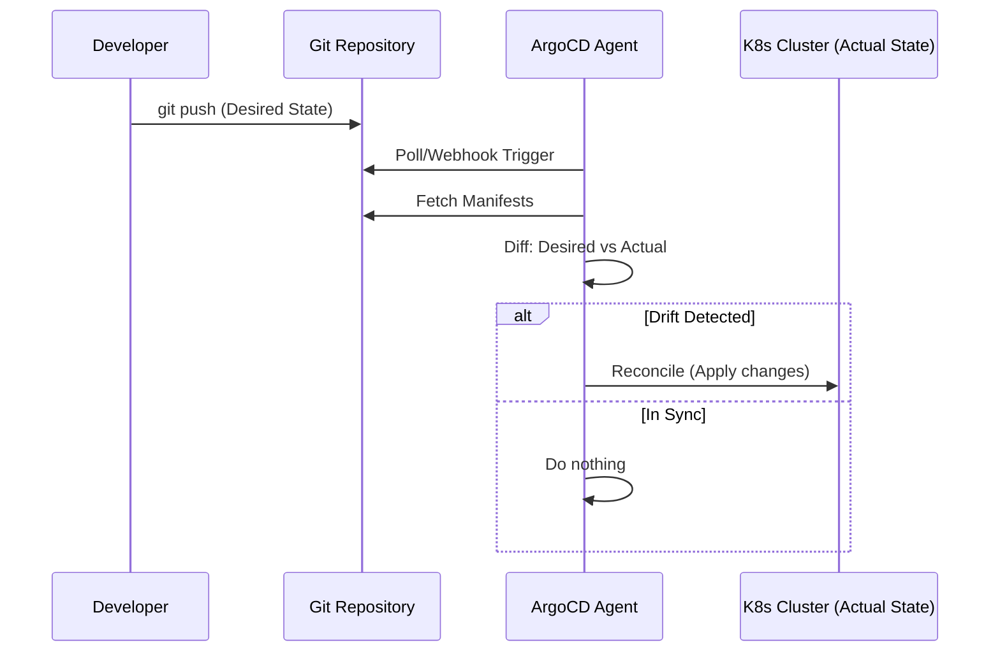

# GitOps: The Ultimate Delivery Model

GitOps is a modern evolution of Continuous Delivery. It treats **Git as the single source of truth** for both infrastructure and applications. In this module, we move beyond "pushing" code to "reconciling" state.

---

## 🏗️ 1. The Reconciler Architecture

In traditional CD, a pipeline (like Jenkins) "pushes" changes to a cluster. In GitOps, an agent runs **inside** the cluster (like ArgoCD) and pulls the desired state from Git.



---

## 🔐 2. Secret Management in GitOps

A major challenge in GitOps is how to store secrets (API keys, DB passwords) in a Git repository without compromising security.

### 🛡️ The "Sealed Secrets" Pattern
1.  **Encrypt**: You encrypt a secret locally using a public key provided by the cluster.
2.  **Commit**: You commit the encrypted `SealedSecret` to Git.
3.  **Decrypt**: The Bitnami Sealed Secrets controller in the cluster uses its private key to decrypt it back into a standard `Secret`.

---

## 🛠️ 3. Essential ArgoCD Commands

### 🔍 Inspection and Sync
*When to use: Manually triggering or checking the status of GitOps applications.*

```bash
# Login to ArgoCD server
argocd login <server_addr>

# List all managed applications
argocd app list

# Get detailed status of an app
argocd app get my-app

# Manually trigger a synchronization
argocd app sync my-app
```

---

## 💡 GitOps Best Practices

- **Never push to the cluster manually**: Disable `kubectl apply` for human users to prevent "Configuration Drift".
- **Separation of Concerns**: Keep your application code (Java/Go/Python) and your K8s manifests (Helm/Plain) in separate repositories.
- **Automated Sync**: Enable "Prune" to remove deleted resources from the cluster automatically when they are removed from Git.
- **Rollback via Git**: To fix a broken deployment, `git revert` the last commit. Don't use `kubectl` to fix things.

---

## 🧠 Training & Assessment

### Knowledge Quiz

**1. What is "Configuration Drift"?**
- A) When the code in the repository is updated too frequently
- B) When the actual state of the cluster differs from the desired state in Git
- C) When a developer forgets to commit their changes
- D) When the cloud provider updates their API

**2. Which GitOps tool runs as a pull-agent inside the Kubernetes cluster?**
- A) Jenkins
- B) GitHub Actions
- C) ArgoCD
- D) GitLab CI

**3. What is the benefit of keeping manifests in a separate repository?**
- A) It's required by Kubernetes
- B) It prevents CI loops and allows independent scaling of dev vs. ops tasks
- C) It makes the code run faster
- D) It's only for security reasons

---

### Real-World Troubleshooting Scenarios

#### Scenario 1: The "Out of Sync" Mystery
**Problem:** You committed a change to Git, but ArgoCD shows the app as `OutOfSync` and won't match the cluster.
**Investigation:**
1.  **Check Status:** `argocd app get <name>` shows some resources are "Failed to sync".
2.  **Check Errors:** The error message says `Resource Quote Exceeded`.
**Solution:** The new deployment requires more CPU than the namespace allows. Increase the ResourceQuota or reduce the app's requests in Git.

---

## ✅ Knowledge Check
- [ ] Understand the Pull vs. Push delivery models
- [ ] Install ArgoCD on a Kubernetes cluster
- [ ] Connect a Git repository to ArgoCD
- [ ] Manage Application-of-Applications patterns
- [ ] Monitor and resolve configuration drift

---

## 🧠 Training & Assessment

### Knowledge Quiz

**1. What does it mean to "Shift Left" in security?**
- A) Moving all security tools to the left side of the data center
- B) Integrating security early in the development lifecycle (Planning/Coding)
- C) Delegating security only to the operations team
- D) Ignoring security until the deployment phase

**2. Which tool is best suited for scanning container images for vulnerabilities (CVEs)?**
- A) SonarQube
- B) HashiCorp Vault
- C) Trivy
- D) OPA

**3. In a Zero Trust architecture, what is the core assumption?**
- A) Users on the VPN can be trusted
- B) Internal traffic is always safe
- C) Never trust, always verify (no one is trusted by default)
- D) Trust but verify

---

### Real-World Troubleshooting Scenarios

#### Scenario 1: The "Secret Leak" Incident
**Problem:** A junior developer accidentally committed an AWS Access Key to a public Git repository.
**Investigation:**
1.  **Detection:** GitGuardian or a similar secret-scanner alerts the security team.
2.  **Impact:** The key is now compromised and could be used by anyone.
**Solution:**
    - **IMMEDIATELY** revoke/deactivate the key in AWS.
    - Purge the secret from Git history (using BFG Repo-Cleaner or `git filter-repo`).
    - Rotate all keys and audit for any unauthorized actions.

#### Scenario 2: Pipeline Failed on SCA
**Problem:** Your Jenkins pipeline fails at the "Dependency Scan" stage.
**Investigation:**
1.  **Check Logs:** Snyk/Trivy found a `CRITICAL` vulnerability in a core package (e.g., `log4j`).
2.  **Decision:** The security policy forbids deploying images with critical vulnerabilities.
**Solution:** Update the dependency to a patched version in your `package.json` or `pom.xml`, test for breaking changes, and re-run the pipeline.

---

## 🏆 Related Certifications

- **Argo Project**: While not a formal certification, mastering ArgoCD is key for GitOps roles.
- **GitLab Certified GitOps Professional**: Validates GitOps principles using GitLab.

---

## 🔗 Next Steps
- **[Advanced Kubernetes](../../01-Phase-1/04-Container-Orchestration/Advanced-K8s/)** - Master the platform GitOps manages.
- **[Security Hardening](../../01-Phase-1/07-Security/)** - Secure your GitOps pipelines.
- **[Enterprise Observability](../06-Observability/)** - Monitor your GitOps agent health.

---
*In GitOps, the commit is the command. Trust the repository.*