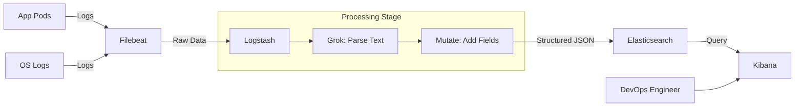

# ELK Stack: Centralized Logging & Enterprise Search

The **ELK Stack**—Elasticsearch, Logstash, and Kibana—is the most popular open-source platform for centralizing, searching, and visualizing logs. In modern DevOps, it provides the "textual evidence" or "logs" pillar of observability.

---

## 🏛️ The Architecture: Ingestion Pipeline

A production-ready logging pipeline handles data in four distinct stages: **Ship → Process → Store → Visualize**.

### 1. The Components
- **Elasticsearch (Store)**: A distributed JSON-based search engine. It is the core of the stack, storing and indexing data for near real-time search.
- **Logstash (Process)**: A heavy-duty data processing pipeline. It ingests data from multiple sources, transforms it (filters, grok, mutate), and sends it to Elasticsearch.
- **Kibana (Visualize)**: The user interface. It allows you to explore Elasticsearch indices, build dashboards, and set up alerts.
- **Beats (Ship)**: Lightweight agents installed on nodes and pods.
    - **Filebeat**: Harvests log files.
    - **Metricbeat**: Collects system/service metrics.

### 2. Log Ingestion Flow (Mermaid)


---

## 🚀 Installation & Setup

### Option A: Local Testing (Docker Compose)
Ideal for testing Logstash filters or Kibana dashboards locally.

```yaml
version: '3.7'
services:
  elasticsearch:
    image: docker.elastic.co/elasticsearch/elasticsearch:8.10.0
    environment:
      - discovery.type=single-node
      - xpack.security.enabled=false
    ports:
      - 9200:9200

  logstash:
    image: docker.elastic.co/logstash/logstash:8.10.0
    volumes:
      - ./logstash.conf:/usr/share/logstash/pipeline/logstash.conf

  kibana:
    image: docker.elastic.co/kibana/kibana:8.10.0
    ports:
      - 5601:5601
```

### Option B: Kubernetes Deployment (Helm)
The standard for enterprise clusters.

```bash
helm repo add elastic https://helm.elastic.co
helm repo update

# Install Elasticsearch (Minimal Dev Config)
helm install elasticsearch elastic/elasticsearch \
  --set replicationFactor=1 \
  --set minimumMasterNodes=1

# Install Kibana
helm install kibana elastic/kibana
```

---

## 🛠️ Configuration: The Power of Logstash

Logstash uses a 3-part configuration: `input`, `filter`, and `output`.

```ruby
input {
  beats {
    port => 5044
  }
}

filter {
  if [type] == "nginx" {
    # Grok converts unstructured text into structured fields
    grok {
      match => { "message" => "%{COMBINEDAPACHELOG}" }
    }
    # Mutate can add metadata like Environment
    mutate {
      add_field => { "environment" => "production" }
      remove_field => [ "ident", "auth" ]
    }
  }
}

output {
  elasticsearch {
    hosts => ["http://elasticsearch:9200"]
    index => "%{[@metadata][beat]}-%{[@metadata][version]}"
  }
}
```

---

## 🔍 Best Practices & Operational Excellence

1. **Persistent Queues (Logstash)**: Enable this to prevent data loss if Logstash crashes or the network blips.
2. **Index Lifecycle Management (ILM)**: Automatically "roll over" or delete old indices after 30 days to prevent your disk from filling up.
3. **Structured Logging**: If possible, have your applications log directly in **JSON format**. This bypasses the need for complex Logstash Grok filters and reduces CPU usage.
4. **Security**: Never expose Kibana or Elasticsearch to the public internet without an Identity Provider (OIDC/SAML) or a VPN.

---

**Advanced Patterns**: Learn how to correlate these logs with live metrics in the [Kube-Prometheus-Stack Guide](../01-Kube-Prometheus-Stack/README.md).
