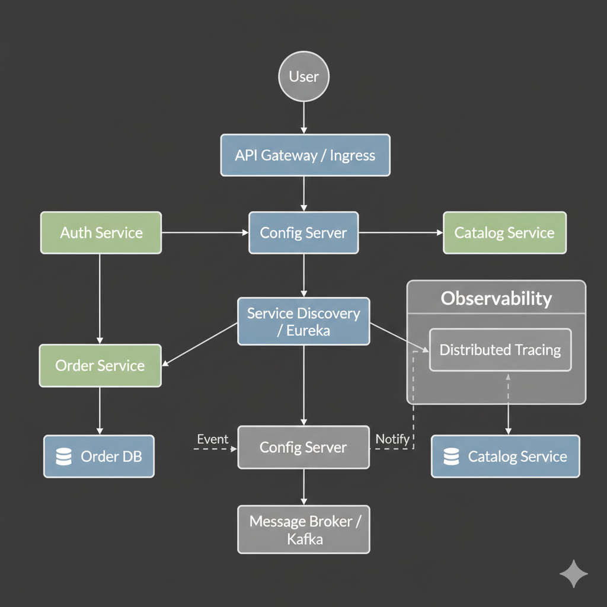

# Microservices: Managing Distributed Complexity

Microservices is an architectural style that structures an application as a collection of small, autonomous services. While they offer scalability and developer agility, they introduce significant operational "tax." This module focuses on how to manage that complexity.

---

## 🏗️ Microservices Ecosystem Architecture

A production-grade microservices environment requires several supporting components to handle communication, security, and state.


---

## 1. Why Microservices?

- **Agility**: Teams can deploy their services independently without waiting for others.
- **Scalability**: You can scale only the services that are under high load (e.g., just the Payment service).
- **Fault Tolerance**: A bug in the Recommendation service shouldn't crash the entire platform.
- **Tech Diversity**: Use the best language for the job (Go for networking, Python for AI, Java for enterprise logic).

---

## 2. Data Management Patterns

### Database per Service
The cornerstone of microservices. Each service owns its data. Any access to that data must happen via the service's API, never via direct DB access.
- **Goal**: Loose coupling and independent schema evolution.
- **Challenge**: Distributed transactions and joins.

### Shared Database (Anti-Pattern)
Multiple services talking to the same DB schema.
- **Risk**: A change in Service A's schema breaks Service B. It creates a "Distributed Monolith."

### Event Sourcing & CQRS
Using an event bus (like Kafka) to synchronize data between services.
- **CQRS**: Separating Command (write) and Query (read) models for high performance.

---

## 3. Resilience and Fault Tolerance

In a distributed system, you must **assume failure**.

### Circuit Breaker Pattern
Prevents a failing service from causing a cascading failure across the entire system.

**Example (Resilience4j / Spring Cloud):**
```yaml
resilience4j.circuitbreaker:
  instances:
    backendA:
      registerHealthIndicator: true
      slidingWindowSize: 100
      permittedNumberOfCallsInHalfOpenState: 10
      waitDurationInOpenState: 10s
      failureRateThreshold: 50
      eventConsumerBufferSize: 10
```

### Sidecar Pattern (Service Mesh)
Offloading networking logic (security, retries, tracing) to a specialized proxy (Envoy) that runs alongside your container.
- **Tools**: Istio, Linkerd.

---

## 4. Core Modules

### 🍃 [Spring Boot Microservices](../../../README.md)
Practical implementation using the most popular enterprise Java framework. Includes Service Discovery (Eureka), API Gateway, and Config Server.

### 🏗️ [Design Patterns](../../../README.md)
Understanding Circuit Breakers, Bulkheads, and Sidecars.

---

## 5. Best Practices
1. **API First**: Define your service contracts (OpenAPI) before you write any code.
2. **Infrastructure-as-Code**: You cannot manage microservices manually. CD is mandatory.
3. **Database per Service**: Avoid the "Shared DB" trap at all costs.
4. **Shift-Left Security**: Authenticate and authorize at the Gateway and between services (mTLS).

---
**Advanced Networking**: Learn how to manage service communication at scale in the [Advanced Kubernetes Module](../../../README.md).
