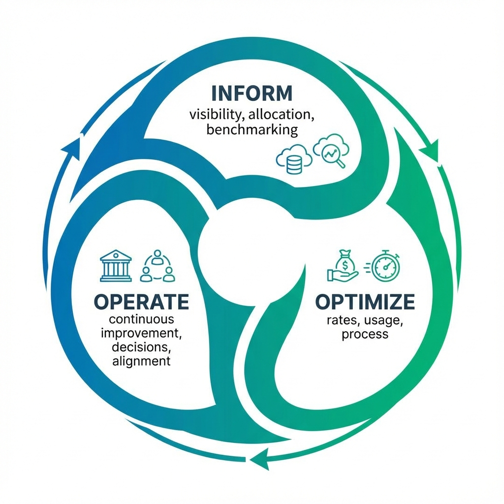
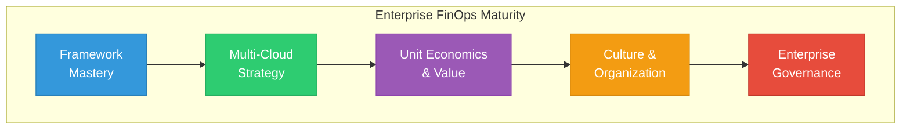
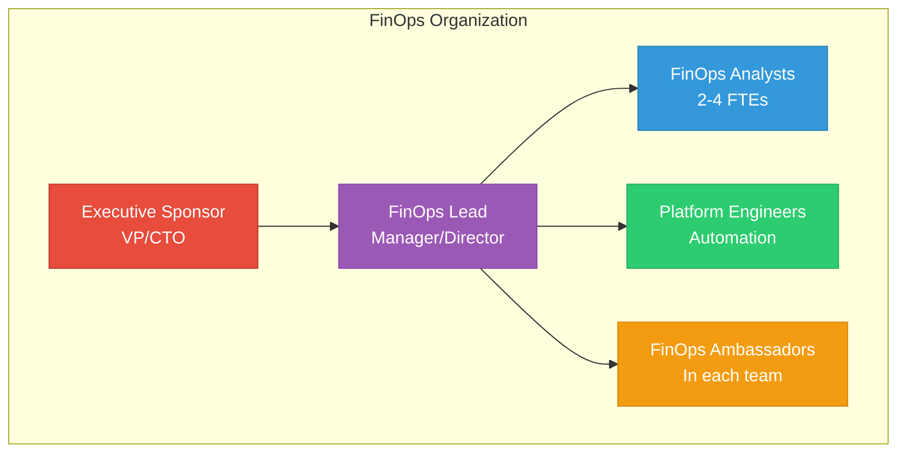

# FinOps - Advanced Level

## Welcome to Enterprise FinOps

This advanced guide covers enterprise-scale FinOps frameworks, multi-cloud cost management, unit economics, and building a sustainable FinOps culture.

---

## Learning Path Overview

| Lesson | Topic | Duration |
|--------|-------|----------|
| 01 | [FinOps Framework Deep Dive](./01-FinOps-Framework/README.md) | 75 min |
| 02 | [Multi-Cloud FinOps](./02-Multi-Cloud-FinOps/README.md) | 60 min |
| 03 | [Unit Economics & Value Metrics](./03-Unit-Economics/README.md) | 60 min |
| 04 | [Building FinOps Culture](./04-FinOps-Culture/README.md) | 45 min |
| 05 | [Enterprise Governance](./05-Enterprise-Governance/README.md) | 60 min |

---

## Prerequisites

Before starting this level, ensure you have completed:
- ✅ [Beginner FinOps](../../../README.md)
- ✅ [Intermediate FinOps](../../../README.md)
- ✅ Experience with cloud cost management
- ✅ Understanding of organizational structures

---

## Advanced FinOps Capabilities

---

## The FinOps Foundation Framework

The FinOps Foundation defines a structured approach to cloud financial management:

### FinOps Domains

| Domain | Description | Key Activities |
|--------|-------------|----------------|
| **Understanding Cloud Usage & Cost** | Know what you're spending | Data ingestion, allocation, reporting |
| **Performance Tracking & Benchmarking** | Measure efficiency | KPIs, forecasting, trending |
| **Real-Time Decision Making** | Act on insights | Anomaly management, decisions |
| **Cloud Rate Optimization** | Optimize unit costs | Commitments, discounts, pricing |
| **Cloud Usage Optimization** | Optimize consumption | Right-sizing, workload management |
| **Organizational Alignment** | Culture and process | FinOps practice, education |

### FinOps Maturity Model

| Capability | Crawl | Walk | Run |
|------------|-------|------|-----|
| **Cost Allocation** | Basic tagging | Multi-dimensional | Real-time, automated |
| **Forecasting** | Spreadsheet | Trend-based | ML-powered |
| **Optimization** | Manual | Scheduled | Autonomous |
| **Governance** | Ad-hoc | Policy-based | Automated enforcement |
| **Culture** | Central team | Shared awareness | Embedded practice |

---

## Enterprise FinOps Metrics

### Strategic Metrics

| Metric | Description | Target |
|--------|-------------|--------|
| **Cloud Unit Cost** | Cost per unit of business value | Decreasing |
| **Cost per Revenue $** | Cloud spend / revenue | <5% typically |
| **Engineering Efficiency** | Revenue per engineer | Increasing |
| **Time to Value** | Deploy to production time | Decreasing |

### Operational Metrics

| Metric | Description | Target |
|--------|-------------|--------|
| **RI/SP Coverage** | % of eligible spend covered | >70% |
| **Commitment Utilization** | Usage of purchased commitments | >80% |
| **Tagging Compliance** | % of resources properly tagged | >95% |
| **Waste Ratio** | Unused resources / total | <5% |

---

## Enterprise Tools

### FinOps Platforms

| Platform | Strengths | Best For |
|----------|-----------|----------|
| **Apptio Cloudability** | Enterprise analytics, forecasting | Large enterprises |
| **CloudHealth (VMware)** | Governance, multi-cloud | Mid to enterprise |
| **Flexera** | Asset management, licensing | Complex licensing |
| **Spot.io (NetApp)** | Optimization automation | Compute-heavy |
| **Kubecost** | Kubernetes-native | K8s environments |
| **Vantage** | Modern UX, integrations | Growing companies |

### Build vs. Buy Considerations

| Factor | Build | Buy |
|--------|-------|-----|
| **Customization** | Unlimited | Limited to features |
| **Time to value** | Months | Weeks |
| **Maintenance** | Internal team | Vendor |
| **Cost** | Engineering time | License fees |
| **Best for** | Unique requirements | Standard needs |

---

## Building a FinOps Practice

### FinOps Team Structure

### RACI Matrix

| Activity | FinOps | Engineering | Finance | Exec |
|----------|--------|-------------|---------|------|
| Set budgets | C | I | A | R |
| Tagging strategy | A | R | C | I |
| Optimization | C | R | I | I |
| Anomaly response | R | C | I | I |
| Commitment purchase | A | C | R | A |
| Reporting | R | I | C | I |

*R=Responsible, A=Accountable, C=Consulted, I=Informed*

---

## Certifications and Resources

### FinOps Foundation Certifications

| Certification | Level | Description |
|---------------|-------|-------------|
| **FinOps Certified Practitioner** | Foundation | Core FinOps principles |
| **FinOps Certified Professional** | Advanced | Deep expertise |
| **FinOps Certified Engineer** | Technical | Technical implementation |

### Learning Resources

| Resource | Type | Link |
|----------|------|------|
| FinOps Foundation | Standard body | finops.org |
| Cloud FinOps Book | Book | O'Reilly |
| FinOps Slack | Community | finopsfoundation.slack.com |
| AWS Well-Architected | Framework | aws.amazon.com/well-architected |
| Azure Cost Optimization | Guide | docs.microsoft.com |

---

## Next Steps

Start with **[Lesson 01: FinOps Framework Deep Dive](./01-FinOps-Framework/README.md)** to master the FinOps Foundation framework!
