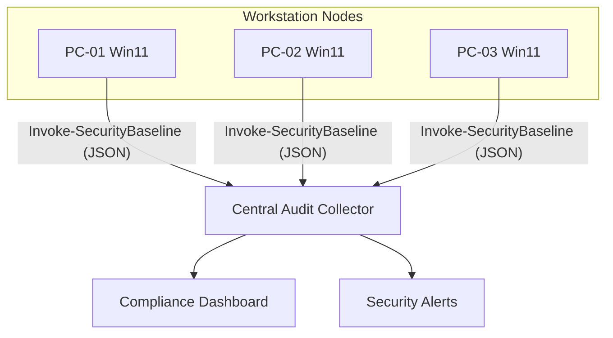

# Advanced: Security, Performance & Compliance

> **Deep Dive: Securing and Baselining the Enterprise**

This is the expert tier. Here we stop looking at just "Configuration" and start looking for "Vulnerabilities" and "Drift." This module involves analyzing security posture, checking patch levels against CVEs, and verifying Group Policy application.

## 🎯 Learning Objectives

1.  Perform a "Security Baseline" audit (UAC, SMBv1, RDP status).
2.  Audit Windows Update history for compliance.
3.  Analyze the event log for signs of privilege escalation or cleared logs.

## 🏗️ Enterprise Audit Architecture

## 🛠️ Practical Exercises

### 1. Security Baseline Scanner
Run `Invoke-SecurityBaseline.ps1`. This script checks critical keys: Is UAC on? Is RDP open to the world? Is the Firewall active?

### 2. Patch Compliance Auditor
Use `Get-PatchCompliance.ps1` to export a list of the last 10 installed updates and calculate the "Days Since Last Patch."

---

**[⬅️ Back to Intermediate Auditing](../../../../../2-Intermediate/02-Phase-2/04-System-Administration/Auditing/README.md)**
