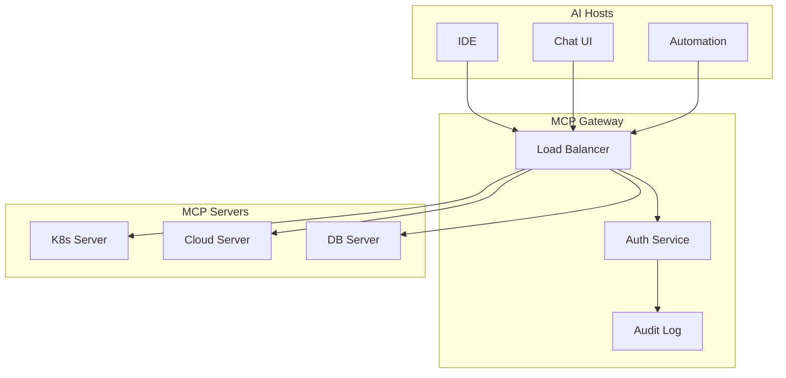

# Model Context Protocol (MCP) - Advanced Level

## Introduction

This advanced module covers enterprise MCP deployments, custom transport implementations, advanced security patterns, and building production-grade MCP infrastructure.

## Learning Objectives

- Design enterprise-scale MCP architectures
- Implement custom transports and protocols
- Build production-grade MCP infrastructure
- Master advanced security and compliance patterns

## Topics Covered

### 1. Enterprise MCP Architecture


### 2. Custom Transports
- HTTP/WebSocket implementations
- gRPC transport
- Message queue integration (Kafka, RabbitMQ)
- Custom protocol development

### 3. High Availability
- Server clustering
- State replication
- Disaster recovery
- Global distribution

### 4. Advanced Security
- Zero-trust architecture
- mTLS implementation
- Dynamic credential rotation
- Security scanning and compliance

### 5. Performance Optimization
- Connection pooling
- Request batching
- Caching strategies
- Async processing patterns

### 6. Observability
- Distributed tracing
- Metrics collection
- Log aggregation
- Alerting and dashboards

### 7. Multi-Cloud MCP
- Cross-cloud server federation
- Unified resource access
- Cloud-agnostic tooling
- Hybrid deployments

## Production Patterns

### Gateway Pattern
```python
class MCPGateway:
    def __init__(self):
        self.servers = ServerRegistry()
        self.auth = AuthService()
        self.metrics = MetricsCollector()
    
    async def route_request(self, request):
        await self.auth.verify(request)
        server = self.servers.get_server(request.target)
        with self.metrics.trace(request):
            return await server.handle(request)
```

### Federation Pattern
- Cross-organization MCP sharing
- Federated identity
- Resource sharing policies
- Trust establishment

## Case Studies

1. Building a multi-cloud MCP infrastructure
2. Implementing enterprise MCP gateway
3. MCP for regulated industries
4. Global-scale MCP deployment

## Best Practices

- Design for failure and resilience
- Implement comprehensive monitoring
- Maintain backward compatibility
- Document all tools and resources
