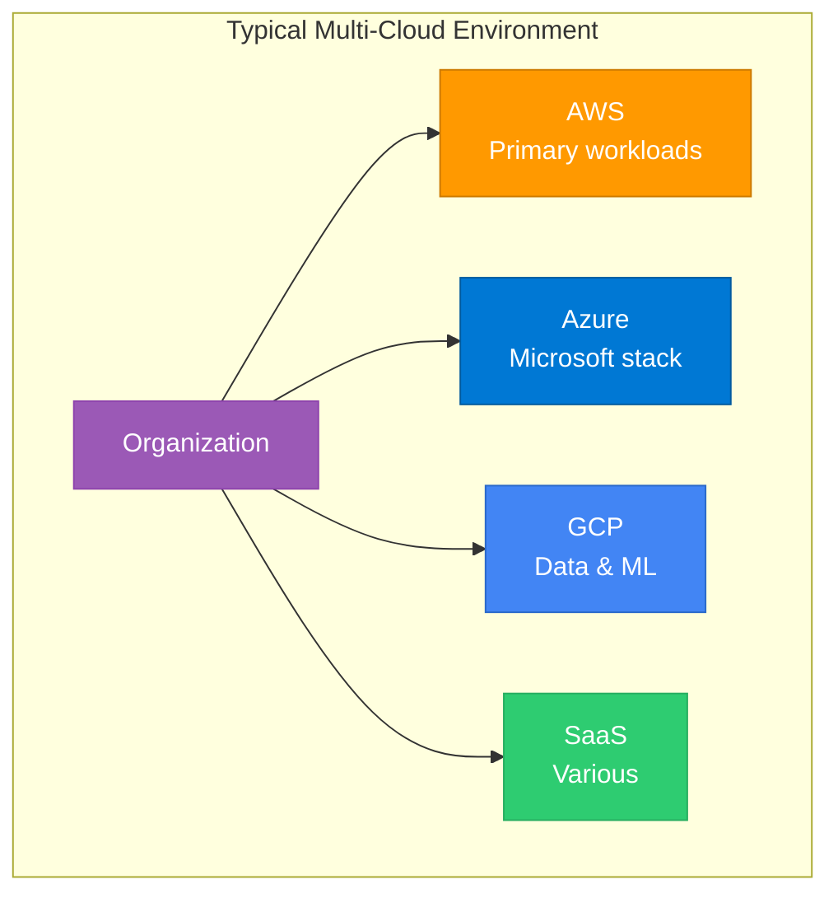
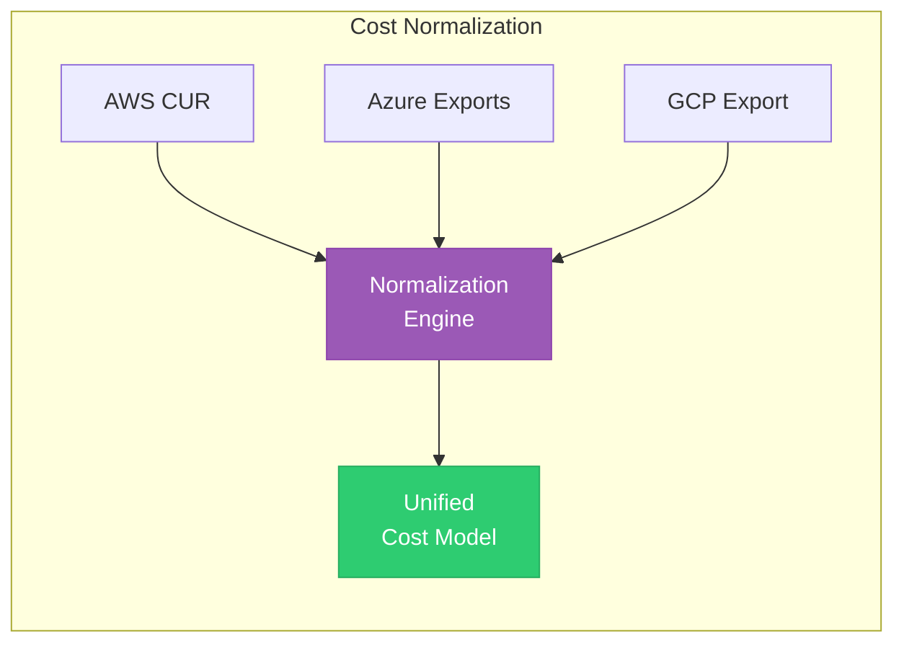
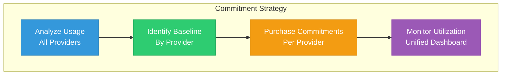
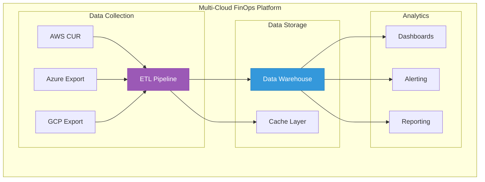

# Lesson 02: Multi-Cloud FinOps

## Learning Objectives

By the end of this lesson, you will:
- Implement multi-cloud cost management strategies
- Normalize costs across providers
- Handle multi-cloud commitments
- Build a unified FinOps platform

---

## Multi-Cloud Reality

Most enterprises use multiple cloud providers:



### Why Multi-Cloud?

| Reason | Description |
|--------|-------------|
| **Best of breed** | Use optimal services from each provider |
| **M&A** | Inherited environments from acquisitions |
| **Compliance** | Regulatory requirements |
| **Vendor diversification** | Reduce lock-in risk |
| **Regional availability** | Geographic coverage |

---

## Multi-Cloud Challenges

### Cost Visibility Challenges

| Challenge | Description | Impact |
|-----------|-------------|--------|
| **Different billing formats** | Each provider has unique structure | Hard to compare |
| **Currency variations** | Multi-currency billing | Conversion complexity |
| **Timing differences** | Different billing cycles | Reporting lag |
| **Service mapping** | Different service names | Unclear comparisons |

### Optimization Challenges

| Challenge | Description | Impact |
|-----------|-------------|--------|
| **Commitment fragmentation** | Separate RI/SP per provider | Lower utilization |
| **Tool fragmentation** | Multiple dashboards | Incomplete view |
| **Skill gaps** | Different expertise needed | Inconsistent optimization |

---

## Cost Normalization

### Creating a Universal Cost Model



### Service Category Mapping

| Category | AWS | Azure | GCP |
|----------|-----|-------|-----|
| **Compute VMs** | EC2 | Virtual Machines | Compute Engine |
| **Serverless** | Lambda | Functions | Cloud Functions |
| **Object Storage** | S3 | Blob Storage | Cloud Storage |
| **Block Storage** | EBS | Managed Disks | Persistent Disk |
| **Kubernetes** | EKS | AKS | GKE |
| **Databases** | RDS | SQL Database | Cloud SQL |
| **Data Warehouse** | Redshift | Synapse | BigQuery |

### Normalized Cost Schema

```sql
CREATE TABLE normalized_costs (
    id UUID PRIMARY KEY,
    billing_date DATE,
    provider VARCHAR(20),  -- aws, azure, gcp
    account_id VARCHAR(50),
    account_name VARCHAR(100),
    service_category VARCHAR(50),  -- compute, storage, database
    service_name VARCHAR(100),     -- Original service name
    region VARCHAR(50),
    resource_id VARCHAR(200),
    usage_quantity DECIMAL(18,4),
    usage_unit VARCHAR(50),
    cost_usd DECIMAL(18,4),
    tags JSONB
);
```

---

## Unified Tagging Strategy

### Cross-Cloud Tag Standards

| Tag Key | Purpose | AWS | Azure | GCP |
|---------|---------|-----|-------|-----|
| `environment` | Environment type | Tag | Tag | Label |
| `team` | Owning team | Tag | Tag | Label |
| `project` | Project ID | Tag | Tag | Label |
| `cost-center` | Finance allocation | Tag | Tag | Label |
| `application` | Application name | Tag | Tag | Label |

### Tag Enforcement by Provider

**AWS (Tag Policy):**
```json
{
  "tags": {
    "environment": {
      "tag_value": {
        "@@assign": ["production", "staging", "development"]
      }
    }
  }
}
```

**Azure (Policy):**
```json
{
  "if": {
    "field": "tags['environment']",
    "exists": "false"
  },
  "then": {
    "effect": "deny"
  }
}
```

**GCP (Organization Policy):**
```yaml
constraint: constraints/compute.requireLabels
listPolicy:
  allValues: DENY
  suggestedValue: environment,team,project
```

---

## Multi-Cloud Commitment Strategy

### Commitment Options by Provider

| Provider | Commitment Type | Term | Savings |
|----------|-----------------|------|---------|
| **AWS** | Savings Plans | 1-3 years | Up to 72% |
| **AWS** | Reserved Instances | 1-3 years | Up to 72% |
| **Azure** | Reserved Instances | 1-3 years | Up to 72% |
| **Azure** | Azure Hybrid Benefit | Existing licenses | Up to 40% |
| **GCP** | Committed Use Discounts | 1-3 years | Up to 57% |
| **GCP** | Sustained Use Discounts | Automatic | Up to 30% |

### Cross-Cloud Commitment Planning



### Commitment Allocation Framework

| Workload Type | AWS Strategy | Azure Strategy | GCP Strategy |
|---------------|--------------|----------------|--------------|
| **Stable Production** | Compute SP (1yr) | 1yr RI | 1yr CUD |
| **Variable Production** | On-Demand + Spot | Pay-as-you-go + Spot | On-Demand + Preemptible |
| **Dev/Test** | Spot | Spot | Preemptible |
| **Data/Analytics** | Savings Plan | Reserved | Sustained Use |

---

## Building a Unified Platform

### Architecture



### Data Collection Setup

**AWS Cost & Usage Report:**
```bash
aws cur put-report-definition \
  --report-definition '{
    "ReportName": "multi-cloud-cur",
    "TimeUnit": "HOURLY",
    "Format": "Parquet",
    "Compression": "Parquet",
    "S3Bucket": "my-billing-bucket",
    "S3Prefix": "aws-cur",
    "S3Region": "us-east-1",
    "AdditionalSchemaElements": ["RESOURCES", "SPLIT_COST_ALLOCATION_DATA"],
    "RefreshClosedReports": true,
    "ReportVersioning": "OVERWRITE_REPORT"
  }'
```

**Azure Export:**
```bash
az costmanagement export create \
  --name multi-cloud-export \
  --scope "/subscriptions/{subscription-id}" \
  --storage-account-id "/subscriptions/{sub}/resourceGroups/{rg}/providers/Microsoft.Storage/storageAccounts/{sa}" \
  --storage-container exports \
  --type Usage \
  --schedule-recurrence Daily
```

**GCP Export:**
```bash
bq --location=US mk \
  --dataset \
  --description "Billing export" \
  billing_export

# Enable in Console: Billing > Billing export > BigQuery export
```

---

## Multi-Cloud Reporting

### Unified Dashboard Components

| Component | Metrics |
|-----------|---------|
| **Total Spend** | Combined spend across all providers |
| **Provider Breakdown** | Pie chart by provider |
| **Service Categories** | Spend by normalized category |
| **Trend Analysis** | MoM, YoY comparisons |
| **Commitment Coverage** | RI/SP utilization |

### Sample SQL Query

```sql
-- Monthly spend by provider and category
SELECT 
    DATE_TRUNC('month', billing_date) as month,
    provider,
    service_category,
    SUM(cost_usd) as total_cost,
    SUM(cost_usd) / SUM(SUM(cost_usd)) OVER (PARTITION BY DATE_TRUNC('month', billing_date)) as pct_of_total
FROM normalized_costs
WHERE billing_date >= DATE_TRUNC('month', CURRENT_DATE - INTERVAL '6 months')
GROUP BY 1, 2, 3
ORDER BY 1, 4 DESC;
```

---

## Multi-Cloud Tools

### Comparison

| Tool | AWS | Azure | GCP | K8s | Strengths |
|------|-----|-------|-----|-----|-----------|
| **CloudHealth** | ✅ | ✅ | ✅ | ✅ | Enterprise-grade |
| **Cloudability** | ✅ | ✅ | ✅ | ✅ | Advanced analytics |
| **Spot.io** | ✅ | ✅ | ✅ | ✅ | Optimization automation |
| **Flexera** | ✅ | ✅ | ✅ | Limited | License management |
| **Vantage** | ✅ | ✅ | ✅ | ✅ | Modern UX |

### Open Source Options

| Tool | Description |
|------|-------------|
| **Komiser** | Multi-cloud visibility |
| **Infracost** | Cost estimation in CI/CD |
| **Cloud Custodian** | Policy as code |
| **OpenCost** | Kubernetes cost monitoring |

---

## Hands-On Exercise

### Exercise 1: Service Mapping

Create a mapping table for your services:
1. List your top 20 services across clouds
2. Map to normalized categories
3. Identify gaps

### Exercise 2: Unified Dashboard Design

Design a multi-cloud dashboard:
1. Define key metrics
2. Sketch layout
3. Identify data sources

### Exercise 3: Commitment Analysis

Analyze commitment opportunities:
1. Calculate baseline by provider
2. Determine optimal commitment mix
3. Estimate total savings

---

## Key Takeaways

- ✅ Multi-cloud requires cost normalization
- ✅ Unified tagging enables cross-cloud allocation
- ✅ Commitment strategy varies by provider
- ✅ Unified tooling provides complete visibility
- ✅ Data warehouse approach enables custom analytics

---

## Next Lesson

Continue to **[Lesson 03: Unit Economics & Value Metrics](../03-Unit-Economics/README.md)** to learn how to connect cloud costs to business value.
